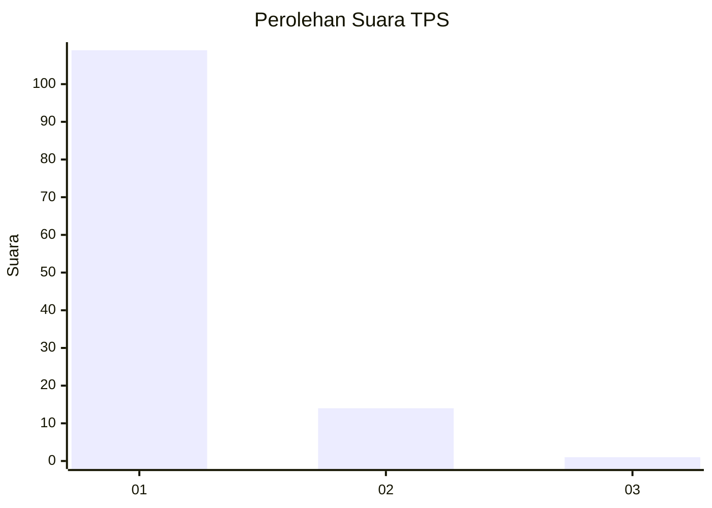
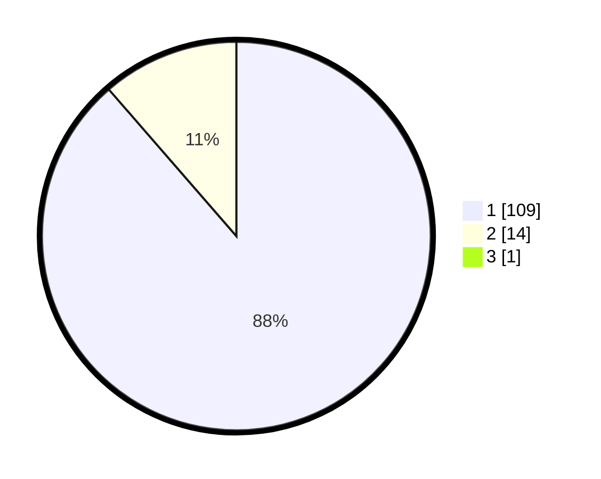

# Hasil

## Grafik

## Tabel

| No. | Nama Paslon    | Suara | Suara (raw) | Persentase |
|:--- |:-------------- | -----:| -----------:| ----------:|
| 1   | ANIES MUHAIMIN | 109   | [109][p-1]  | 87,90      |
| 2   | PRABOWO GIBRAN | 14    | [14][p-2]   | 11,29      |
| 3   | GANJAR MAHFUD  | 1     | [1][p-3]    | 0,81       |

[p-1]: https://github.com/gigit-pemilu/pemilu-2024-11-aceh/blob/main/pilpres/hitung-suara/sub/11-aceh/sub/03-aceh-timur/sub/10-ranto-peureulak/sub/2024-seumanah-jaya/sub/012-tps/sub/paslon-1.txt
[p-2]: https://github.com/gigit-pemilu/pemilu-2024-11-aceh/blob/main/pilpres/hitung-suara/sub/11-aceh/sub/03-aceh-timur/sub/10-ranto-peureulak/sub/2024-seumanah-jaya/sub/012-tps/sub/paslon-2.txt
[p-3]: https://github.com/gigit-pemilu/pemilu-2024-11-aceh/blob/main/pilpres/hitung-suara/sub/11-aceh/sub/03-aceh-timur/sub/10-ranto-peureulak/sub/2024-seumanah-jaya/sub/012-tps/sub/paslon-3.txt

## Foto C Plano

https://sirekap-obj-formc.kpu.go.id/fb98/pemilu/ppwp/11/03/10/20/24/1103102024012-20240214-195952--159bf4f1-9cbe-4319-bfeb-6e8266e6e9b3.jpg

https://sirekap-obj-formc.kpu.go.id/fb98/pemilu/ppwp/11/03/10/20/24/1103102024012-20240214-200029--1df972f4-c871-4bf4-aae7-02bad12a19dd.jpg

https://sirekap-obj-formc.kpu.go.id/fb98/pemilu/ppwp/11/03/10/20/24/1103102024012-20240214-200045--25c0353b-d43a-4839-a261-9d5634ee40be.jpg

## Metadata

| Key        | Value               |
| ---------- | ------------------- |
| Time Stamp | 2024-02-14 21:46:01 |

## DATA PEMILIH TETAP

Jumlah pemilih dalam DPT: **150**.
 * L: **19**.
 * P: **131**.

## DATA PENGGUNA HAK PILIH

Jumlah pengguna hak pilih dalam DPT: **150**.
 * L: **19**.
 * P: **131**.

Jumlah pengguna hak pilih dalam DPTb: **111**.
 * L: **11**.
 * P: **100**.

Jumlah pengguna hak pilih dalam DPK: **18**.
 * L: **10**.
 * P: **8**.

Jumlah pengguna hak pilih: **129**.
 * L: **21**.
 * P: **108**.

## JUMLAH SUARA SAH DAN TIDAK SAH

JUMLAH SELURUH SUARA SAH: **124**.

JUMLAH SUARA TIDAK SAH: **5**.

JUMLAH SELURUH SUARA SAH DAN SUARA TIDAK SAH: **129**.

