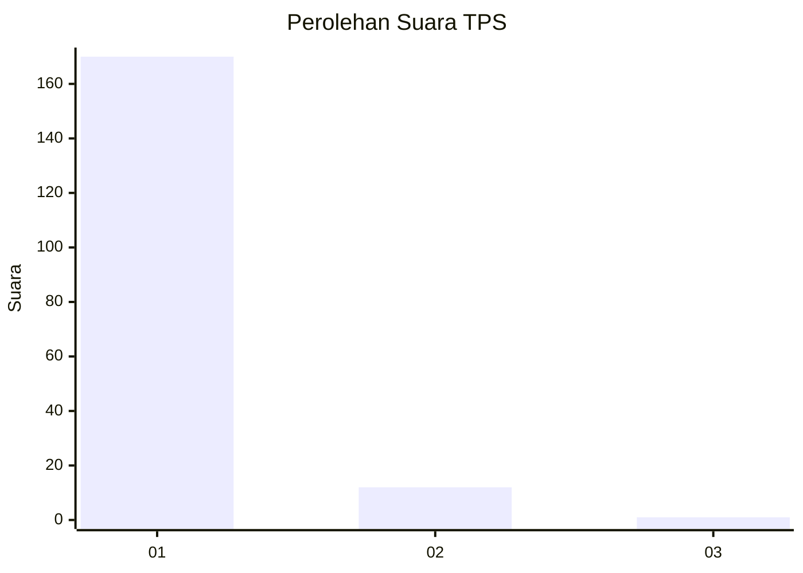
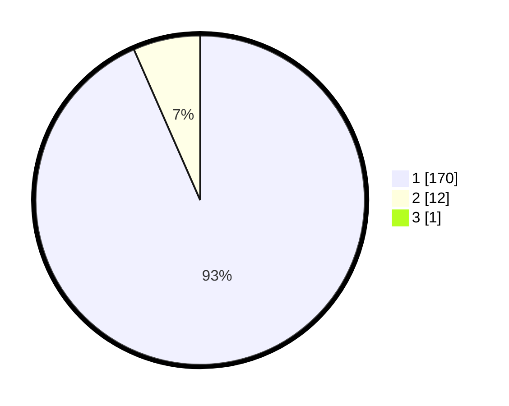

# Hasil

## Grafik

## Tabel

| No. | Nama Paslon    | Suara | Suara (raw) | Persentase |
|:--- |:-------------- | -----:| -----------:| ----------:|
| 1   | ANIES MUHAIMIN | 170   | [170][p-1]  | 92,90      |
| 2   | PRABOWO GIBRAN | 12    | [12][p-2]   | 6,56       |
| 3   | GANJAR MAHFUD  | 1     | [1][p-3]    | 0,55       |

[p-1]: https://github.com/gigit-pemilu/pemilu-2024-11-aceh/blob/main/pilpres/hitung-suara/sub/11-aceh/sub/03-aceh-timur/sub/11-pante-bidari/sub/2005-alue-ie-mirah/sub/002-tps/sub/paslon-1.txt
[p-2]: https://github.com/gigit-pemilu/pemilu-2024-11-aceh/blob/main/pilpres/hitung-suara/sub/11-aceh/sub/03-aceh-timur/sub/11-pante-bidari/sub/2005-alue-ie-mirah/sub/002-tps/sub/paslon-2.txt
[p-3]: https://github.com/gigit-pemilu/pemilu-2024-11-aceh/blob/main/pilpres/hitung-suara/sub/11-aceh/sub/03-aceh-timur/sub/11-pante-bidari/sub/2005-alue-ie-mirah/sub/002-tps/sub/paslon-3.txt

## Foto C Plano

https://sirekap-obj-formc.kpu.go.id/479d/pemilu/ppwp/11/03/11/20/05/1103112005002-20240221-123953--22766ef1-3f62-41a1-be57-30759e7ef31c.jpg

https://sirekap-obj-formc.kpu.go.id/479d/pemilu/ppwp/11/03/11/20/05/1103112005002-20240215-101332--2edd8ef2-d29f-46f8-9c37-7eb75100ec0b.jpg

https://sirekap-obj-formc.kpu.go.id/479d/pemilu/ppwp/11/03/11/20/05/1103112005002-20240214-215559--a3cafc2b-a547-46d5-9845-61c3d5d71fe6.jpg

## Metadata

| Key        | Value               |
| ---------- | ------------------- |
| Time Stamp | 2024-02-24 22:31:28 |

