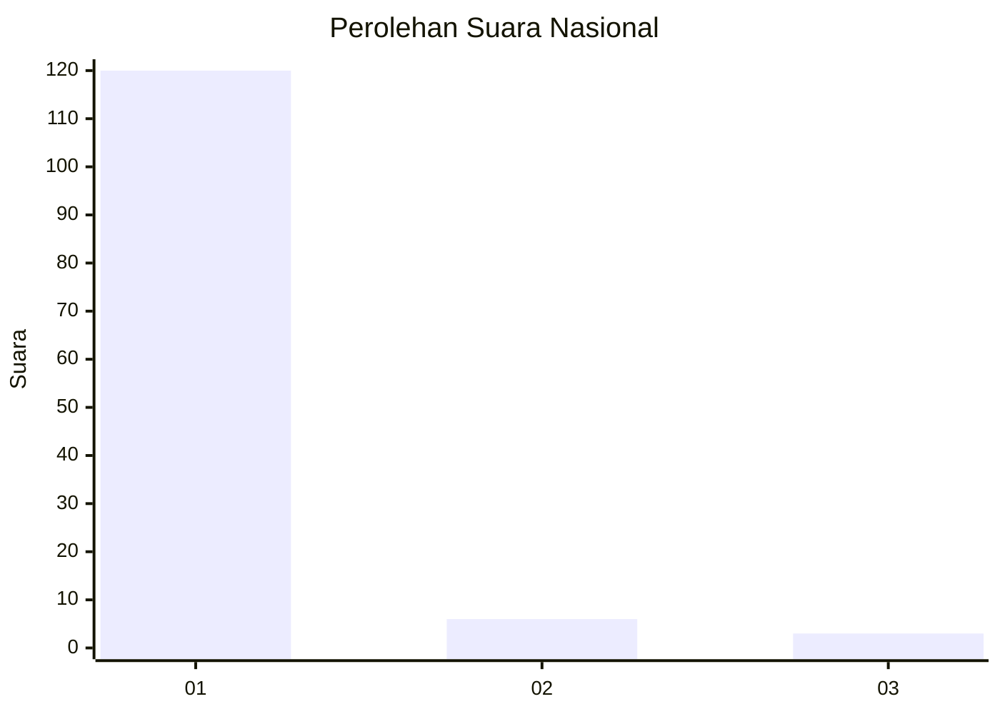
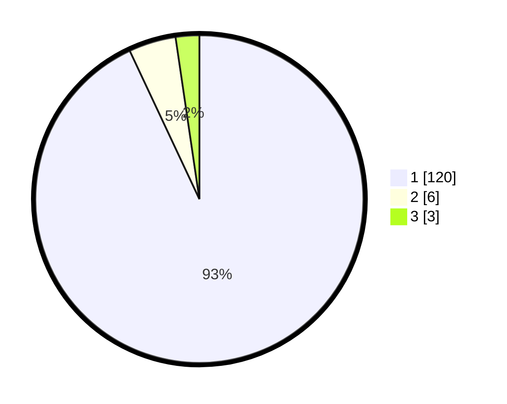

# Hasil

## Grafik

## Tabel

| No. | Nama Paslon    | Suara | Suara (raw) | Persentase |
|:--- |:-------------- | -----:| -----------:| ----------:|
| 1   | ANIES MUHAIMIN | 120   | [120][p-1]  | 93,02      |
| 2   | PRABOWO GIBRAN | 6     | [6][p-2]    | 4,65       |
| 3   | GANJAR MAHFUD  | 3     | [3][p-3]    | 2,33       |

[p-1]: https://github.com/gigit-pemilu/pemilu-2024/blob/main/pilpres/hitung-suara/sub/11-aceh/sub/03-aceh-timur/sub/11-pante-bidari/sub/2005-alue-ie-mirah/sub/003-tps/sub/paslon-1.txt
[p-2]: https://github.com/gigit-pemilu/pemilu-2024/blob/main/pilpres/hitung-suara/sub/11-aceh/sub/03-aceh-timur/sub/11-pante-bidari/sub/2005-alue-ie-mirah/sub/003-tps/sub/paslon-2.txt
[p-3]: https://github.com/gigit-pemilu/pemilu-2024/blob/main/pilpres/hitung-suara/sub/11-aceh/sub/03-aceh-timur/sub/11-pante-bidari/sub/2005-alue-ie-mirah/sub/003-tps/sub/paslon-3.txt

## Foto C Plano

https://sirekap-obj-formc.kpu.go.id/6ad1/pemilu/ppwp/11/03/11/20/05/1103112005003-20240216-221619--9300b5a1-05cc-4378-9062-f0a81b63a460.jpg

https://sirekap-obj-formc.kpu.go.id/6ad1/pemilu/ppwp/11/03/11/20/05/1103112005003-20240216-223215--3a932bc7-7421-4592-95dc-f0685c5ae5f7.jpg

https://sirekap-obj-formc.kpu.go.id/6ad1/pemilu/ppwp/11/03/11/20/05/1103112005003-20240216-231047--b1fa4ddd-1c29-46ac-88e3-37a2191e2e4b.jpg

## Metadata

| Key        | Value               |
| ---------- | ------------------- |
| Time Stamp | 2024-02-19 09:00:00 |

## DATA PEMILIH TETAP

Jumlah pemilih dalam DPT: **178**.
 * L: **90**.
 * P: **88**.

## DATA PENGGUNA HAK PILIH

Jumlah pengguna hak pilih dalam DPT: **120**.
 * L: **67**.
 * P: **53**.

Jumlah pengguna hak pilih dalam DPTb: **9**.
 * L: **7**.
 * P: **2**.

Jumlah pengguna hak pilih dalam DPK: **2**.
 * L: **2**.
 * P: **0**.

Jumlah pengguna hak pilih: **131**.
 * L: **76**.
 * P: **55**.

## JUMLAH SUARA SAH DAN TIDAK SAH

JUMLAH SELURUH SUARA SAH: **129**.

JUMLAH SUARA TIDAK SAH: **2**.

JUMLAH SELURUH SUARA SAH DAN SUARA TIDAK SAH: **131**.

