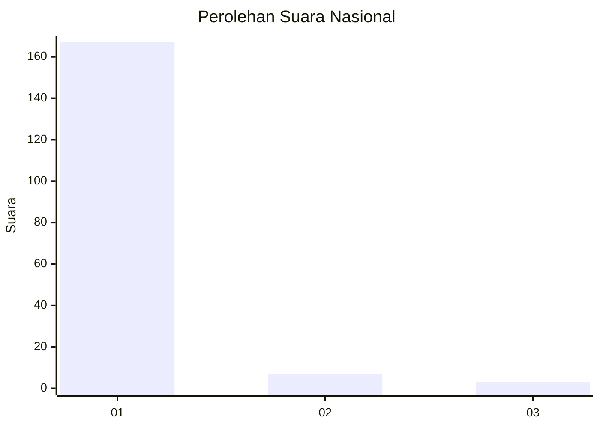
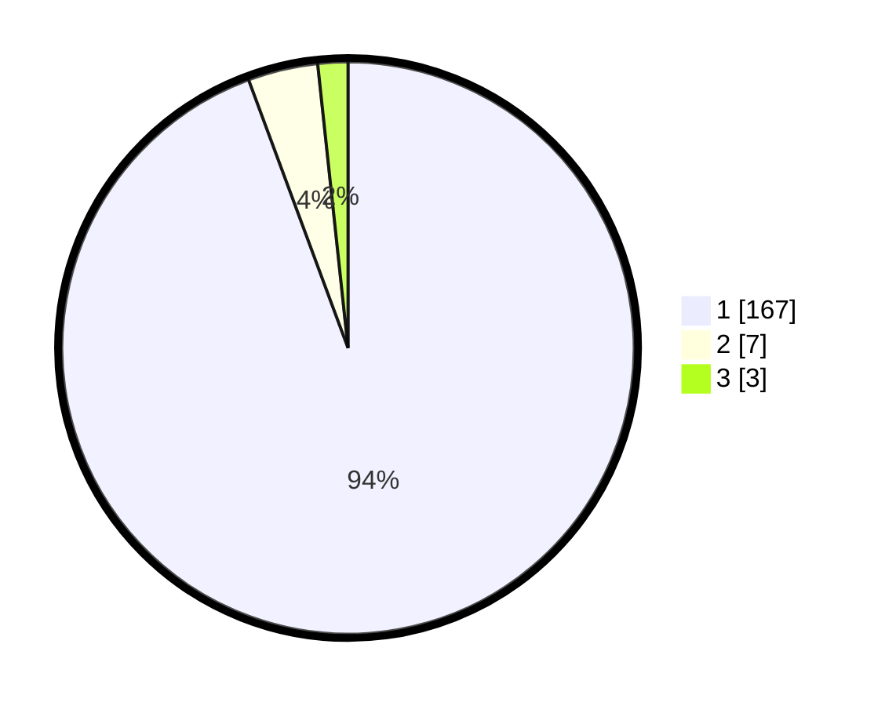

# Hasil

## Grafik

## Tabel

| No. | Nama Paslon    | Suara | Suara (raw) | Persentase |
|:--- |:-------------- | -----:| -----------:| ----------:|
| 1   | ANIES MUHAIMIN | 167   | [167][p-1]  | 94,35      |
| 2   | PRABOWO GIBRAN | 7     | [7][p-2]    | 3,95       |
| 3   | GANJAR MAHFUD  | 3     | [3][p-3]    | 1,69       |

[p-1]: https://github.com/gigit-pemilu/pemilu-2024/blob/main/pilpres/hitung-suara/sub/11-aceh/sub/03-aceh-timur/sub/11-pante-bidari/sub/2007-seuneubok-saboh/sub/002-tps/sub/paslon-1.txt
[p-2]: https://github.com/gigit-pemilu/pemilu-2024/blob/main/pilpres/hitung-suara/sub/11-aceh/sub/03-aceh-timur/sub/11-pante-bidari/sub/2007-seuneubok-saboh/sub/002-tps/sub/paslon-2.txt
[p-3]: https://github.com/gigit-pemilu/pemilu-2024/blob/main/pilpres/hitung-suara/sub/11-aceh/sub/03-aceh-timur/sub/11-pante-bidari/sub/2007-seuneubok-saboh/sub/002-tps/sub/paslon-3.txt

## Foto C Plano

https://sirekap-obj-formc.kpu.go.id/656c/pemilu/ppwp/11/03/11/20/07/1103112007002-20240215-010715--a4dfd17a-8d1d-4d5b-8540-3c1fa5519008.jpg

https://sirekap-obj-formc.kpu.go.id/656c/pemilu/ppwp/11/03/11/20/07/1103112007002-20240215-011025--6d942828-654d-42ef-aa07-acf305a1f717.jpg

https://sirekap-obj-formc.kpu.go.id/656c/pemilu/ppwp/11/03/11/20/07/1103112007002-20240214-215842--5a4e3b90-c2ed-46c4-a6ba-6efb75d756dc.jpg

## Metadata

| Key        | Value               |
| ---------- | ------------------- |
| Time Stamp | 2024-02-24 22:31:28 |

