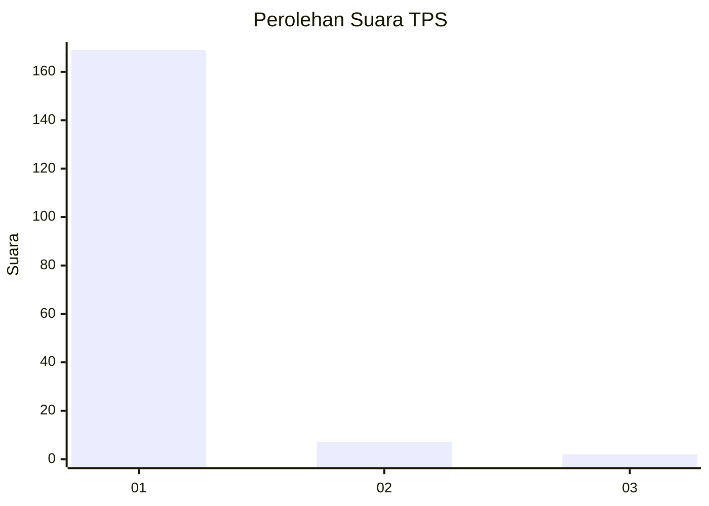
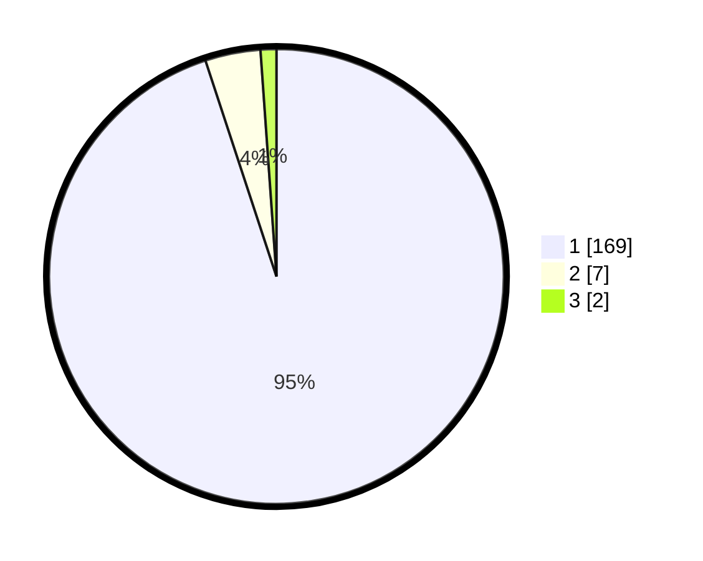

# Hasil

## Grafik

## Tabel

| No. | Nama Paslon    | Suara | Suara (raw) | Persentase |
|:--- |:-------------- | -----:| -----------:| ----------:|
| 1   | ANIES MUHAIMIN | 169   | [169][p-1]  | 94,94      |
| 2   | PRABOWO GIBRAN | 7     | [7][p-2]    | 3,93       |
| 3   | GANJAR MAHFUD  | 2     | [2][p-3]    | 1,12       |

[p-1]: https://github.com/gigit-pemilu/pemilu-2024-11-aceh/blob/main/pilpres/hitung-suara/sub/11-aceh/sub/03-aceh-timur/sub/11-pante-bidari/sub/2008-buket-kareung/sub/001-tps/sub/paslon-1.txt
[p-2]: https://github.com/gigit-pemilu/pemilu-2024-11-aceh/blob/main/pilpres/hitung-suara/sub/11-aceh/sub/03-aceh-timur/sub/11-pante-bidari/sub/2008-buket-kareung/sub/001-tps/sub/paslon-2.txt
[p-3]: https://github.com/gigit-pemilu/pemilu-2024-11-aceh/blob/main/pilpres/hitung-suara/sub/11-aceh/sub/03-aceh-timur/sub/11-pante-bidari/sub/2008-buket-kareung/sub/001-tps/sub/paslon-3.txt

## Foto C Plano

https://sirekap-obj-formc.kpu.go.id/a870/pemilu/ppwp/11/03/11/20/08/1103112008001-20240215-123708--a32b4b64-88c6-44f8-bb7a-fca59bfd6abe.jpg

https://sirekap-obj-formc.kpu.go.id/a870/pemilu/ppwp/11/03/11/20/08/1103112008001-20240215-124239--19ef7b6e-fe6d-43da-b423-2acbb4ed82e1.jpg

https://sirekap-obj-formc.kpu.go.id/a870/pemilu/ppwp/11/03/11/20/08/1103112008001-20240215-124358--6b51e9e3-3cf0-4753-9c79-6f9f2a3bbcee.jpg

## Metadata

| Key        | Value               |
| ---------- | ------------------- |
| Time Stamp | 2024-02-24 22:31:28 |

