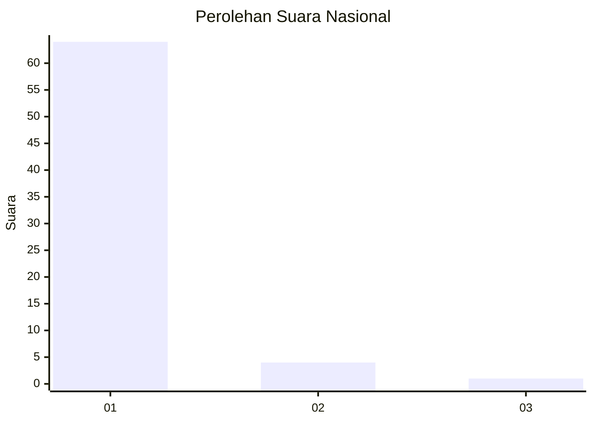
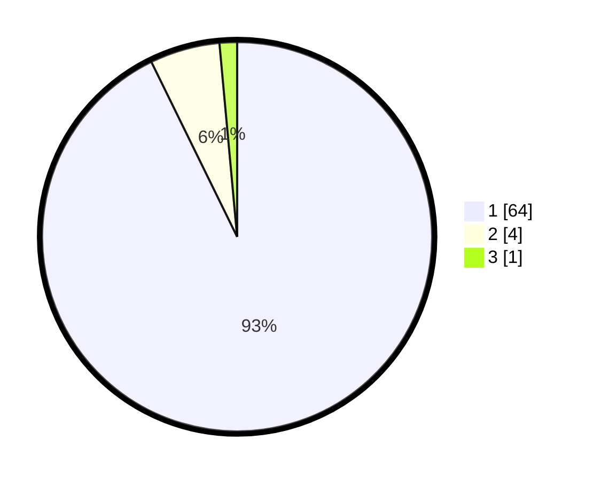

# Hasil

## Grafik

## Tabel

| No. | Nama Paslon    | Suara | Suara (raw) | Persentase |
|:--- |:-------------- | -----:| -----------:| ----------:|
| 1   | ANIES MUHAIMIN | 64    | [64][p-1]   | 92,75      |
| 2   | PRABOWO GIBRAN | 4     | [4][p-2]    | 5,80       |
| 3   | GANJAR MAHFUD  | 1     | [1][p-3]    | 1,45       |

[p-1]: https://github.com/gigit-pemilu/pemilu-2024/blob/main/pilpres/hitung-suara/sub/11-aceh/sub/03-aceh-timur/sub/11-pante-bidari/sub/2008-buket-kareung/sub/003-tps/sub/paslon-1.txt
[p-2]: https://github.com/gigit-pemilu/pemilu-2024/blob/main/pilpres/hitung-suara/sub/11-aceh/sub/03-aceh-timur/sub/11-pante-bidari/sub/2008-buket-kareung/sub/003-tps/sub/paslon-2.txt
[p-3]: https://github.com/gigit-pemilu/pemilu-2024/blob/main/pilpres/hitung-suara/sub/11-aceh/sub/03-aceh-timur/sub/11-pante-bidari/sub/2008-buket-kareung/sub/003-tps/sub/paslon-3.txt

## Foto C Plano

https://sirekap-obj-formc.kpu.go.id/e761/pemilu/ppwp/11/03/11/20/08/1103112008003-20240224-154935--3e638166-dd7b-4d15-890a-9ce00f0b199d.jpg

https://sirekap-obj-formc.kpu.go.id/e761/pemilu/ppwp/11/03/11/20/08/1103112008003-20240224-154936--16be4314-9867-4510-85d6-9e77a6349afe.jpg

https://sirekap-obj-formc.kpu.go.id/e761/pemilu/ppwp/11/03/11/20/08/1103112008003-20240224-154935--890054e4-5bc8-4c05-b864-3f8c3f432f79.jpg

## Metadata

| Key        | Value               |
| ---------- | ------------------- |
| Time Stamp | 2024-02-24 22:31:28 |

## DATA PEMILIH TETAP

Jumlah pemilih dalam DPT: **106**.
 * L: **47**.
 * P: **59**.

## DATA PENGGUNA HAK PILIH

Jumlah pengguna hak pilih dalam DPT: **65**.
 * L: **26**.
 * P: **39**.

Jumlah pengguna hak pilih dalam DPTb: **0**.
 * L: **0**.
 * P: **0**.

Jumlah pengguna hak pilih dalam DPK: **7**.
 * L: **2**.
 * P: **5**.

Jumlah pengguna hak pilih: **72**.
 * L: **28**.
 * P: **44**.

## JUMLAH SUARA SAH DAN TIDAK SAH

JUMLAH SELURUH SUARA SAH: **69**.

JUMLAH SUARA TIDAK SAH: **3**.

JUMLAH SELURUH SUARA SAH DAN SUARA TIDAK SAH: **72**.

