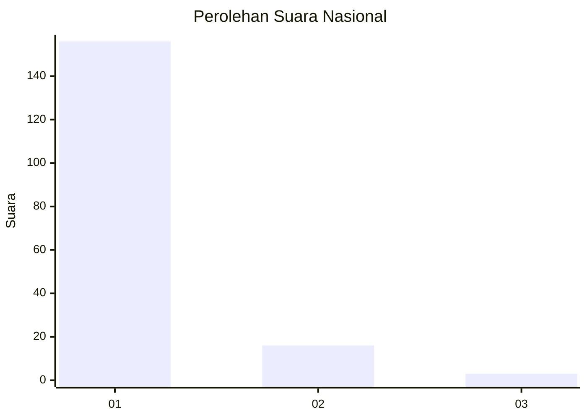
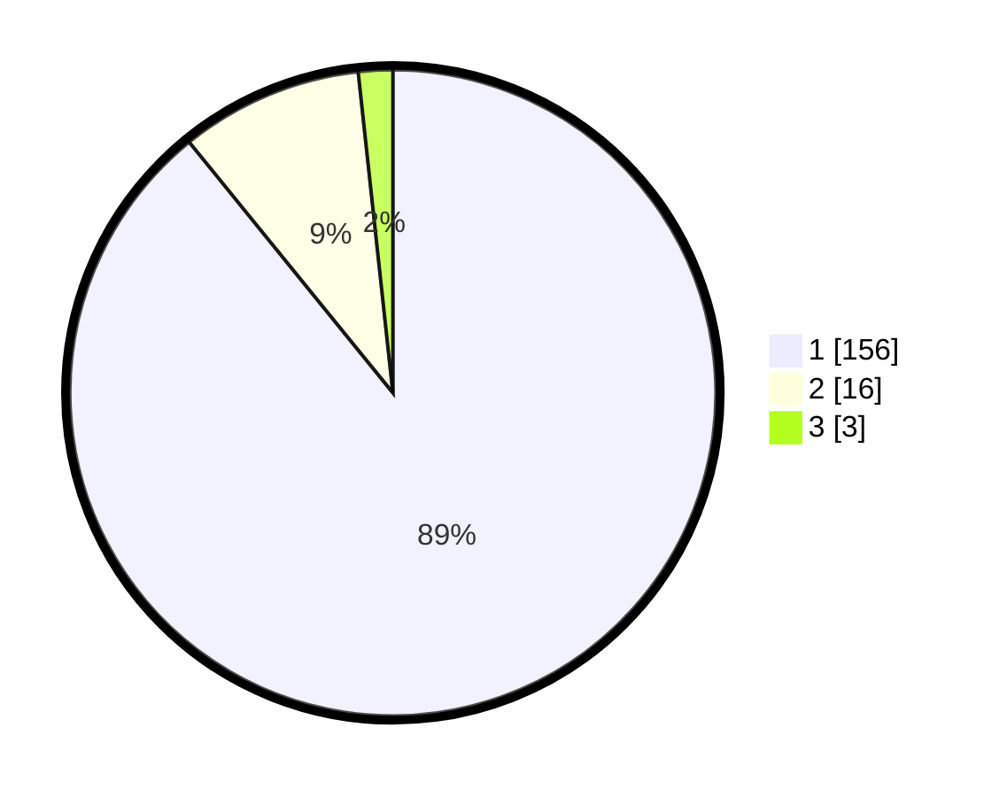

# Hasil

## Grafik

## Tabel

| No. | Nama Paslon    | Suara | Suara (raw) | Persentase |
|:--- |:-------------- | -----:| -----------:| ----------:|
| 1   | ANIES MUHAIMIN | 156   | [156][p-1]  | 89,14      |
| 2   | PRABOWO GIBRAN | 16    | [16][p-2]   | 9,14       |
| 3   | GANJAR MAHFUD  | 3     | [3][p-3]    | 1,71       |

[p-1]: https://github.com/gigit-pemilu/pemilu-2024/blob/main/pilpres/hitung-suara/sub/11-aceh/sub/03-aceh-timur/sub/11-pante-bidari/sub/2009-buket-bata/sub/002-tps/sub/paslon-1.txt
[p-2]: https://github.com/gigit-pemilu/pemilu-2024/blob/main/pilpres/hitung-suara/sub/11-aceh/sub/03-aceh-timur/sub/11-pante-bidari/sub/2009-buket-bata/sub/002-tps/sub/paslon-2.txt
[p-3]: https://github.com/gigit-pemilu/pemilu-2024/blob/main/pilpres/hitung-suara/sub/11-aceh/sub/03-aceh-timur/sub/11-pante-bidari/sub/2009-buket-bata/sub/002-tps/sub/paslon-3.txt

## Foto C Plano

https://sirekap-obj-formc.kpu.go.id/69ef/pemilu/ppwp/11/03/11/20/09/1103112009002-20240222-141543--53820bbd-b21f-49ab-8178-c9d9821105a1.jpg

https://sirekap-obj-formc.kpu.go.id/69ef/pemilu/ppwp/11/03/11/20/09/1103112009002-20240215-143953--d92eb0e2-4e84-466e-be67-847254609c7a.jpg

https://sirekap-obj-formc.kpu.go.id/69ef/pemilu/ppwp/11/03/11/20/09/1103112009002-20240222-141716--ba40c108-55cb-4f61-9bd0-90b487c2b662.jpg

## Metadata

| Key        | Value               |
| ---------- | ------------------- |
| Time Stamp | 2024-02-24 22:31:28 |

