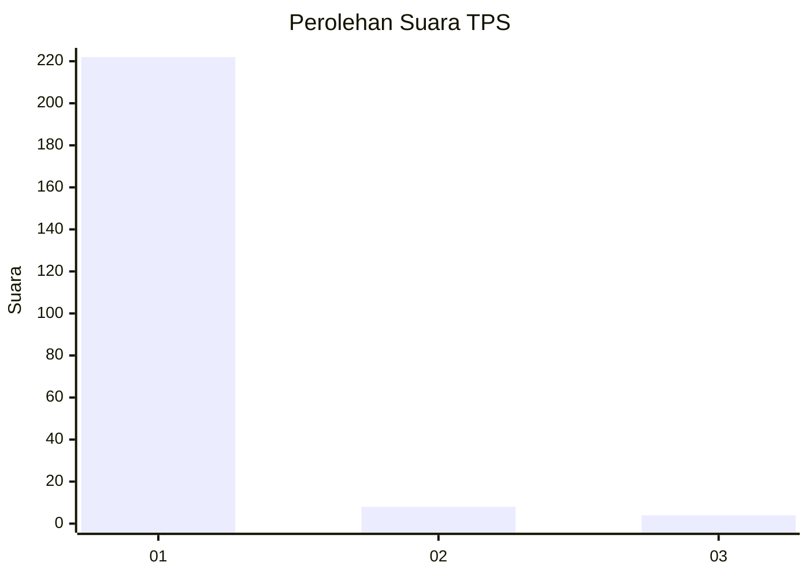
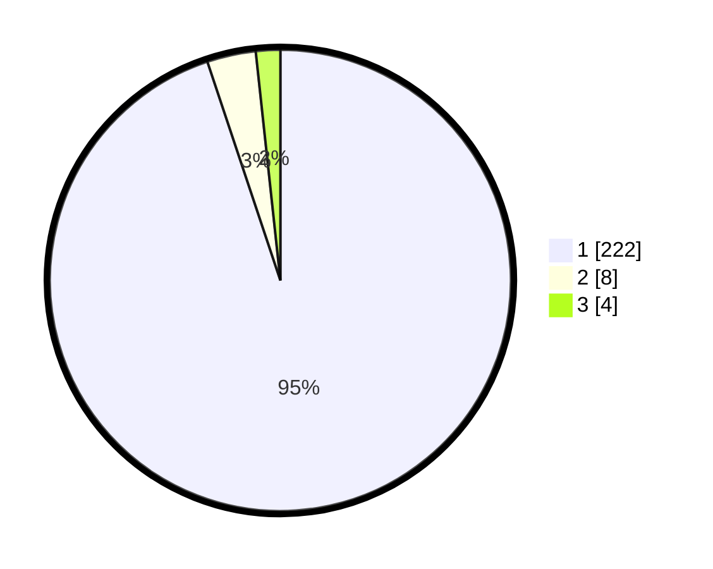

# Hasil

## Grafik

## Tabel

| No. | Nama Paslon    | Suara | Suara (raw) | Persentase |
|:--- |:-------------- | -----:| -----------:| ----------:|
| 1   | ANIES MUHAIMIN | 222   | [222][p-1]  | 94,87      |
| 2   | PRABOWO GIBRAN | 8     | [8][p-2]    | 3,42       |
| 3   | GANJAR MAHFUD  | 4     | [4][p-3]    | 1,71       |

[p-1]: https://github.com/gigit-pemilu/pemilu-2024-11-aceh/blob/main/pilpres/hitung-suara/sub/11-aceh/sub/03-aceh-timur/sub/11-pante-bidari/sub/2009-buket-bata/sub/004-tps/sub/paslon-1.txt
[p-2]: https://github.com/gigit-pemilu/pemilu-2024-11-aceh/blob/main/pilpres/hitung-suara/sub/11-aceh/sub/03-aceh-timur/sub/11-pante-bidari/sub/2009-buket-bata/sub/004-tps/sub/paslon-2.txt
[p-3]: https://github.com/gigit-pemilu/pemilu-2024-11-aceh/blob/main/pilpres/hitung-suara/sub/11-aceh/sub/03-aceh-timur/sub/11-pante-bidari/sub/2009-buket-bata/sub/004-tps/sub/paslon-3.txt

## Foto C Plano

https://sirekap-obj-formc.kpu.go.id/f476/pemilu/ppwp/11/03/11/20/09/1103112009004-20240215-101052--cf43a6fb-010a-43b4-84d9-e54a8c90911b.jpg

https://sirekap-obj-formc.kpu.go.id/f476/pemilu/ppwp/11/03/11/20/09/1103112009004-20240215-094017--40b270e3-faed-451a-942b-b3dd489c746e.jpg

https://sirekap-obj-formc.kpu.go.id/f476/pemilu/ppwp/11/03/11/20/09/1103112009004-20240215-094148--d13a16fd-0dec-4db5-a3c5-d81857d1a2b9.jpg

## Metadata

| Key        | Value               |
| ---------- | ------------------- |
| Time Stamp | 2024-02-24 22:31:28 |

