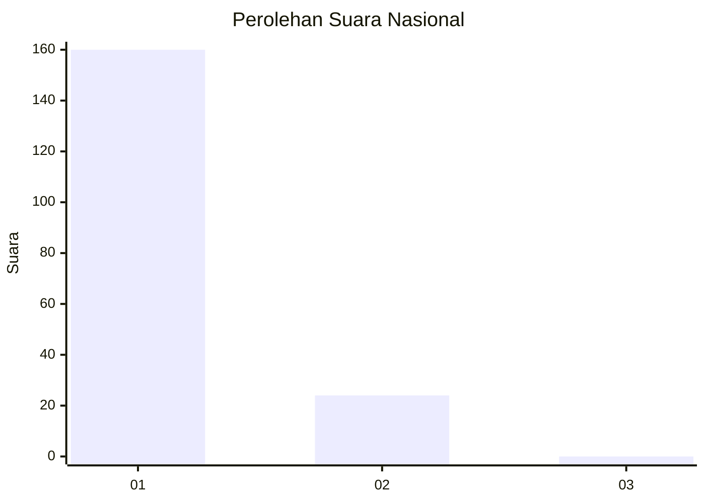
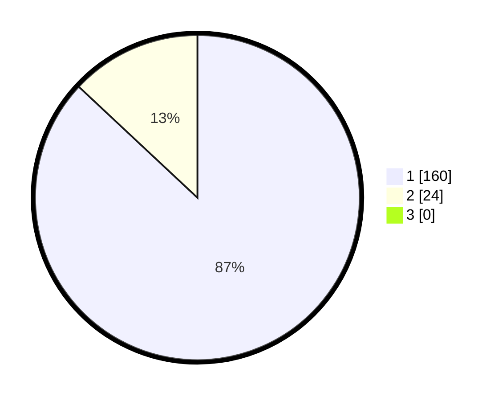

# Hasil

## Grafik

## Tabel

| No. | Nama Paslon    | Suara | Suara (raw) | Persentase |
|:--- |:-------------- | -----:| -----------:| ----------:|
| 1   | ANIES MUHAIMIN | 160   | [160][p-1]  | 86,96      |
| 2   | PRABOWO GIBRAN | 24    | [24][p-2]   | 13,04      |
| 3   | GANJAR MAHFUD  | 0     | [0][p-3]    | 0,00       |

[p-1]: https://github.com/gigit-pemilu/pemilu-2024/blob/main/pilpres/hitung-suara/sub/11-aceh/sub/03-aceh-timur/sub/11-pante-bidari/sub/2010-meunasah-tunong/sub/002-tps/sub/paslon-1.txt
[p-2]: https://github.com/gigit-pemilu/pemilu-2024/blob/main/pilpres/hitung-suara/sub/11-aceh/sub/03-aceh-timur/sub/11-pante-bidari/sub/2010-meunasah-tunong/sub/002-tps/sub/paslon-2.txt
[p-3]: https://github.com/gigit-pemilu/pemilu-2024/blob/main/pilpres/hitung-suara/sub/11-aceh/sub/03-aceh-timur/sub/11-pante-bidari/sub/2010-meunasah-tunong/sub/002-tps/sub/paslon-3.txt

## Foto C Plano

https://sirekap-obj-formc.kpu.go.id/00cb/pemilu/ppwp/11/03/11/20/10/1103112010002-20240215-034915--53654f1a-8c08-4d59-a9cf-aa648318c0ea.jpg

https://sirekap-obj-formc.kpu.go.id/00cb/pemilu/ppwp/11/03/11/20/10/1103112010002-20240215-033453--10dca9ca-946c-4865-9ab1-0e54e5416e5e.jpg

https://sirekap-obj-formc.kpu.go.id/00cb/pemilu/ppwp/11/03/11/20/10/1103112010002-20240215-033916--beb2e098-796e-48d7-9ab8-2856a538fb4e.jpg

## Metadata

| Key        | Value               |
| ---------- | ------------------- |
| Time Stamp | 2024-02-24 22:31:28 |

