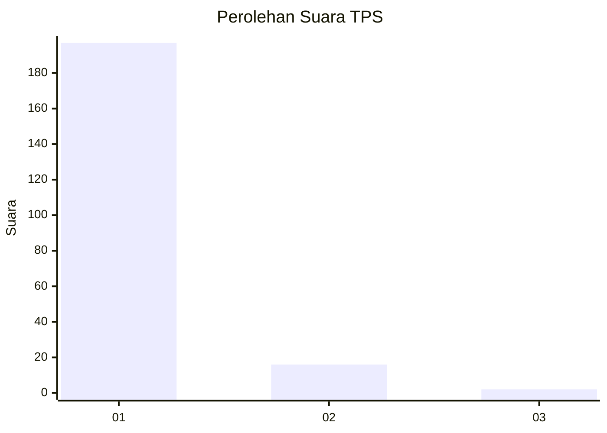
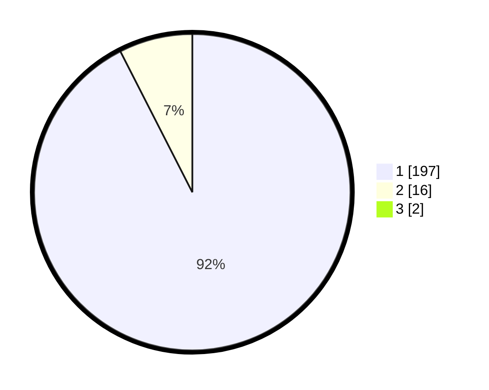

# Hasil

## Grafik

## Tabel

| No. | Nama Paslon    | Suara | Suara (raw) | Persentase |
|:--- |:-------------- | -----:| -----------:| ----------:|
| 1   | ANIES MUHAIMIN | 197   | [197][p-1]  | 91,63      |
| 2   | PRABOWO GIBRAN | 16    | [16][p-2]   | 7,44       |
| 3   | GANJAR MAHFUD  | 2     | [2][p-3]    | 0,93       |

[p-1]: https://github.com/gigit-pemilu/pemilu-2024-11-aceh/blob/main/pilpres/hitung-suara/sub/11-aceh/sub/03-aceh-timur/sub/11-pante-bidari/sub/2011-meunasah-teungoh/sub/003-tps/sub/paslon-1.txt
[p-2]: https://github.com/gigit-pemilu/pemilu-2024-11-aceh/blob/main/pilpres/hitung-suara/sub/11-aceh/sub/03-aceh-timur/sub/11-pante-bidari/sub/2011-meunasah-teungoh/sub/003-tps/sub/paslon-2.txt
[p-3]: https://github.com/gigit-pemilu/pemilu-2024-11-aceh/blob/main/pilpres/hitung-suara/sub/11-aceh/sub/03-aceh-timur/sub/11-pante-bidari/sub/2011-meunasah-teungoh/sub/003-tps/sub/paslon-3.txt

## Foto C Plano

https://sirekap-obj-formc.kpu.go.id/513f/pemilu/ppwp/11/03/11/20/11/1103112011003-20240215-105402--21f88617-bf48-4cf0-9ef1-0bd63617178b.jpg

https://sirekap-obj-formc.kpu.go.id/513f/pemilu/ppwp/11/03/11/20/11/1103112011003-20240215-105629--cccf97f7-5ea1-4c7b-9cf8-56b6595f5bf8.jpg

https://sirekap-obj-formc.kpu.go.id/513f/pemilu/ppwp/11/03/11/20/11/1103112011003-20240215-105944--b4a6a3e1-cd86-42e9-b445-9de228ddd513.jpg

## Metadata

| Key        | Value               |
| ---------- | ------------------- |
| Time Stamp | 2024-02-24 22:31:28 |

