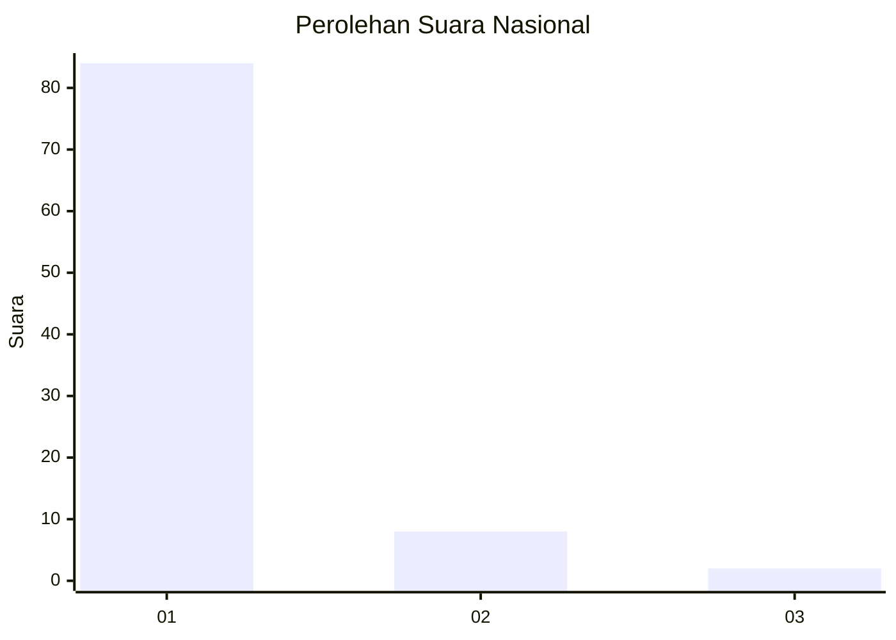
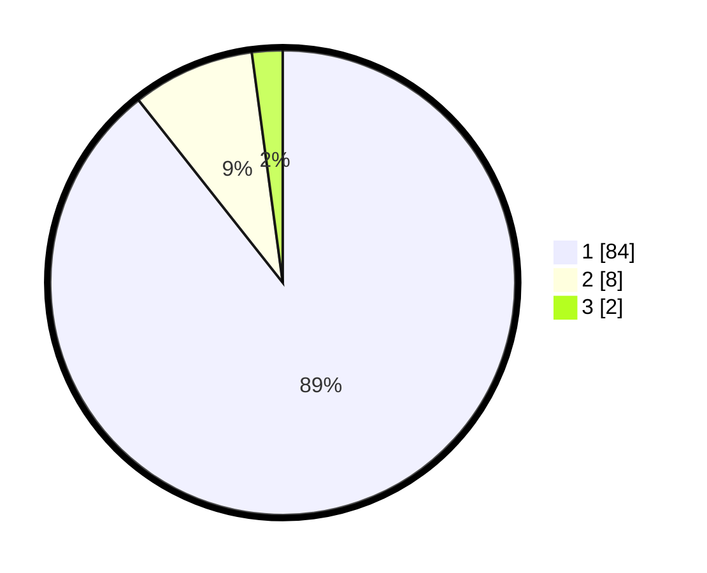

# Hasil

## Grafik

## Tabel

| No. | Nama Paslon    | Suara | Suara (raw) | Persentase |
|:--- |:-------------- | -----:| -----------:| ----------:|
| 1   | ANIES MUHAIMIN | 84    | [84][p-1]   | 89,36      |
| 2   | PRABOWO GIBRAN | 8     | [8][p-2]    | 8,51       |
| 3   | GANJAR MAHFUD  | 2     | [2][p-3]    | 2,13       |

[p-1]: https://github.com/gigit-pemilu/pemilu-2024/blob/main/pilpres/hitung-suara/sub/11-aceh/sub/03-aceh-timur/sub/11-pante-bidari/sub/2011-meunasah-teungoh/sub/005-tps/sub/paslon-1.txt
[p-2]: https://github.com/gigit-pemilu/pemilu-2024/blob/main/pilpres/hitung-suara/sub/11-aceh/sub/03-aceh-timur/sub/11-pante-bidari/sub/2011-meunasah-teungoh/sub/005-tps/sub/paslon-2.txt
[p-3]: https://github.com/gigit-pemilu/pemilu-2024/blob/main/pilpres/hitung-suara/sub/11-aceh/sub/03-aceh-timur/sub/11-pante-bidari/sub/2011-meunasah-teungoh/sub/005-tps/sub/paslon-3.txt

## Foto C Plano

https://sirekap-obj-formc.kpu.go.id/b1db/pemilu/ppwp/11/03/11/20/11/1103112011005-20240215-002205--4e0ab277-c64e-4c24-a356-9a82cf409f19.jpg

https://sirekap-obj-formc.kpu.go.id/b1db/pemilu/ppwp/11/03/11/20/11/1103112011005-20240215-081314--cb8895db-3e00-4d91-865f-566cb56897d2.jpg

https://sirekap-obj-formc.kpu.go.id/b1db/pemilu/ppwp/11/03/11/20/11/1103112011005-20240215-080238--1f6b3560-1f2d-49e9-90a9-4881489c4c2a.jpg

## Metadata

| Key        | Value               |
| ---------- | ------------------- |
| Time Stamp | 2024-02-25 16:00:00 |

