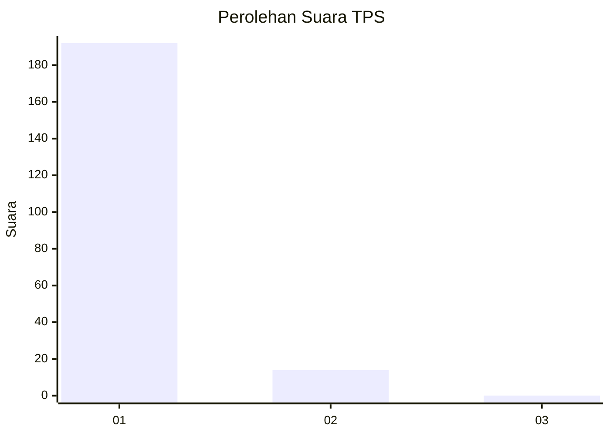
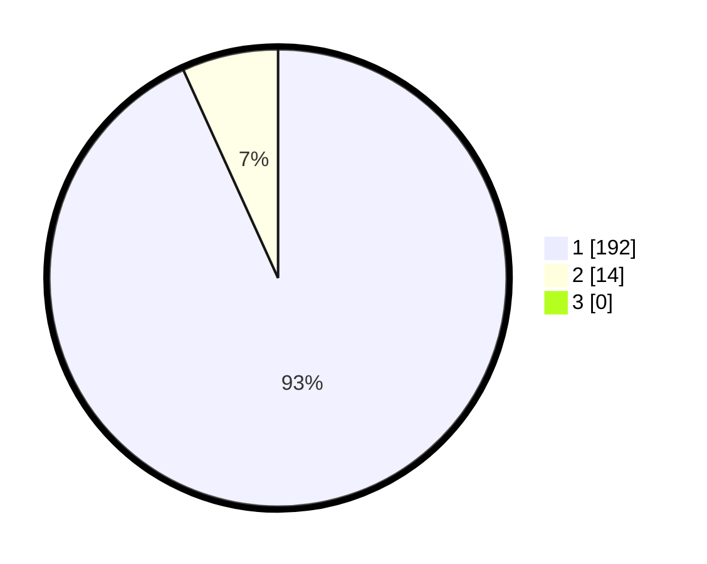

# Hasil

## Grafik

## Tabel

| No. | Nama Paslon    | Suara | Suara (raw) | Persentase |
|:--- |:-------------- | -----:| -----------:| ----------:|
| 1   | ANIES MUHAIMIN | 192   | [192][p-1]  | 93,20      |
| 2   | PRABOWO GIBRAN | 14    | [14][p-2]   | 6,80       |
| 3   | GANJAR MAHFUD  | 0     | [0][p-3]    | 0,00       |

[p-1]: https://github.com/gigit-pemilu/pemilu-2024-11-aceh/blob/main/pilpres/hitung-suara/sub/11-aceh/sub/03-aceh-timur/sub/11-pante-bidari/sub/2013-matang-perlak/sub/002-tps/sub/paslon-1.txt
[p-2]: https://github.com/gigit-pemilu/pemilu-2024-11-aceh/blob/main/pilpres/hitung-suara/sub/11-aceh/sub/03-aceh-timur/sub/11-pante-bidari/sub/2013-matang-perlak/sub/002-tps/sub/paslon-2.txt
[p-3]: https://github.com/gigit-pemilu/pemilu-2024-11-aceh/blob/main/pilpres/hitung-suara/sub/11-aceh/sub/03-aceh-timur/sub/11-pante-bidari/sub/2013-matang-perlak/sub/002-tps/sub/paslon-3.txt

## Foto C Plano

https://sirekap-obj-formc.kpu.go.id/025b/pemilu/ppwp/11/03/11/20/13/1103112013002-20240215-001609--eeff2124-6dbc-4c16-93aa-00b5d906bdbf.jpg

https://sirekap-obj-formc.kpu.go.id/025b/pemilu/ppwp/11/03/11/20/13/1103112013002-20240215-001856--0016d5d0-1e78-44cb-8a53-533ee246d018.jpg

https://sirekap-obj-formc.kpu.go.id/025b/pemilu/ppwp/11/03/11/20/13/1103112013002-20240215-002033--ed4a8da8-0bc4-40e0-8d35-d54a04eb5272.jpg

## Metadata

| Key        | Value               |
| ---------- | ------------------- |
| Time Stamp | 2024-02-24 22:31:28 |

