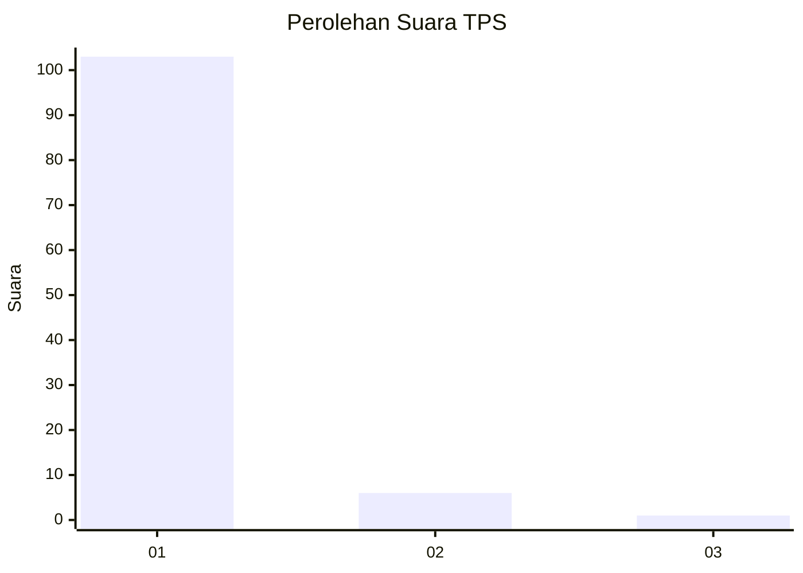
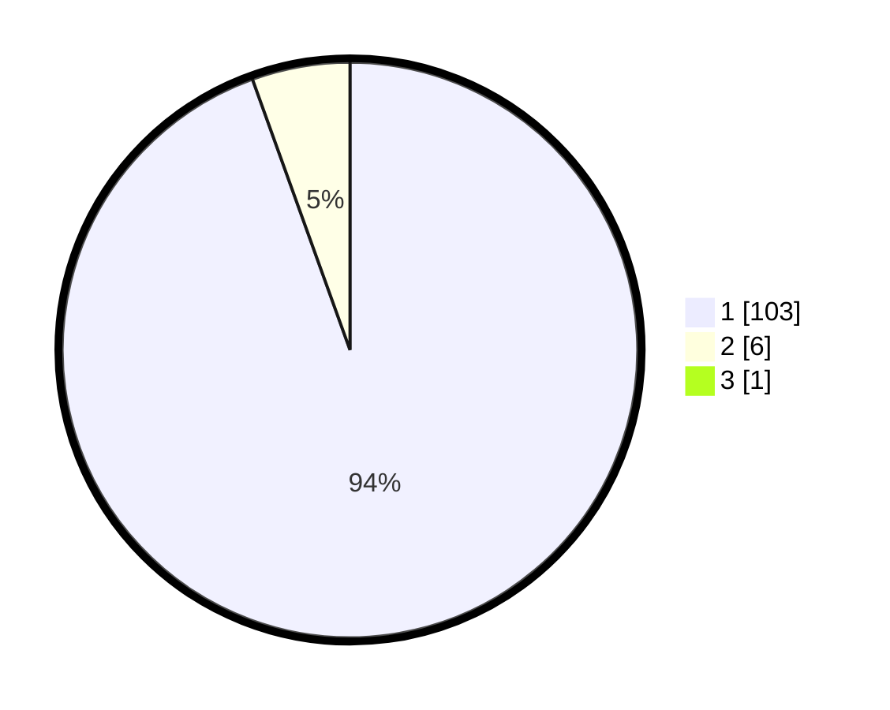

# Hasil

## Grafik

## Tabel

| No. | Nama Paslon    | Suara | Suara (raw) | Persentase |
|:--- |:-------------- | -----:| -----------:| ----------:|
| 1   | ANIES MUHAIMIN | 103   | [103][p-1]  | 93,64      |
| 2   | PRABOWO GIBRAN | 6     | [6][p-2]    | 5,45       |
| 3   | GANJAR MAHFUD  | 1     | [1][p-3]    | 0,91       |

[p-1]: https://github.com/gigit-pemilu/pemilu-2024-11-aceh/blob/main/pilpres/hitung-suara/sub/11-aceh/sub/03-aceh-timur/sub/11-pante-bidari/sub/2015-matang-kruet/sub/003-tps/sub/paslon-1.txt
[p-2]: https://github.com/gigit-pemilu/pemilu-2024-11-aceh/blob/main/pilpres/hitung-suara/sub/11-aceh/sub/03-aceh-timur/sub/11-pante-bidari/sub/2015-matang-kruet/sub/003-tps/sub/paslon-2.txt
[p-3]: https://github.com/gigit-pemilu/pemilu-2024-11-aceh/blob/main/pilpres/hitung-suara/sub/11-aceh/sub/03-aceh-timur/sub/11-pante-bidari/sub/2015-matang-kruet/sub/003-tps/sub/paslon-3.txt

## Foto C Plano

https://sirekap-obj-formc.kpu.go.id/1ecb/pemilu/ppwp/11/03/11/20/15/1103112015003-20240216-145559--2dd9e988-1630-4598-a45c-7b9f4249b7cd.jpg

https://sirekap-obj-formc.kpu.go.id/1ecb/pemilu/ppwp/11/03/11/20/15/1103112015003-20240216-145600--781dda72-fa5c-4e3b-8d68-cbed216b0073.jpg

https://sirekap-obj-formc.kpu.go.id/1ecb/pemilu/ppwp/11/03/11/20/15/1103112015003-20240216-145559--454d197c-80cb-427c-8dff-a1fa2c3f945d.jpg

## Metadata

| Key        | Value               |
| ---------- | ------------------- |
| Time Stamp | 2024-02-19 09:00:00 |

## DATA PEMILIH TETAP

Jumlah pemilih dalam DPT: **163**.
 * L: **67**.
 * P: **96**.

## DATA PENGGUNA HAK PILIH

Jumlah pengguna hak pilih dalam DPT: **106**.
 * L: **46**.
 * P: **60**.

Jumlah pengguna hak pilih dalam DPTb: **4**.
 * L: **2**.
 * P: **2**.

Jumlah pengguna hak pilih dalam DPK: **2**.
 * L: **1**.
 * P: **1**.

Jumlah pengguna hak pilih: **112**.
 * L: **49**.
 * P: **63**.

## JUMLAH SUARA SAH DAN TIDAK SAH

JUMLAH SELURUH SUARA SAH: **110**.

JUMLAH SUARA TIDAK SAH: **2**.

JUMLAH SELURUH SUARA SAH DAN SUARA TIDAK SAH: **112**.

