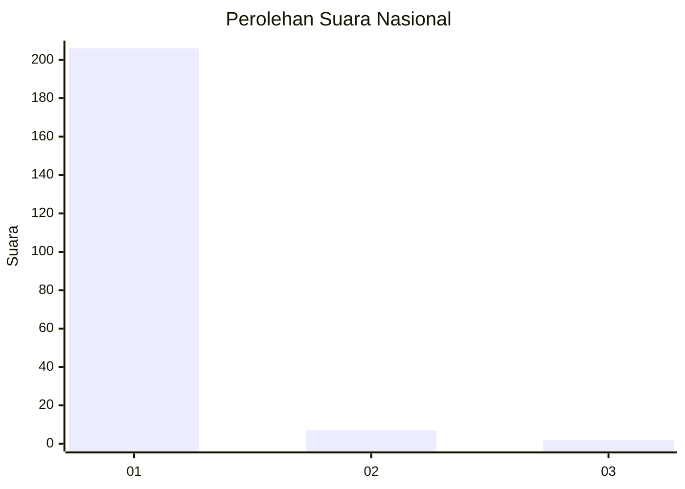
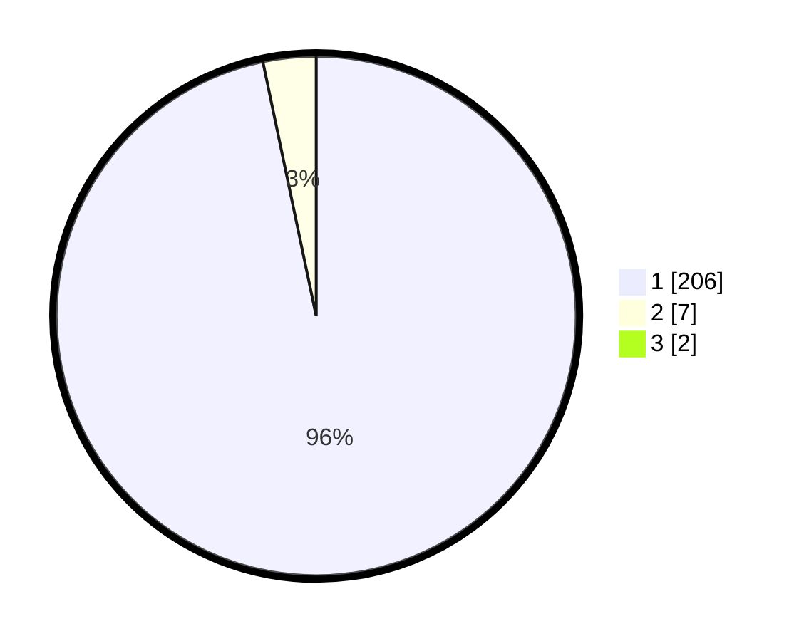

# Hasil

## Grafik

## Tabel

| No. | Nama Paslon    | Suara | Suara (raw) | Persentase |
|:--- |:-------------- | -----:| -----------:| ----------:|
| 1   | ANIES MUHAIMIN | 206   | [206][p-1]  | 95,81      |
| 2   | PRABOWO GIBRAN | 7     | [7][p-2]    | 3,26       |
| 3   | GANJAR MAHFUD  | 2     | [2][p-3]    | 0,93       |

[p-1]: https://github.com/gigit-pemilu/pemilu-2024/blob/main/pilpres/hitung-suara/sub/11-aceh/sub/03-aceh-timur/sub/11-pante-bidari/sub/2018-paya-demam-sa/sub/005-tps/sub/paslon-1.txt
[p-2]: https://github.com/gigit-pemilu/pemilu-2024/blob/main/pilpres/hitung-suara/sub/11-aceh/sub/03-aceh-timur/sub/11-pante-bidari/sub/2018-paya-demam-sa/sub/005-tps/sub/paslon-2.txt
[p-3]: https://github.com/gigit-pemilu/pemilu-2024/blob/main/pilpres/hitung-suara/sub/11-aceh/sub/03-aceh-timur/sub/11-pante-bidari/sub/2018-paya-demam-sa/sub/005-tps/sub/paslon-3.txt

## Foto C Plano

https://sirekap-obj-formc.kpu.go.id/0c29/pemilu/ppwp/11/03/11/20/18/1103112018005-20240214-222219--3bec1a3d-2101-4663-a543-4110b6c419e2.jpg

https://sirekap-obj-formc.kpu.go.id/0c29/pemilu/ppwp/11/03/11/20/18/1103112018005-20240214-222238--0c10ba32-ea80-40a8-ad7e-a44fe3dd423d.jpg

https://sirekap-obj-formc.kpu.go.id/0c29/pemilu/ppwp/11/03/11/20/18/1103112018005-20240214-222301--afc47edb-7e9e-455c-b4e1-929f2bf115c1.jpg

## Metadata

| Key        | Value               |
| ---------- | ------------------- |
| Time Stamp | 2024-02-15 15:00:29 |

