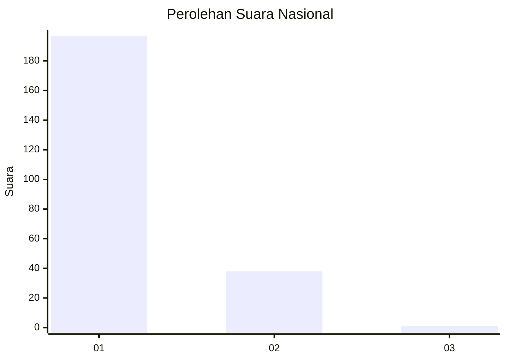
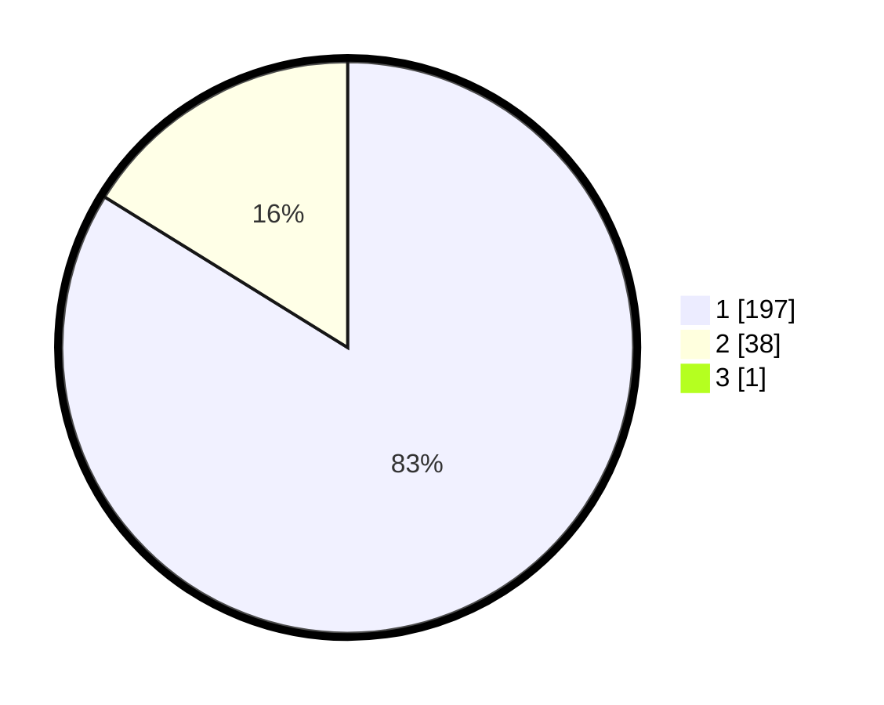

# Hasil

## Grafik

## Tabel

| No. | Nama Paslon    | Suara | Suara (raw) | Persentase |
|:--- |:-------------- | -----:| -----------:| ----------:|
| 1   | ANIES MUHAIMIN | 197   | [197][p-1]  | 83,47      |
| 2   | PRABOWO GIBRAN | 38    | [38][p-2]   | 16,10      |
| 3   | GANJAR MAHFUD  | 1     | [1][p-3]    | 0,42       |

[p-1]: https://github.com/gigit-pemilu/pemilu-2024/blob/main/pilpres/hitung-suara/sub/11-aceh/sub/03-aceh-timur/sub/11-pante-bidari/sub/2022-putoh-sa/sub/003-tps/sub/paslon-1.txt
[p-2]: https://github.com/gigit-pemilu/pemilu-2024/blob/main/pilpres/hitung-suara/sub/11-aceh/sub/03-aceh-timur/sub/11-pante-bidari/sub/2022-putoh-sa/sub/003-tps/sub/paslon-2.txt
[p-3]: https://github.com/gigit-pemilu/pemilu-2024/blob/main/pilpres/hitung-suara/sub/11-aceh/sub/03-aceh-timur/sub/11-pante-bidari/sub/2022-putoh-sa/sub/003-tps/sub/paslon-3.txt

## Foto C Plano

https://sirekap-obj-formc.kpu.go.id/2906/pemilu/ppwp/11/03/11/20/22/1103112022003-20240214-191945--67527708-d6b0-4e1a-9f03-ac2896799453.jpg

https://sirekap-obj-formc.kpu.go.id/2906/pemilu/ppwp/11/03/11/20/22/1103112022003-20240214-191924--2226b566-b2ac-4432-9207-0c68bb0b2a93.jpg

https://sirekap-obj-formc.kpu.go.id/2906/pemilu/ppwp/11/03/11/20/22/1103112022003-20240214-192010--f2c60c24-6125-400a-97a7-a2a8ca738aa3.jpg

## Metadata

| Key        | Value               |
| ---------- | ------------------- |
| Time Stamp | 2024-02-25 14:00:00 |

