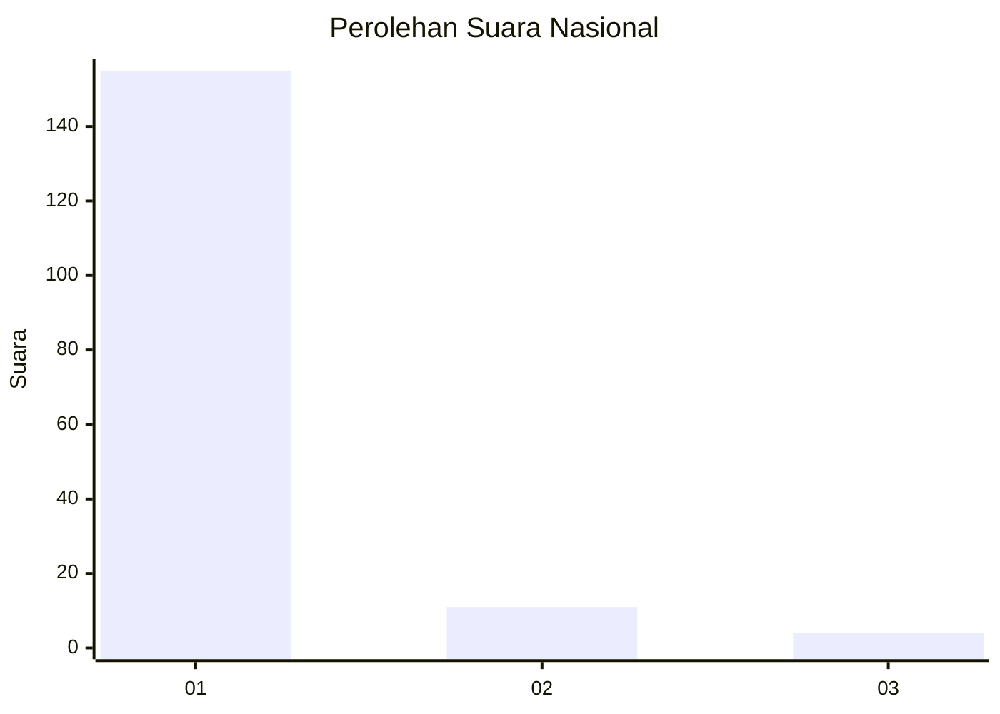
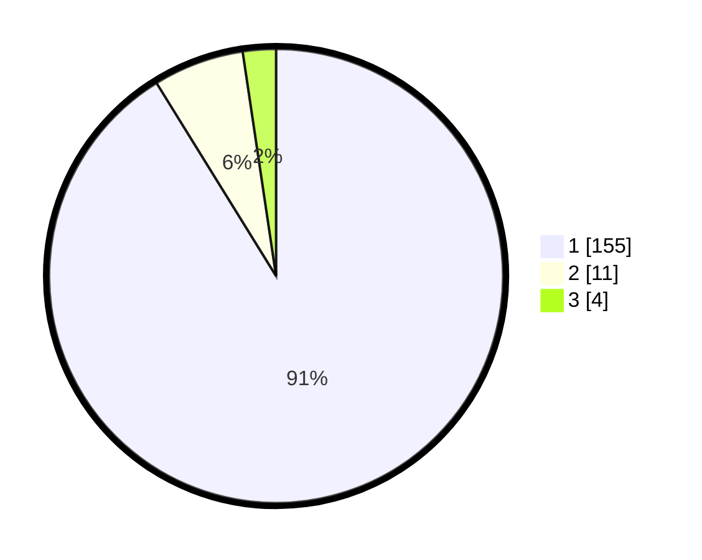

# Hasil

## Grafik

## Tabel

| No. | Nama Paslon    | Suara | Suara (raw) | Persentase |
|:--- |:-------------- | -----:| -----------:| ----------:|
| 1   | ANIES MUHAIMIN | 155   | [155][p-1]  | 91,18      |
| 2   | PRABOWO GIBRAN | 11    | [11][p-2]   | 6,47       |
| 3   | GANJAR MAHFUD  | 4     | [4][p-3]    | 2,35       |

[p-1]: https://github.com/gigit-pemilu/pemilu-2024/blob/main/pilpres/hitung-suara/sub/11-aceh/sub/03-aceh-timur/sub/11-pante-bidari/sub/2024-sah-raja/sub/001-tps/sub/paslon-1.txt
[p-2]: https://github.com/gigit-pemilu/pemilu-2024/blob/main/pilpres/hitung-suara/sub/11-aceh/sub/03-aceh-timur/sub/11-pante-bidari/sub/2024-sah-raja/sub/001-tps/sub/paslon-2.txt
[p-3]: https://github.com/gigit-pemilu/pemilu-2024/blob/main/pilpres/hitung-suara/sub/11-aceh/sub/03-aceh-timur/sub/11-pante-bidari/sub/2024-sah-raja/sub/001-tps/sub/paslon-3.txt

## Foto C Plano

https://sirekap-obj-formc.kpu.go.id/94b8/pemilu/ppwp/11/03/11/20/24/1103112024001-20240218-234233--4ee7c54d-cbdf-4f76-8c97-ed9e7f7852a7.jpg

https://sirekap-obj-formc.kpu.go.id/94b8/pemilu/ppwp/11/03/11/20/24/1103112024001-20240218-234234--cfeb85f9-d070-4080-a2d4-9361854387be.jpg

https://sirekap-obj-formc.kpu.go.id/94b8/pemilu/ppwp/11/03/11/20/24/1103112024001-20240218-234233--f538a76e-792c-4ae1-8129-9876c7f69763.jpg

## Metadata

| Key        | Value               |
| ---------- | ------------------- |
| Time Stamp | 2024-02-19 09:00:00 |

## DATA PEMILIH TETAP

Jumlah pemilih dalam DPT: **229**.
 * L: **135**.
 * P: **94**.

## DATA PENGGUNA HAK PILIH

Jumlah pengguna hak pilih dalam DPT: **152**.
 * L: **66**.
 * P: **86**.

Jumlah pengguna hak pilih dalam DPTb: **0**.
 * L: **0**.
 * P: **0**.

Jumlah pengguna hak pilih dalam DPK: **20**.
 * L: **5**.
 * P: **15**.

Jumlah pengguna hak pilih: **172**.
 * L: **71**.
 * P: **101**.

## JUMLAH SUARA SAH DAN TIDAK SAH

JUMLAH SELURUH SUARA SAH: **170**.

JUMLAH SUARA TIDAK SAH: **2**.

JUMLAH SELURUH SUARA SAH DAN SUARA TIDAK SAH: **172**.

