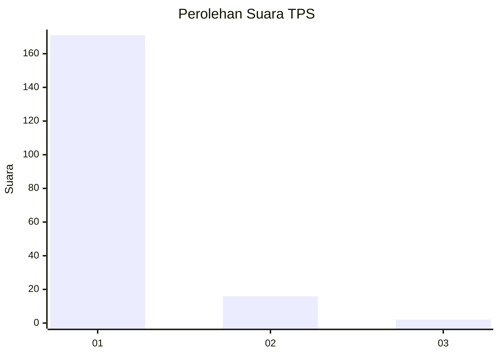
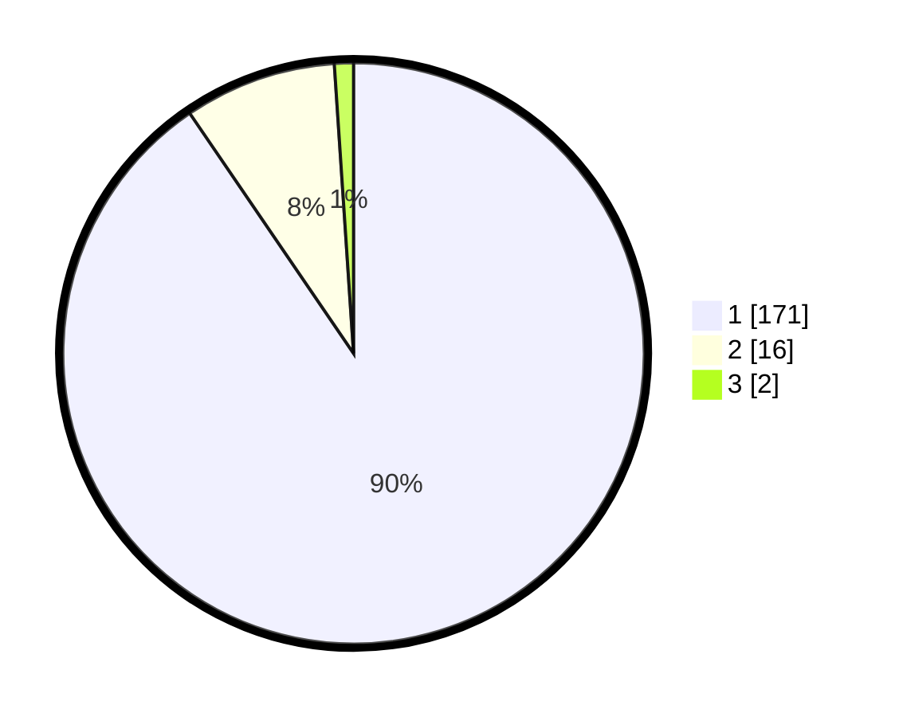

# Hasil

## Grafik

## Tabel

| No. | Nama Paslon    | Suara | Suara (raw) | Persentase |
|:--- |:-------------- | -----:| -----------:| ----------:|
| 1   | ANIES MUHAIMIN | 171   | [171][p-1]  | 90,48      |
| 2   | PRABOWO GIBRAN | 16    | [16][p-2]   | 8,47       |
| 3   | GANJAR MAHFUD  | 2     | [2][p-3]    | 1,06       |

[p-1]: https://github.com/gigit-pemilu/pemilu-2024-11-aceh/blob/main/pilpres/hitung-suara/sub/11-aceh/sub/03-aceh-timur/sub/12-madat/sub/2001-madat/sub/001-tps/sub/paslon-1.txt
[p-2]: https://github.com/gigit-pemilu/pemilu-2024-11-aceh/blob/main/pilpres/hitung-suara/sub/11-aceh/sub/03-aceh-timur/sub/12-madat/sub/2001-madat/sub/001-tps/sub/paslon-2.txt
[p-3]: https://github.com/gigit-pemilu/pemilu-2024-11-aceh/blob/main/pilpres/hitung-suara/sub/11-aceh/sub/03-aceh-timur/sub/12-madat/sub/2001-madat/sub/001-tps/sub/paslon-3.txt

## Foto C Plano

https://sirekap-obj-formc.kpu.go.id/0538/pemilu/ppwp/11/03/12/20/01/1103122001001-20240214-212546--8ed2d776-ca1b-45a4-ab0e-a234434b9782.jpg

https://sirekap-obj-formc.kpu.go.id/0538/pemilu/ppwp/11/03/12/20/01/1103122001001-20240214-191340--340f1a93-01b5-41d6-8c6a-83e339e4372f.jpg

https://sirekap-obj-formc.kpu.go.id/0538/pemilu/ppwp/11/03/12/20/01/1103122001001-20240214-200705--75d23377-b2ac-412a-a798-bbf53a1536e8.jpg

## Metadata

| Key        | Value               |
| ---------- | ------------------- |
| Time Stamp | 2024-02-15 00:41:44 |

