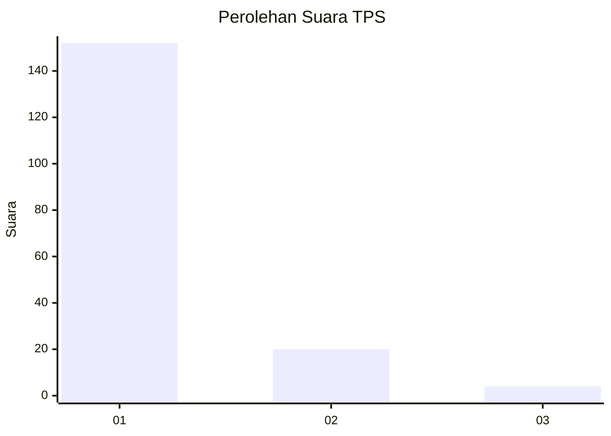
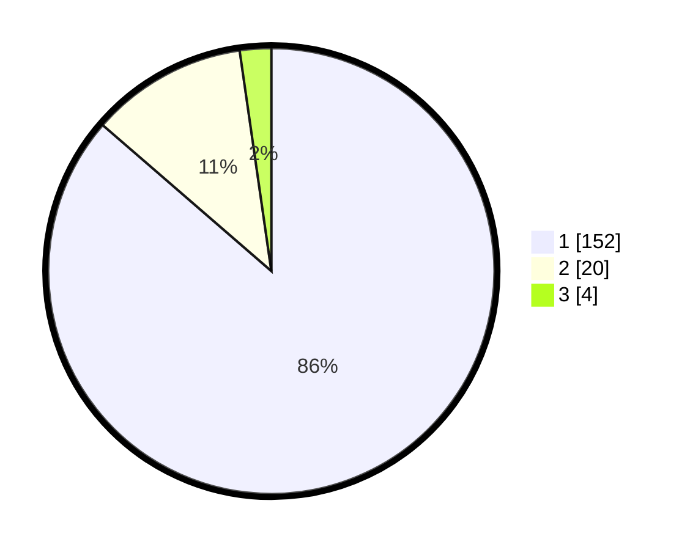

# Hasil

## Grafik

## Tabel

| No. | Nama Paslon    | Suara | Suara (raw) | Persentase |
|:--- |:-------------- | -----:| -----------:| ----------:|
| 1   | ANIES MUHAIMIN | 152   | [152][p-1]  | 86,36      |
| 2   | PRABOWO GIBRAN | 20    | [20][p-2]   | 11,36      |
| 3   | GANJAR MAHFUD  | 4     | [4][p-3]    | 2,27       |

[p-1]: https://github.com/gigit-pemilu/pemilu-2024-11-aceh/blob/main/pilpres/hitung-suara/sub/11-aceh/sub/03-aceh-timur/sub/12-madat/sub/2001-madat/sub/004-tps/sub/paslon-1.txt
[p-2]: https://github.com/gigit-pemilu/pemilu-2024-11-aceh/blob/main/pilpres/hitung-suara/sub/11-aceh/sub/03-aceh-timur/sub/12-madat/sub/2001-madat/sub/004-tps/sub/paslon-2.txt
[p-3]: https://github.com/gigit-pemilu/pemilu-2024-11-aceh/blob/main/pilpres/hitung-suara/sub/11-aceh/sub/03-aceh-timur/sub/12-madat/sub/2001-madat/sub/004-tps/sub/paslon-3.txt

## Foto C Plano

https://sirekap-obj-formc.kpu.go.id/a95f/pemilu/ppwp/11/03/12/20/01/1103122001004-20240215-014309--356a4f3c-57d1-459f-84e0-472381eb4e92.jpg

https://sirekap-obj-formc.kpu.go.id/a95f/pemilu/ppwp/11/03/12/20/01/1103122001004-20240215-014615--723cffdc-576c-4a04-9aae-49facccee192.jpg

https://sirekap-obj-formc.kpu.go.id/a95f/pemilu/ppwp/11/03/12/20/01/1103122001004-20240215-014518--90a89fc7-6a21-46ab-b19e-3ef97be1b737.jpg

## Metadata

| Key        | Value               |
| ---------- | ------------------- |
| Time Stamp | 2024-02-24 22:31:28 |

