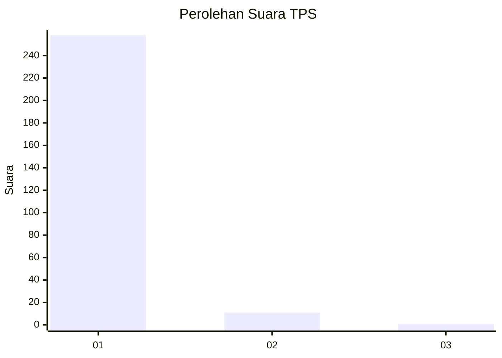
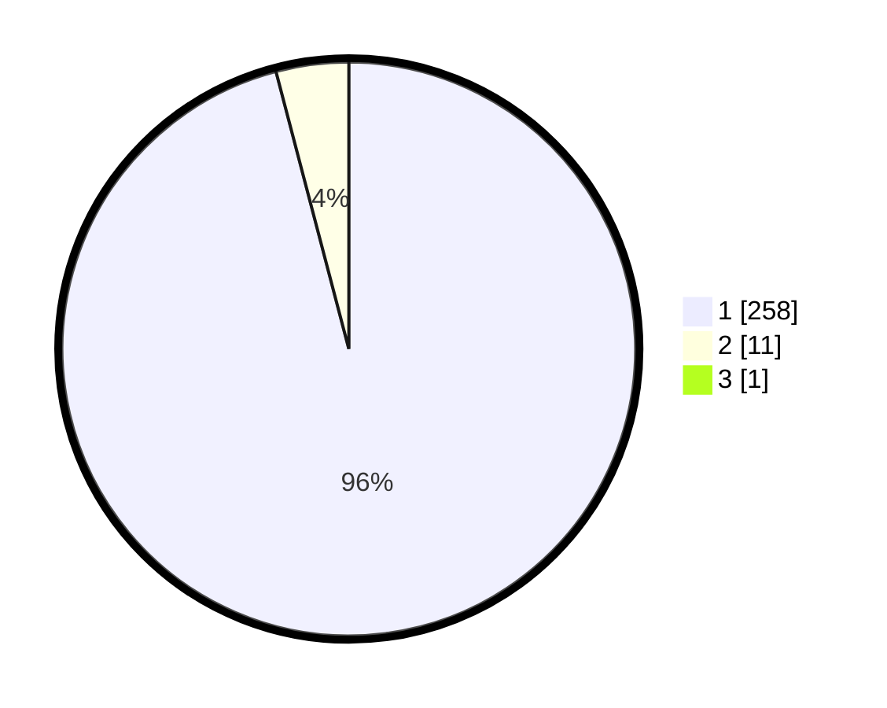

# Hasil

## Grafik

## Tabel

| No. | Nama Paslon    | Suara | Suara (raw) | Persentase |
|:--- |:-------------- | -----:| -----------:| ----------:|
| 1   | ANIES MUHAIMIN | 258   | [258][p-1]  | 95,56      |
| 2   | PRABOWO GIBRAN | 11    | [11][p-2]   | 4,07       |
| 3   | GANJAR MAHFUD  | 1     | [1][p-3]    | 0,37       |

[p-1]: https://github.com/gigit-pemilu/pemilu-2024-11-aceh/blob/main/pilpres/hitung-suara/sub/11-aceh/sub/03-aceh-timur/sub/12-madat/sub/2002-matang-keupula-sa/sub/002-tps/sub/paslon-1.txt
[p-2]: https://github.com/gigit-pemilu/pemilu-2024-11-aceh/blob/main/pilpres/hitung-suara/sub/11-aceh/sub/03-aceh-timur/sub/12-madat/sub/2002-matang-keupula-sa/sub/002-tps/sub/paslon-2.txt
[p-3]: https://github.com/gigit-pemilu/pemilu-2024-11-aceh/blob/main/pilpres/hitung-suara/sub/11-aceh/sub/03-aceh-timur/sub/12-madat/sub/2002-matang-keupula-sa/sub/002-tps/sub/paslon-3.txt

## Foto C Plano

https://sirekap-obj-formc.kpu.go.id/2ae3/pemilu/ppwp/11/03/12/20/02/1103122002002-20240214-205929--95ddf5e3-fd1a-4073-a03c-8909b59be469.jpg

https://sirekap-obj-formc.kpu.go.id/2ae3/pemilu/ppwp/11/03/12/20/02/1103122002002-20240214-231013--a0491d3e-0a5c-4fc5-809a-54c8ee76d1ad.jpg

https://sirekap-obj-formc.kpu.go.id/2ae3/pemilu/ppwp/11/03/12/20/02/1103122002002-20240214-212459--c60197db-48f0-4454-b036-372cae2d2bfe.jpg

## Metadata

| Key        | Value               |
| ---------- | ------------------- |
| Time Stamp | 2024-02-19 12:00:00 |

## DATA PEMILIH TETAP

Jumlah pemilih dalam DPT: **280**.
 * L: **136**.
 * P: **144**.

## DATA PENGGUNA HAK PILIH

Jumlah pengguna hak pilih dalam DPT: **270**.
 * L: **130**.
 * P: **140**.

Jumlah pengguna hak pilih dalam DPTb: **0**.
 * L: **0**.
 * P: **0**.

Jumlah pengguna hak pilih dalam DPK: **2**.
 * L: **1**.
 * P: **1**.

Jumlah pengguna hak pilih: **272**.
 * L: **131**.
 * P: **141**.

## JUMLAH SUARA SAH DAN TIDAK SAH

JUMLAH SELURUH SUARA SAH: **270**.

JUMLAH SUARA TIDAK SAH: **2**.

JUMLAH SELURUH SUARA SAH DAN SUARA TIDAK SAH: **272**.

