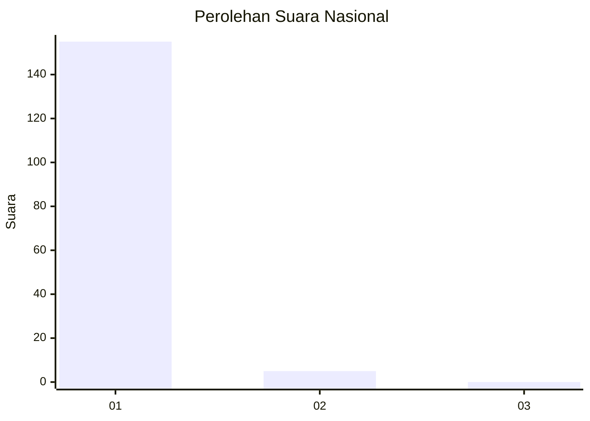
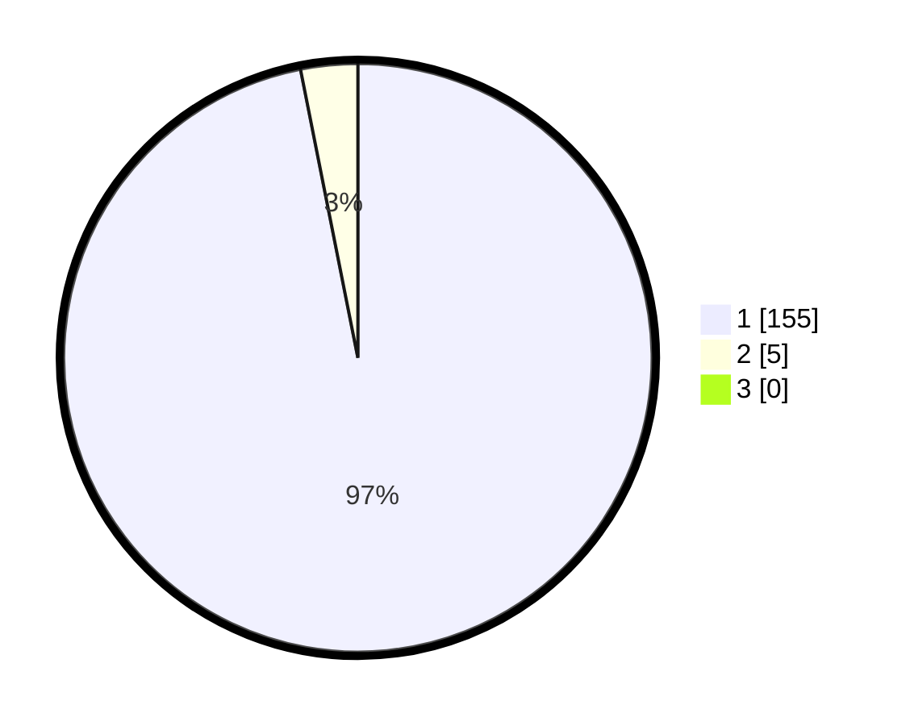

# Hasil

## Grafik

## Tabel

| No. | Nama Paslon    | Suara | Suara (raw) | Persentase |
|:--- |:-------------- | -----:| -----------:| ----------:|
| 1   | ANIES MUHAIMIN | 155   | [155][p-1]  | 96,88      |
| 2   | PRABOWO GIBRAN | 5     | [5][p-2]    | 3,13       |
| 3   | GANJAR MAHFUD  | 0     | [0][p-3]    | 0,00       |

[p-1]: https://github.com/gigit-pemilu/pemilu-2024/blob/main/pilpres/hitung-suara/sub/11-aceh/sub/03-aceh-timur/sub/12-madat/sub/2003-matang-keupula-dua/sub/002-tps/sub/paslon-1.txt
[p-2]: https://github.com/gigit-pemilu/pemilu-2024/blob/main/pilpres/hitung-suara/sub/11-aceh/sub/03-aceh-timur/sub/12-madat/sub/2003-matang-keupula-dua/sub/002-tps/sub/paslon-2.txt
[p-3]: https://github.com/gigit-pemilu/pemilu-2024/blob/main/pilpres/hitung-suara/sub/11-aceh/sub/03-aceh-timur/sub/12-madat/sub/2003-matang-keupula-dua/sub/002-tps/sub/paslon-3.txt

## Foto C Plano

https://sirekap-obj-formc.kpu.go.id/b438/pemilu/ppwp/11/03/12/20/03/1103122003002-20240215-074043--b43c887a-9e27-460e-8e23-8dee535f76dc.jpg

https://sirekap-obj-formc.kpu.go.id/b438/pemilu/ppwp/11/03/12/20/03/1103122003002-20240223-204626--38f25cc2-673b-4166-b37e-c3d19c8392b6.jpg

https://sirekap-obj-formc.kpu.go.id/b438/pemilu/ppwp/11/03/12/20/03/1103122003002-20240223-210408--0e3a1d19-8603-4d52-bf7a-0dcba3127c8b.jpg

## Metadata

| Key        | Value               |
| ---------- | ------------------- |
| Time Stamp | 2024-02-24 22:31:28 |

