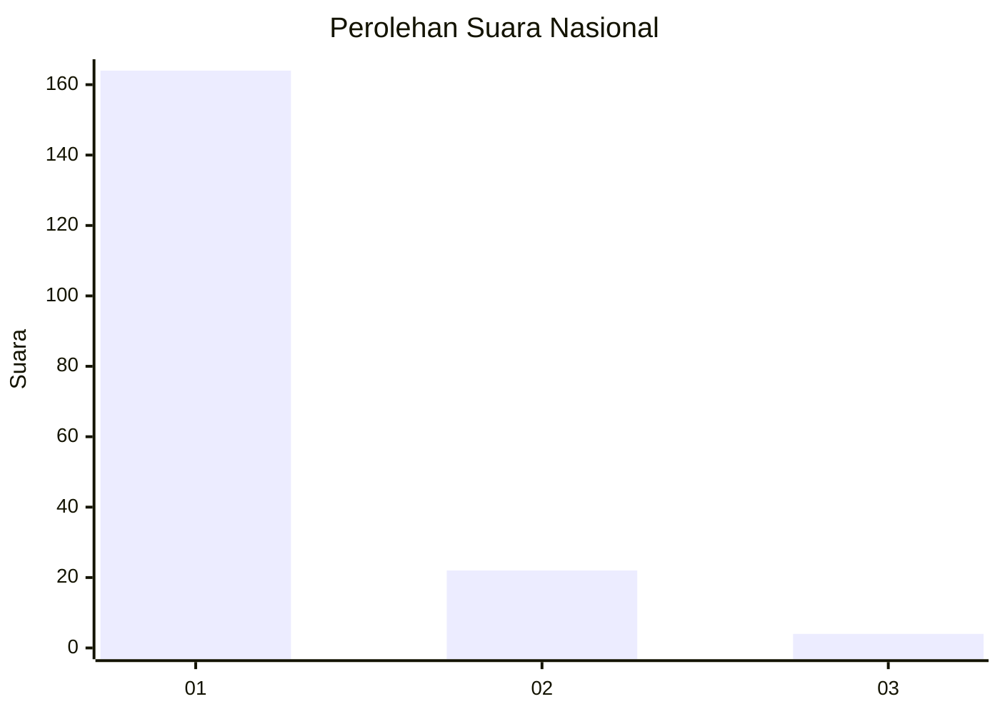
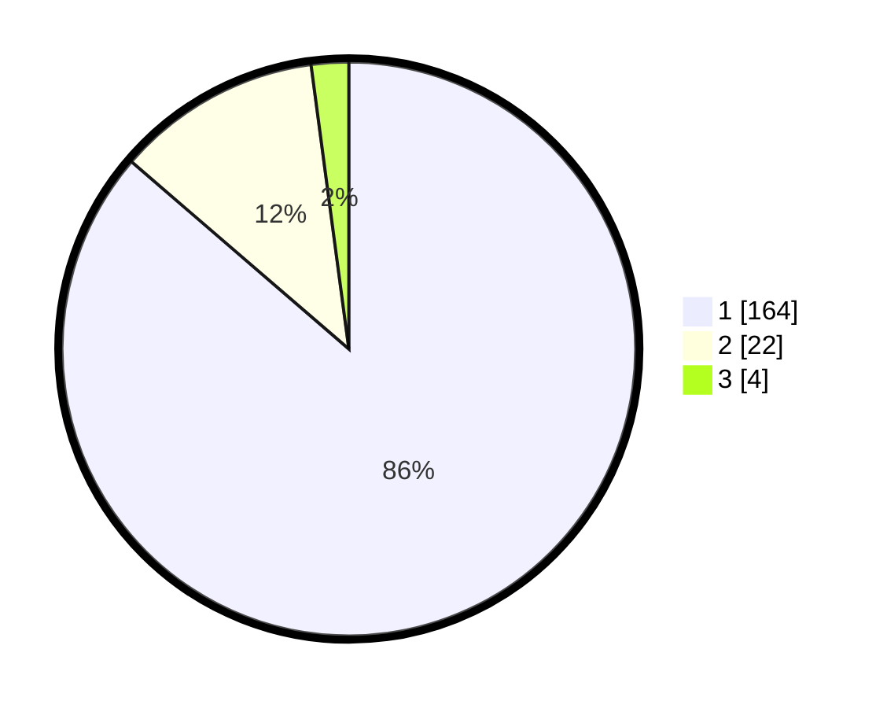

# Hasil

## Grafik

## Tabel

| No. | Nama Paslon    | Suara | Suara (raw) | Persentase |
|:--- |:-------------- | -----:| -----------:| ----------:|
| 1   | ANIES MUHAIMIN | 164   | [164][p-1]  | 86,32      |
| 2   | PRABOWO GIBRAN | 22    | [22][p-2]   | 11,58      |
| 3   | GANJAR MAHFUD  | 4     | [4][p-3]    | 2,11       |

[p-1]: https://github.com/gigit-pemilu/pemilu-2024/blob/main/pilpres/hitung-suara/sub/11-aceh/sub/03-aceh-timur/sub/12-madat/sub/2004-matang-keupula-lhee/sub/001-tps/sub/paslon-1.txt
[p-2]: https://github.com/gigit-pemilu/pemilu-2024/blob/main/pilpres/hitung-suara/sub/11-aceh/sub/03-aceh-timur/sub/12-madat/sub/2004-matang-keupula-lhee/sub/001-tps/sub/paslon-2.txt
[p-3]: https://github.com/gigit-pemilu/pemilu-2024/blob/main/pilpres/hitung-suara/sub/11-aceh/sub/03-aceh-timur/sub/12-madat/sub/2004-matang-keupula-lhee/sub/001-tps/sub/paslon-3.txt

## Foto C Plano

https://sirekap-obj-formc.kpu.go.id/1725/pemilu/ppwp/11/03/12/20/04/1103122004001-20240215-085633--34370620-b869-44d0-b6b7-d26eb03df72f.jpg

https://sirekap-obj-formc.kpu.go.id/1725/pemilu/ppwp/11/03/12/20/04/1103122004001-20240215-085819--ce516e97-528c-4c2d-9edb-2acab2220f20.jpg

https://sirekap-obj-formc.kpu.go.id/1725/pemilu/ppwp/11/03/12/20/04/1103122004001-20240215-085957--a734e9b3-cc63-4228-b2ec-6fcd471cf026.jpg

## Metadata

| Key        | Value               |
| ---------- | ------------------- |
| Time Stamp | 2024-02-26 22:00:00 |

