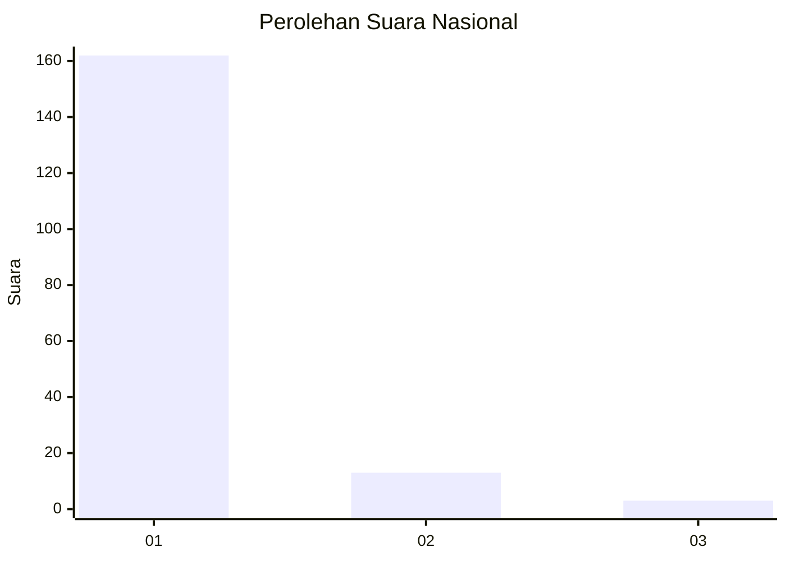
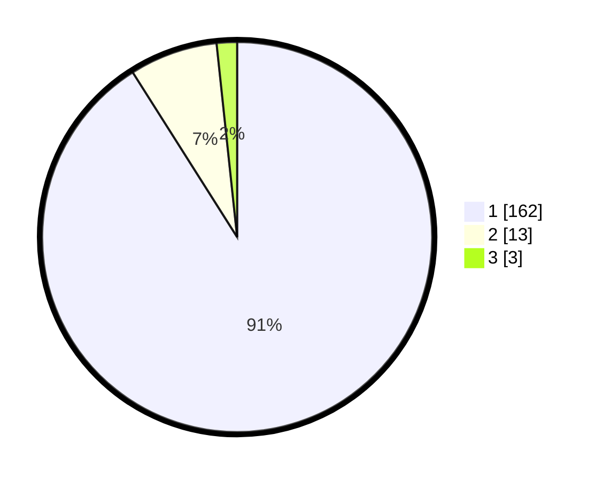

# Hasil

## Grafik

## Tabel

| No. | Nama Paslon    | Suara | Suara (raw) | Persentase |
|:--- |:-------------- | -----:| -----------:| ----------:|
| 1   | ANIES MUHAIMIN | 162   | [162][p-1]  | 91,01      |
| 2   | PRABOWO GIBRAN | 13    | [13][p-2]   | 7,30       |
| 3   | GANJAR MAHFUD  | 3     | [3][p-3]    | 1,69       |

[p-1]: https://github.com/gigit-pemilu/pemilu-2024/blob/main/pilpres/hitung-suara/sub/11-aceh/sub/03-aceh-timur/sub/12-madat/sub/2005-ulee-ateung/sub/001-tps/sub/paslon-1.txt
[p-2]: https://github.com/gigit-pemilu/pemilu-2024/blob/main/pilpres/hitung-suara/sub/11-aceh/sub/03-aceh-timur/sub/12-madat/sub/2005-ulee-ateung/sub/001-tps/sub/paslon-2.txt
[p-3]: https://github.com/gigit-pemilu/pemilu-2024/blob/main/pilpres/hitung-suara/sub/11-aceh/sub/03-aceh-timur/sub/12-madat/sub/2005-ulee-ateung/sub/001-tps/sub/paslon-3.txt

## Foto C Plano

https://sirekap-obj-formc.kpu.go.id/3d54/pemilu/ppwp/11/03/12/20/05/1103122005001-20240215-010907--597b623d-0e0b-477d-9bb6-0c1273d9fc06.jpg

https://sirekap-obj-formc.kpu.go.id/3d54/pemilu/ppwp/11/03/12/20/05/1103122005001-20240215-011257--b4ed301f-9133-4a1a-b910-abcf3d9b6ec4.jpg

https://sirekap-obj-formc.kpu.go.id/3d54/pemilu/ppwp/11/03/12/20/05/1103122005001-20240215-011612--b9d985a1-ff85-4b56-b9fa-644ff8a28f1c.jpg

## Metadata

| Key        | Value               |
| ---------- | ------------------- |
| Time Stamp | 2024-02-15 23:29:50 |

## DATA PEMILIH TETAP

Jumlah pemilih dalam DPT: **241**.
 * L: **117**.
 * P: **124**.

## DATA PENGGUNA HAK PILIH

Jumlah pengguna hak pilih dalam DPT: **181**.
 * L: **74**.
 * P: **107**.

Jumlah pengguna hak pilih dalam DPTb: **2**.
 * L: **1**.
 * P: **1**.

Jumlah pengguna hak pilih dalam DPK: **3**.
 * L: **2**.
 * P: **1**.

Jumlah pengguna hak pilih: **186**.
 * L: **77**.
 * P: **109**.

## JUMLAH SUARA SAH DAN TIDAK SAH

JUMLAH SELURUH SUARA SAH: **178**.

JUMLAH SUARA TIDAK SAH: **8**.

JUMLAH SELURUH SUARA SAH DAN SUARA TIDAK SAH: **186**.

