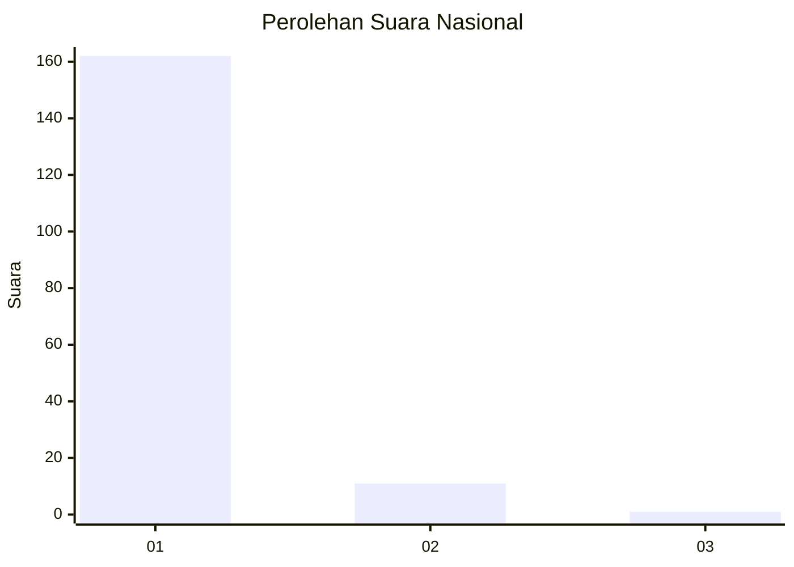
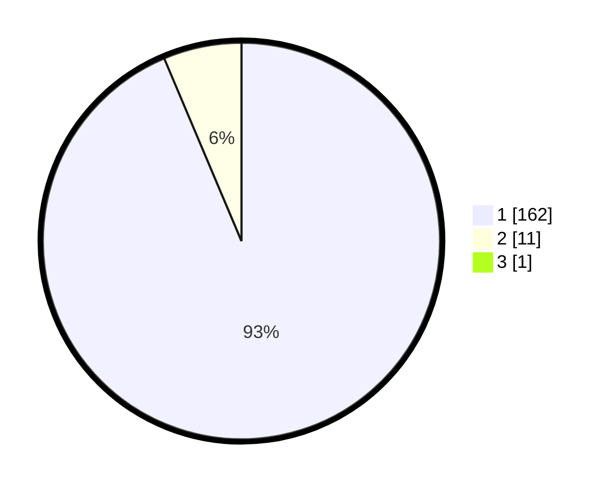

# Hasil

## Grafik

## Tabel

| No. | Nama Paslon    | Suara | Suara (raw) | Persentase |
|:--- |:-------------- | -----:| -----------:| ----------:|
| 1   | ANIES MUHAIMIN | 162   | [162][p-1]  | 93,10      |
| 2   | PRABOWO GIBRAN | 11    | [11][p-2]   | 6,32       |
| 3   | GANJAR MAHFUD  | 1     | [1][p-3]    | 0,57       |

[p-1]: https://github.com/gigit-pemilu/pemilu-2024/blob/main/pilpres/hitung-suara/sub/11-aceh/sub/03-aceh-timur/sub/12-madat/sub/2005-ulee-ateung/sub/002-tps/sub/paslon-1.txt
[p-2]: https://github.com/gigit-pemilu/pemilu-2024/blob/main/pilpres/hitung-suara/sub/11-aceh/sub/03-aceh-timur/sub/12-madat/sub/2005-ulee-ateung/sub/002-tps/sub/paslon-2.txt
[p-3]: https://github.com/gigit-pemilu/pemilu-2024/blob/main/pilpres/hitung-suara/sub/11-aceh/sub/03-aceh-timur/sub/12-madat/sub/2005-ulee-ateung/sub/002-tps/sub/paslon-3.txt

## Foto C Plano

https://sirekap-obj-formc.kpu.go.id/2885/pemilu/ppwp/11/03/12/20/05/1103122005002-20240215-005720--91a254a2-7b21-48e0-9f4c-0cc0ff9702a5.jpg

https://sirekap-obj-formc.kpu.go.id/2885/pemilu/ppwp/11/03/12/20/05/1103122005002-20240215-010355--3a37e150-c83b-4f27-8196-1a5551686e5d.jpg

https://sirekap-obj-formc.kpu.go.id/2885/pemilu/ppwp/11/03/12/20/05/1103122005002-20240215-010841--bf50c9df-d1e7-425f-8461-6800bd00e119.jpg

## Metadata

| Key        | Value               |
| ---------- | ------------------- |
| Time Stamp | 2024-02-24 22:31:28 |

