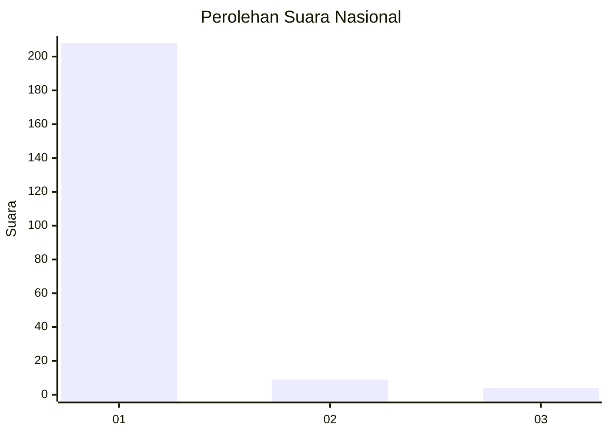
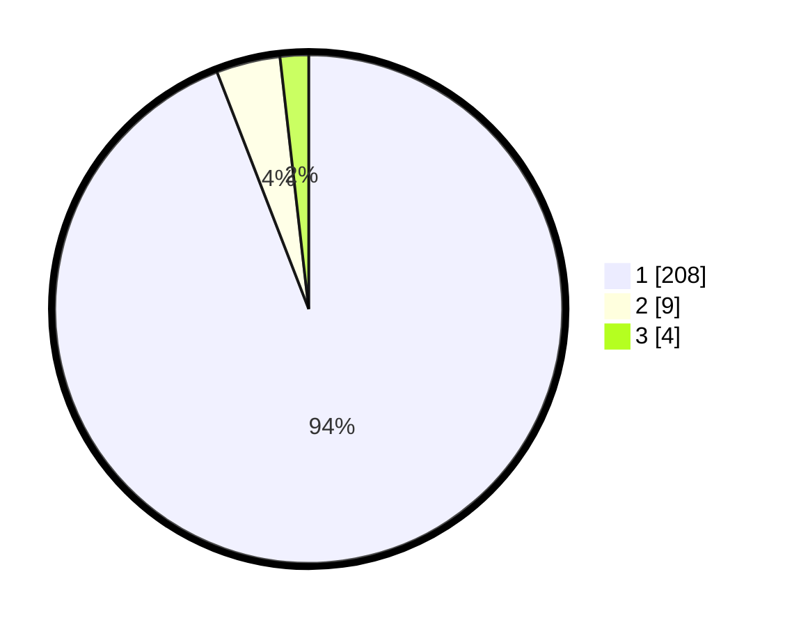

# Hasil

## Grafik

## Tabel

| No. | Nama Paslon    | Suara | Suara (raw) | Persentase |
|:--- |:-------------- | -----:| -----------:| ----------:|
| 1   | ANIES MUHAIMIN | 208   | [208][p-1]  | 94,12      |
| 2   | PRABOWO GIBRAN | 9     | [9][p-2]    | 4,07       |
| 3   | GANJAR MAHFUD  | 4     | [4][p-3]    | 1,81       |

[p-1]: https://github.com/gigit-pemilu/pemilu-2024/blob/main/pilpres/hitung-suara/sub/11-aceh/sub/03-aceh-timur/sub/12-madat/sub/2008-pantee-bayam/sub/003-tps/sub/paslon-1.txt
[p-2]: https://github.com/gigit-pemilu/pemilu-2024/blob/main/pilpres/hitung-suara/sub/11-aceh/sub/03-aceh-timur/sub/12-madat/sub/2008-pantee-bayam/sub/003-tps/sub/paslon-2.txt
[p-3]: https://github.com/gigit-pemilu/pemilu-2024/blob/main/pilpres/hitung-suara/sub/11-aceh/sub/03-aceh-timur/sub/12-madat/sub/2008-pantee-bayam/sub/003-tps/sub/paslon-3.txt

## Foto C Plano

https://sirekap-obj-formc.kpu.go.id/3c3b/pemilu/ppwp/11/03/12/20/08/1103122008003-20240215-125532--98deb0a5-3533-493b-9862-8931755fb134.jpg

https://sirekap-obj-formc.kpu.go.id/3c3b/pemilu/ppwp/11/03/12/20/08/1103122008003-20240215-004334--97a71864-ff1e-4887-beba-ef238f0862d2.jpg

https://sirekap-obj-formc.kpu.go.id/3c3b/pemilu/ppwp/11/03/12/20/08/1103122008003-20240215-125701--82fcac6f-a5e6-407c-b0f5-5470eac04818.jpg

## Metadata

| Key        | Value               |
| ---------- | ------------------- |
| Time Stamp | 2024-02-24 22:31:28 |

