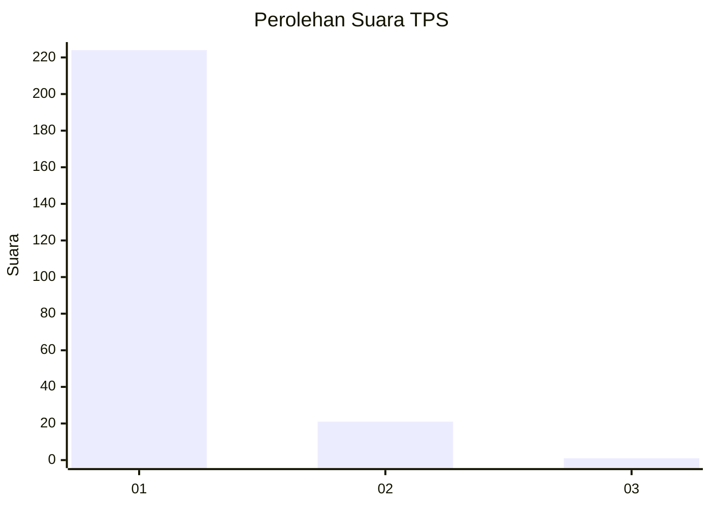
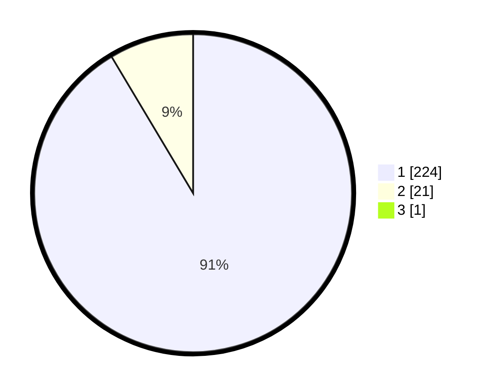

# Hasil

## Grafik

## Tabel

| No. | Nama Paslon    | Suara | Suara (raw) | Persentase |
|:--- |:-------------- | -----:| -----------:| ----------:|
| 1   | ANIES MUHAIMIN | 224   | [224][p-1]  | 91,06      |
| 2   | PRABOWO GIBRAN | 21    | [21][p-2]   | 8,54       |
| 3   | GANJAR MAHFUD  | 1     | [1][p-3]    | 0,41       |

[p-1]: https://github.com/gigit-pemilu/pemilu-2024-11-aceh/blob/main/pilpres/hitung-suara/sub/11-aceh/sub/03-aceh-timur/sub/12-madat/sub/2009-meunasah-asan/sub/004-tps/sub/paslon-1.txt
[p-2]: https://github.com/gigit-pemilu/pemilu-2024-11-aceh/blob/main/pilpres/hitung-suara/sub/11-aceh/sub/03-aceh-timur/sub/12-madat/sub/2009-meunasah-asan/sub/004-tps/sub/paslon-2.txt
[p-3]: https://github.com/gigit-pemilu/pemilu-2024-11-aceh/blob/main/pilpres/hitung-suara/sub/11-aceh/sub/03-aceh-timur/sub/12-madat/sub/2009-meunasah-asan/sub/004-tps/sub/paslon-3.txt

## Foto C Plano

https://sirekap-obj-formc.kpu.go.id/a597/pemilu/ppwp/11/03/12/20/09/1103122009004-20240214-231927--1f75d8cc-91f2-4d38-b7a8-b85345473c64.jpg

https://sirekap-obj-formc.kpu.go.id/a597/pemilu/ppwp/11/03/12/20/09/1103122009004-20240214-231502--c5051c24-2839-458a-a88d-13bcd9c85e6b.jpg

https://sirekap-obj-formc.kpu.go.id/a597/pemilu/ppwp/11/03/12/20/09/1103122009004-20240214-231648--e11494be-7c64-4772-b474-327cdb4a86b9.jpg

## Metadata

| Key        | Value               |
| ---------- | ------------------- |
| Time Stamp | 2024-02-16 17:30:00 |

