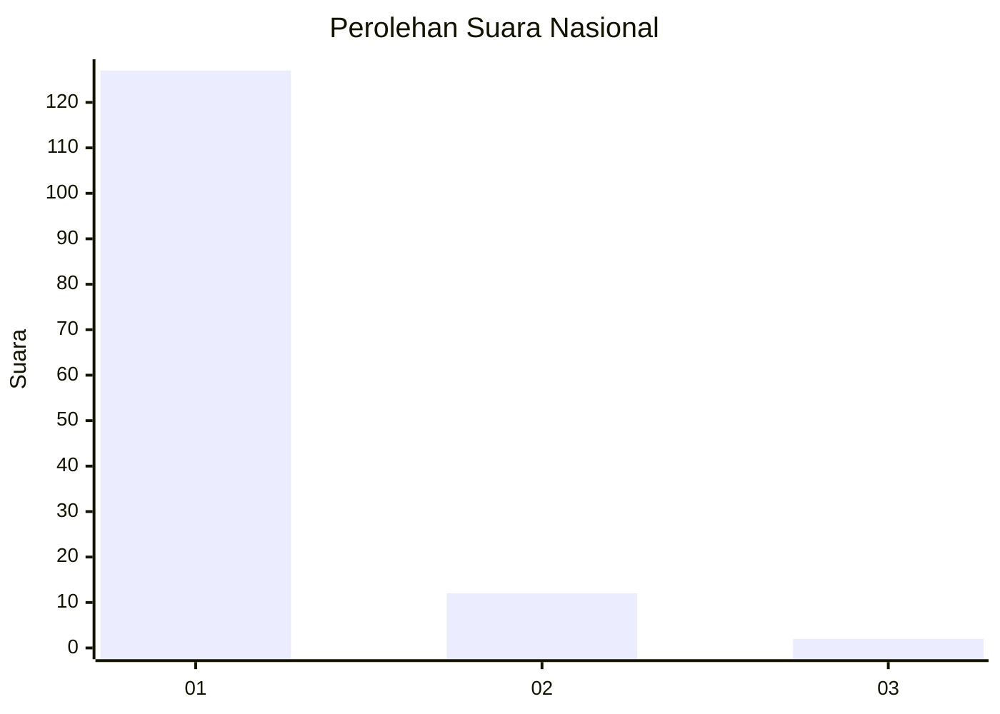
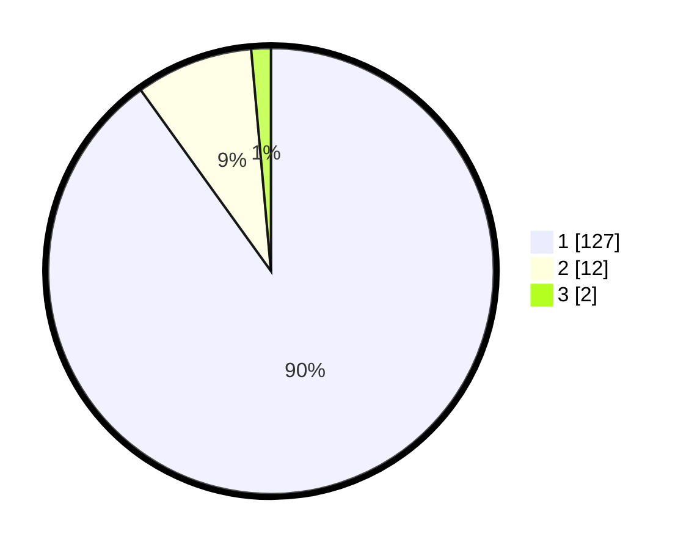

# Hasil

## Grafik

## Tabel

| No. | Nama Paslon    | Suara | Suara (raw) | Persentase |
|:--- |:-------------- | -----:| -----------:| ----------:|
| 1   | ANIES MUHAIMIN | 127   | [127][p-1]  | 90,07      |
| 2   | PRABOWO GIBRAN | 12    | [12][p-2]   | 8,51       |
| 3   | GANJAR MAHFUD  | 2     | [2][p-3]    | 1,42       |

[p-1]: https://github.com/gigit-pemilu/pemilu-2024/blob/main/pilpres/hitung-suara/sub/11-aceh/sub/03-aceh-timur/sub/12-madat/sub/2013-paya-demam-peut/sub/002-tps/sub/paslon-1.txt
[p-2]: https://github.com/gigit-pemilu/pemilu-2024/blob/main/pilpres/hitung-suara/sub/11-aceh/sub/03-aceh-timur/sub/12-madat/sub/2013-paya-demam-peut/sub/002-tps/sub/paslon-2.txt
[p-3]: https://github.com/gigit-pemilu/pemilu-2024/blob/main/pilpres/hitung-suara/sub/11-aceh/sub/03-aceh-timur/sub/12-madat/sub/2013-paya-demam-peut/sub/002-tps/sub/paslon-3.txt

## Foto C Plano

https://sirekap-obj-formc.kpu.go.id/e830/pemilu/ppwp/11/03/12/20/13/1103122013002-20240215-090407--a043e3b3-4199-4da5-af20-a88d50e467e9.jpg

https://sirekap-obj-formc.kpu.go.id/e830/pemilu/ppwp/11/03/12/20/13/1103122013002-20240215-090642--d3d6b22a-016d-49dd-8851-8f9bcd22a05f.jpg

## Metadata

| Key        | Value               |
| ---------- | ------------------- |
| Time Stamp | 2024-02-24 22:31:28 |

