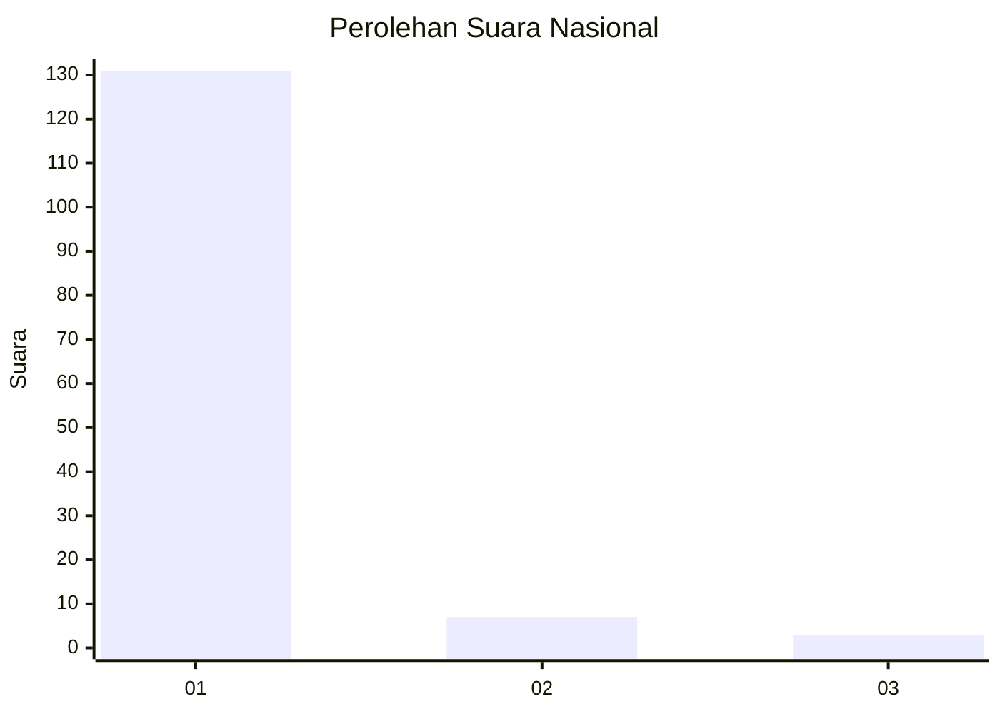
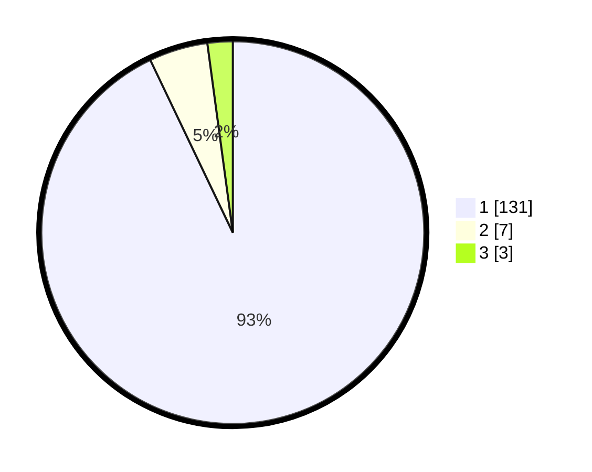

# Hasil

## Grafik

## Tabel

| No. | Nama Paslon    | Suara | Suara (raw) | Persentase |
|:--- |:-------------- | -----:| -----------:| ----------:|
| 1   | ANIES MUHAIMIN | 131   | [131][p-1]  | 92,91      |
| 2   | PRABOWO GIBRAN | 7     | [7][p-2]    | 4,96       |
| 3   | GANJAR MAHFUD  | 3     | [3][p-3]    | 2,13       |

[p-1]: https://github.com/gigit-pemilu/pemilu-2024/blob/main/pilpres/hitung-suara/sub/11-aceh/sub/03-aceh-timur/sub/12-madat/sub/2013-paya-demam-peut/sub/003-tps/sub/paslon-1.txt
[p-2]: https://github.com/gigit-pemilu/pemilu-2024/blob/main/pilpres/hitung-suara/sub/11-aceh/sub/03-aceh-timur/sub/12-madat/sub/2013-paya-demam-peut/sub/003-tps/sub/paslon-2.txt
[p-3]: https://github.com/gigit-pemilu/pemilu-2024/blob/main/pilpres/hitung-suara/sub/11-aceh/sub/03-aceh-timur/sub/12-madat/sub/2013-paya-demam-peut/sub/003-tps/sub/paslon-3.txt

## Foto C Plano

https://sirekap-obj-formc.kpu.go.id/2357/pemilu/ppwp/11/03/12/20/13/1103122013003-20240215-083908--331fd4b3-a5aa-4eb3-b745-da5a54f26560.jpg

https://sirekap-obj-formc.kpu.go.id/2357/pemilu/ppwp/11/03/12/20/13/1103122013003-20240215-084157--4f944ec5-69ad-4b52-b608-ee94ed2677d5.jpg

https://sirekap-obj-formc.kpu.go.id/2357/pemilu/ppwp/11/03/12/20/13/1103122013003-20240215-084245--01cfeb84-e028-486c-bb32-39d5da2ffc33.jpg

## Metadata

| Key        | Value               |
| ---------- | ------------------- |
| Time Stamp | 2024-02-24 22:31:28 |

