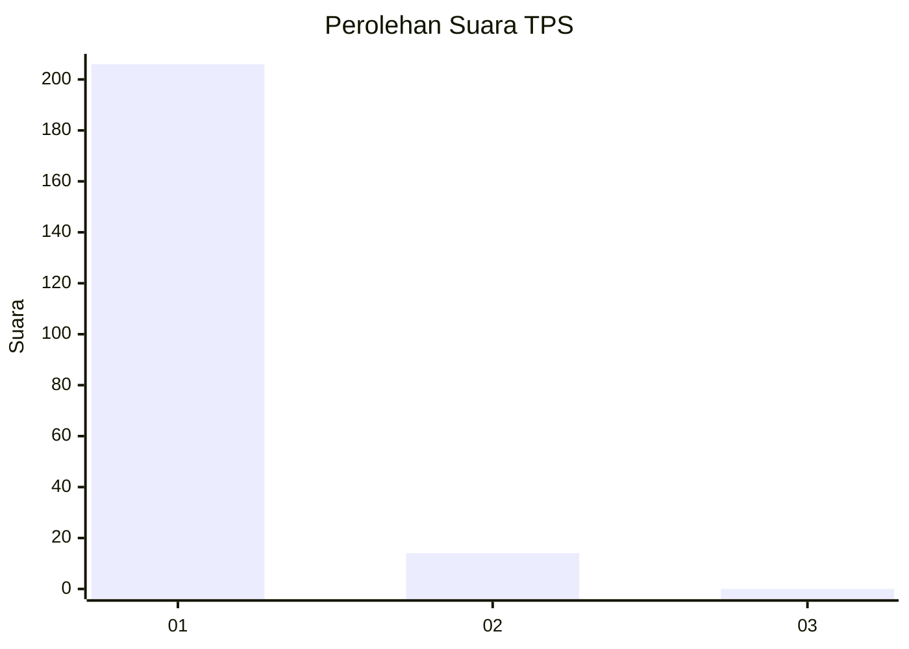
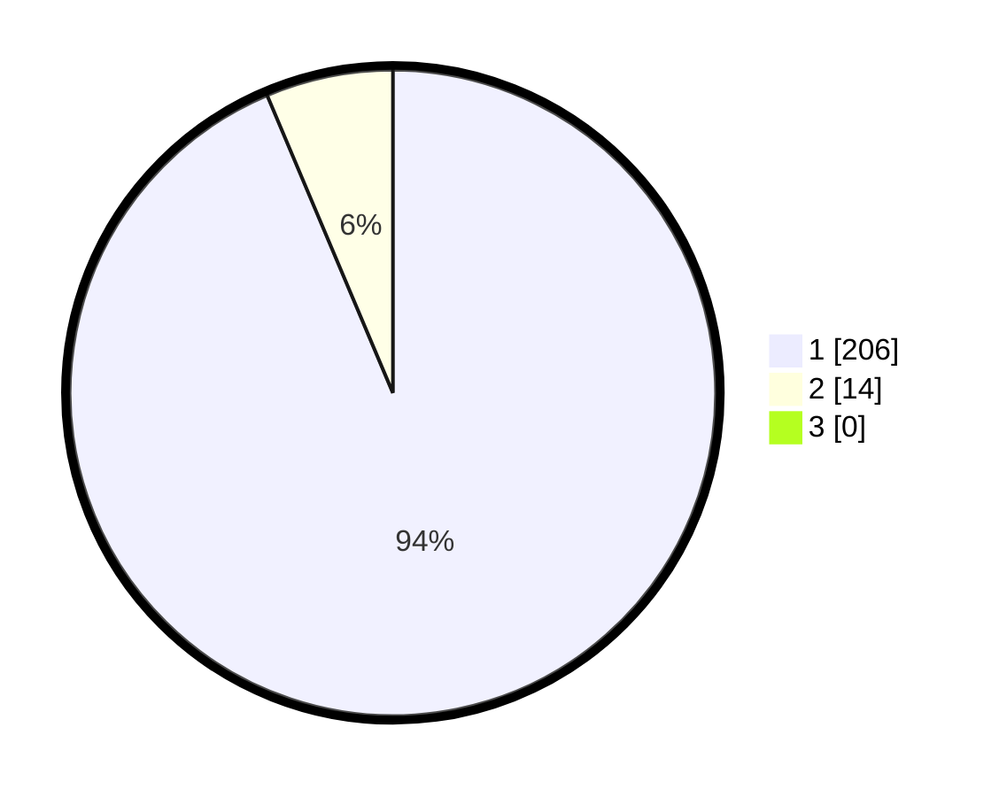

# Hasil

## Grafik

## Tabel

| No. | Nama Paslon    | Suara | Suara (raw) | Persentase |
|:--- |:-------------- | -----:| -----------:| ----------:|
| 1   | ANIES MUHAIMIN | 206   | [206][p-1]  | 93,64      |
| 2   | PRABOWO GIBRAN | 14    | [14][p-2]   | 6,36       |
| 3   | GANJAR MAHFUD  | 0     | [0][p-3]    | 0,00       |

[p-1]: https://github.com/gigit-pemilu/pemilu-2024-11-aceh/blob/main/pilpres/hitung-suara/sub/11-aceh/sub/03-aceh-timur/sub/12-madat/sub/2014-abeuk-geulanteu/sub/001-tps/sub/paslon-1.txt
[p-2]: https://github.com/gigit-pemilu/pemilu-2024-11-aceh/blob/main/pilpres/hitung-suara/sub/11-aceh/sub/03-aceh-timur/sub/12-madat/sub/2014-abeuk-geulanteu/sub/001-tps/sub/paslon-2.txt
[p-3]: https://github.com/gigit-pemilu/pemilu-2024-11-aceh/blob/main/pilpres/hitung-suara/sub/11-aceh/sub/03-aceh-timur/sub/12-madat/sub/2014-abeuk-geulanteu/sub/001-tps/sub/paslon-3.txt

## Foto C Plano

https://sirekap-obj-formc.kpu.go.id/347a/pemilu/ppwp/11/03/12/20/14/1103122014001-20240215-133723--cd187315-6353-404b-b032-c161579abb5f.jpg

https://sirekap-obj-formc.kpu.go.id/347a/pemilu/ppwp/11/03/12/20/14/1103122014001-20240215-134000--3e09fa94-1503-42c3-bf22-a37060f0082f.jpg

https://sirekap-obj-formc.kpu.go.id/347a/pemilu/ppwp/11/03/12/20/14/1103122014001-20240215-120510--4e8f4a36-2b26-47fa-90f7-8b70d1c8725e.jpg

## Metadata

| Key        | Value               |
| ---------- | ------------------- |
| Time Stamp | 2024-02-24 22:31:28 |

