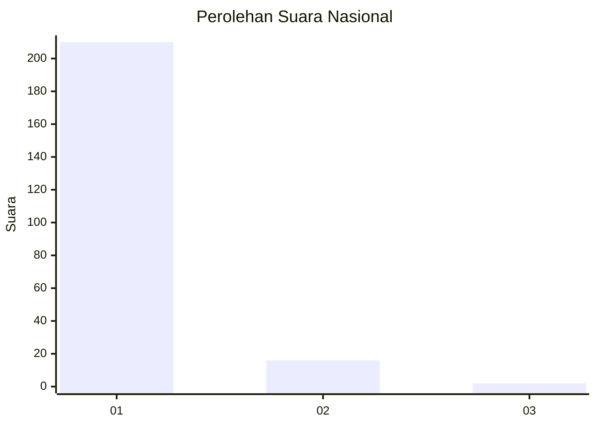
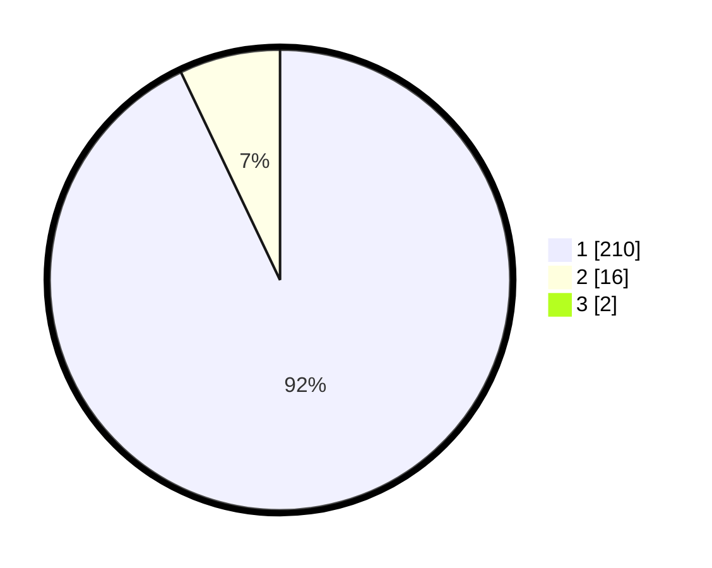

# Hasil

## Grafik

## Tabel

| No. | Nama Paslon    | Suara | Suara (raw) | Persentase |
|:--- |:-------------- | -----:| -----------:| ----------:|
| 1   | ANIES MUHAIMIN | 210   | [210][p-1]  | 92,11      |
| 2   | PRABOWO GIBRAN | 16    | [16][p-2]   | 7,02       |
| 3   | GANJAR MAHFUD  | 2     | [2][p-3]    | 0,88       |

[p-1]: https://github.com/gigit-pemilu/pemilu-2024/blob/main/pilpres/hitung-suara/sub/11-aceh/sub/03-aceh-timur/sub/12-madat/sub/2015-rambong-lop/sub/001-tps/sub/paslon-1.txt
[p-2]: https://github.com/gigit-pemilu/pemilu-2024/blob/main/pilpres/hitung-suara/sub/11-aceh/sub/03-aceh-timur/sub/12-madat/sub/2015-rambong-lop/sub/001-tps/sub/paslon-2.txt
[p-3]: https://github.com/gigit-pemilu/pemilu-2024/blob/main/pilpres/hitung-suara/sub/11-aceh/sub/03-aceh-timur/sub/12-madat/sub/2015-rambong-lop/sub/001-tps/sub/paslon-3.txt

## Foto C Plano

https://sirekap-obj-formc.kpu.go.id/4737/pemilu/ppwp/11/03/12/20/15/1103122015001-20240215-092006--29063754-e7ea-40e1-9f5a-3e03a578aec7.jpg

https://sirekap-obj-formc.kpu.go.id/4737/pemilu/ppwp/11/03/12/20/15/1103122015001-20240215-092531--c1b17982-75b2-4db0-981f-4b156c00be73.jpg

https://sirekap-obj-formc.kpu.go.id/4737/pemilu/ppwp/11/03/12/20/15/1103122015001-20240215-092849--6f2c02da-1ccd-415e-b10c-f9527bc44c99.jpg

## Metadata

| Key        | Value               |
| ---------- | ------------------- |
| Time Stamp | 2024-02-24 22:31:28 |

