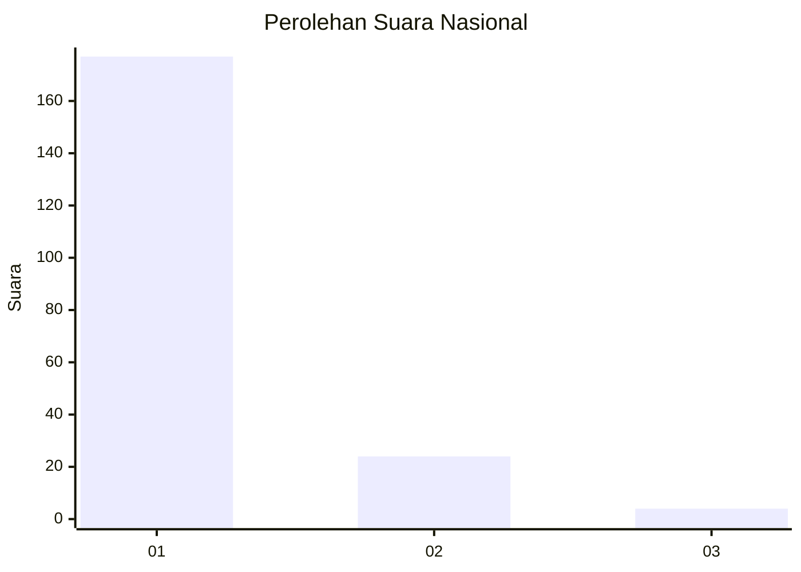
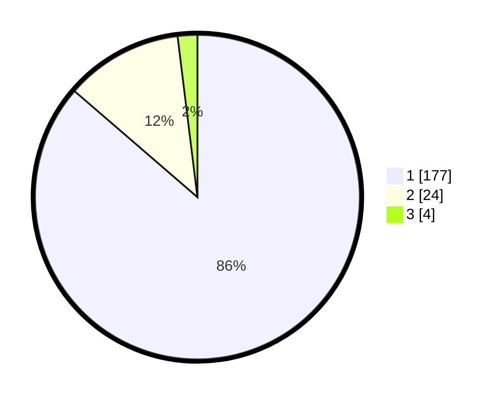

# Hasil

## Grafik

## Tabel

| No. | Nama Paslon    | Suara | Suara (raw) | Persentase |
|:--- |:-------------- | -----:| -----------:| ----------:|
| 1   | ANIES MUHAIMIN | 177   | [177][p-1]  | 86,34      |
| 2   | PRABOWO GIBRAN | 24    | [24][p-2]   | 11,71      |
| 3   | GANJAR MAHFUD  | 4     | [4][p-3]    | 1,95       |

[p-1]: https://github.com/gigit-pemilu/pemilu-2024/blob/main/pilpres/hitung-suara/sub/11-aceh/sub/03-aceh-timur/sub/12-madat/sub/2021-blang-awe/sub/001-tps/sub/paslon-1.txt
[p-2]: https://github.com/gigit-pemilu/pemilu-2024/blob/main/pilpres/hitung-suara/sub/11-aceh/sub/03-aceh-timur/sub/12-madat/sub/2021-blang-awe/sub/001-tps/sub/paslon-2.txt
[p-3]: https://github.com/gigit-pemilu/pemilu-2024/blob/main/pilpres/hitung-suara/sub/11-aceh/sub/03-aceh-timur/sub/12-madat/sub/2021-blang-awe/sub/001-tps/sub/paslon-3.txt

## Foto C Plano

https://sirekap-obj-formc.kpu.go.id/02db/pemilu/ppwp/11/03/12/20/21/1103122021001-20240215-082433--cf0999c8-17e5-4c84-8d19-712537edb66b.jpg

https://sirekap-obj-formc.kpu.go.id/02db/pemilu/ppwp/11/03/12/20/21/1103122021001-20240223-174535--a681623c-5e7c-4597-9b40-bdbda9ac0266.jpg

https://sirekap-obj-formc.kpu.go.id/02db/pemilu/ppwp/11/03/12/20/21/1103122021001-20240215-082843--85deaae3-0547-4f90-b4f3-2fc6aac175ca.jpg

## Metadata

| Key        | Value               |
| ---------- | ------------------- |
| Time Stamp | 2024-02-24 22:31:28 |

