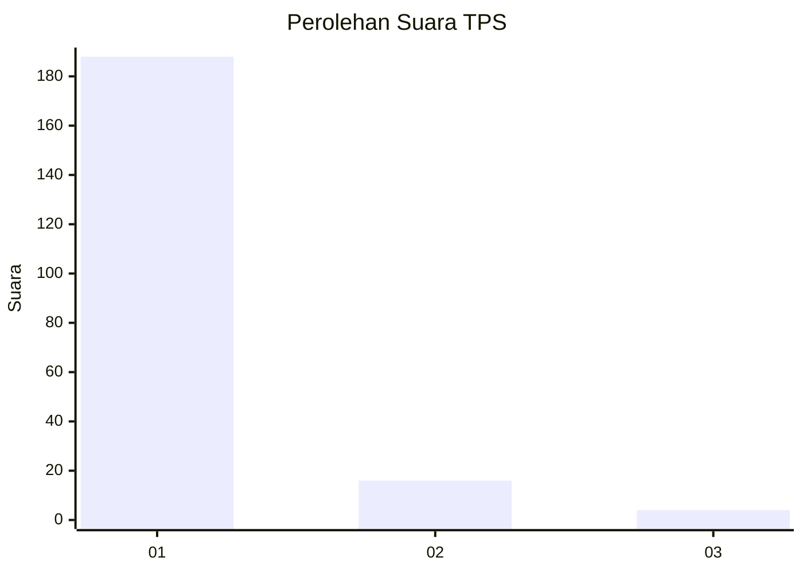
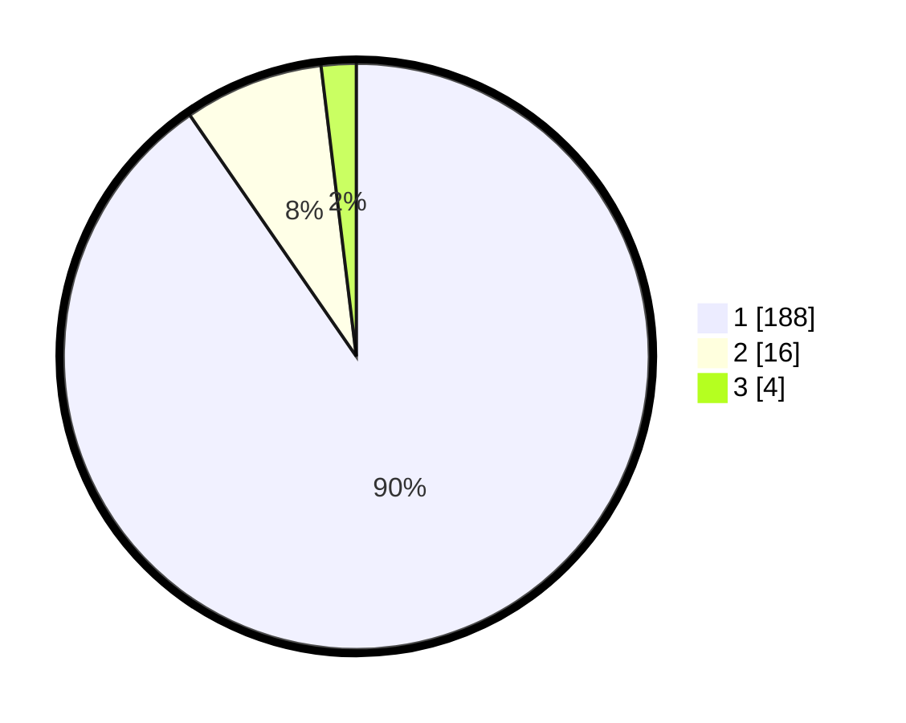

# Hasil

## Grafik

## Tabel

| No. | Nama Paslon    | Suara | Suara (raw) | Persentase |
|:--- |:-------------- | -----:| -----------:| ----------:|
| 1   | ANIES MUHAIMIN | 188   | [188][p-1]  | 90,38      |
| 2   | PRABOWO GIBRAN | 16    | [16][p-2]   | 7,69       |
| 3   | GANJAR MAHFUD  | 4     | [4][p-3]    | 1,92       |

[p-1]: https://github.com/gigit-pemilu/pemilu-2024-11-aceh/blob/main/pilpres/hitung-suara/sub/11-aceh/sub/03-aceh-timur/sub/12-madat/sub/2021-blang-awe/sub/002-tps/sub/paslon-1.txt
[p-2]: https://github.com/gigit-pemilu/pemilu-2024-11-aceh/blob/main/pilpres/hitung-suara/sub/11-aceh/sub/03-aceh-timur/sub/12-madat/sub/2021-blang-awe/sub/002-tps/sub/paslon-2.txt
[p-3]: https://github.com/gigit-pemilu/pemilu-2024-11-aceh/blob/main/pilpres/hitung-suara/sub/11-aceh/sub/03-aceh-timur/sub/12-madat/sub/2021-blang-awe/sub/002-tps/sub/paslon-3.txt

## Foto C Plano

https://sirekap-obj-formc.kpu.go.id/974f/pemilu/ppwp/11/03/12/20/21/1103122021002-20240214-202309--844e9855-820d-4155-9193-13e3e5d2ba22.jpg

https://sirekap-obj-formc.kpu.go.id/974f/pemilu/ppwp/11/03/12/20/21/1103122021002-20240223-202727--233eee28-1a6c-4031-b4a7-6b5b3c9f5a43.jpg

https://sirekap-obj-formc.kpu.go.id/974f/pemilu/ppwp/11/03/12/20/21/1103122021002-20240215-075419--db983f03-eae5-4b61-b6c4-315444f67c03.jpg

## Metadata

| Key        | Value               |
| ---------- | ------------------- |
| Time Stamp | 2024-02-24 22:31:28 |

## DATA PEMILIH TETAP

Jumlah pemilih dalam DPT: **275**.
 * L: **142**.
 * P: **133**.

## DATA PENGGUNA HAK PILIH

Jumlah pengguna hak pilih dalam DPT: **193**.
 * L: **86**.
 * P: **107**.

Jumlah pengguna hak pilih dalam DPTb: **0**.
 * L: **0**.
 * P: **0**.

Jumlah pengguna hak pilih dalam DPK: **17**.
 * L: **8**.
 * P: **9**.

Jumlah pengguna hak pilih: **210**.
 * L: **94**.
 * P: **116**.

## JUMLAH SUARA SAH DAN TIDAK SAH

JUMLAH SELURUH SUARA SAH: **208**.

JUMLAH SUARA TIDAK SAH: **2**.

JUMLAH SELURUH SUARA SAH DAN SUARA TIDAK SAH: **210**.

