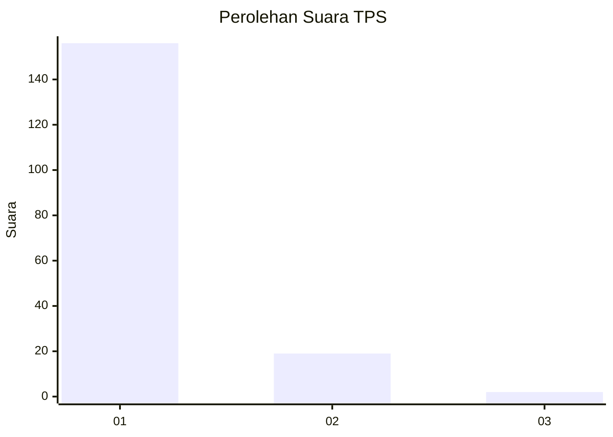
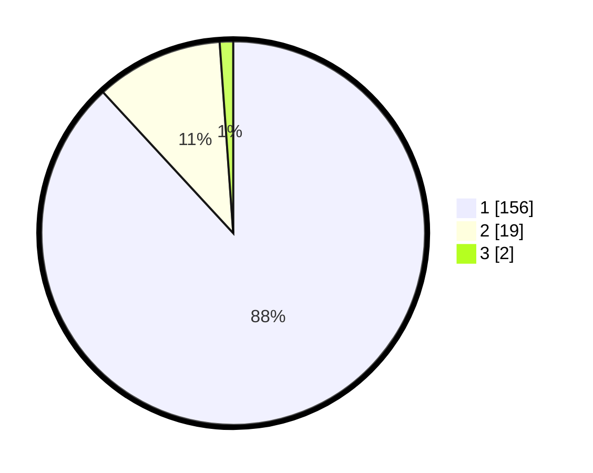

# Hasil

## Grafik

## Tabel

| No. | Nama Paslon    | Suara | Suara (raw) | Persentase |
|:--- |:-------------- | -----:| -----------:| ----------:|
| 1   | ANIES MUHAIMIN | 156   | [156][p-1]  | 88,14      |
| 2   | PRABOWO GIBRAN | 19    | [19][p-2]   | 10,73      |
| 3   | GANJAR MAHFUD  | 2     | [2][p-3]    | 1,13       |

[p-1]: https://github.com/gigit-pemilu/pemilu-2024-11-aceh/blob/main/pilpres/hitung-suara/sub/11-aceh/sub/03-aceh-timur/sub/12-madat/sub/2023-seuneubok-pidie/sub/002-tps/sub/paslon-1.txt
[p-2]: https://github.com/gigit-pemilu/pemilu-2024-11-aceh/blob/main/pilpres/hitung-suara/sub/11-aceh/sub/03-aceh-timur/sub/12-madat/sub/2023-seuneubok-pidie/sub/002-tps/sub/paslon-2.txt
[p-3]: https://github.com/gigit-pemilu/pemilu-2024-11-aceh/blob/main/pilpres/hitung-suara/sub/11-aceh/sub/03-aceh-timur/sub/12-madat/sub/2023-seuneubok-pidie/sub/002-tps/sub/paslon-3.txt

## Foto C Plano

https://sirekap-obj-formc.kpu.go.id/2407/pemilu/ppwp/11/03/12/20/23/1103122023002-20240215-081710--a55eeedc-691b-4af3-b021-59020dcfa09e.jpg

https://sirekap-obj-formc.kpu.go.id/2407/pemilu/ppwp/11/03/12/20/23/1103122023002-20240215-082214--5d0ba52f-33c6-49d3-bba5-ed0211c2f528.jpg

https://sirekap-obj-formc.kpu.go.id/2407/pemilu/ppwp/11/03/12/20/23/1103122023002-20240215-082410--96601c82-ae19-4f22-b402-68940e341ab5.jpg

## Metadata

| Key        | Value               |
| ---------- | ------------------- |
| Time Stamp | 2024-02-25 22:00:00 |

