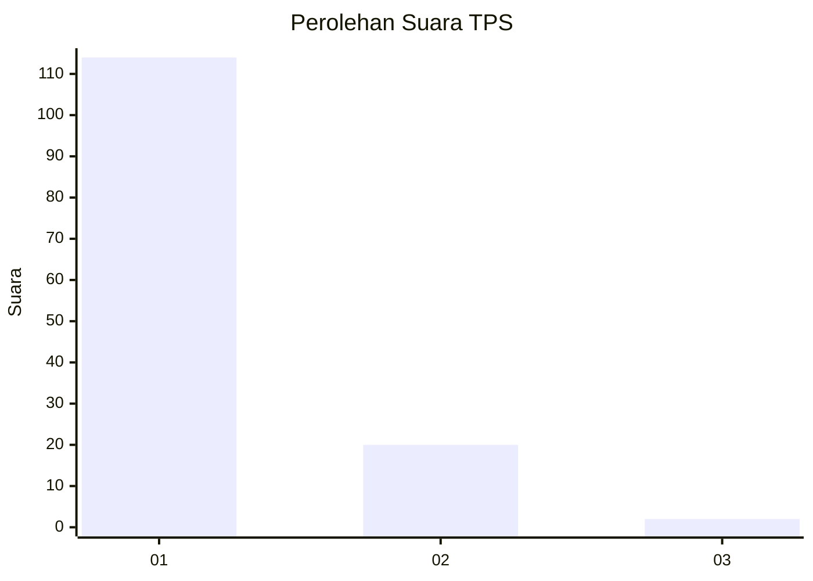
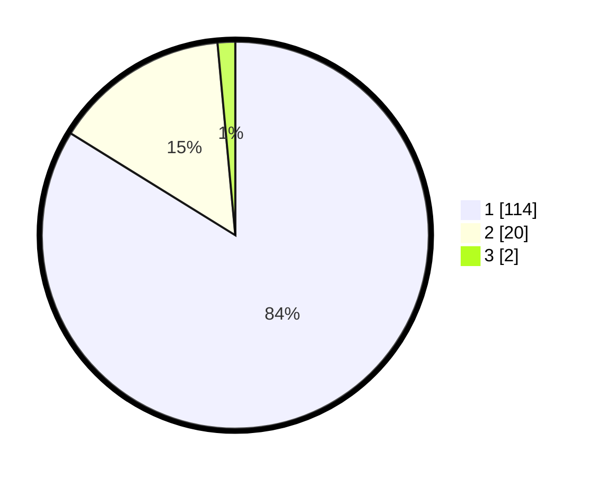

# Hasil

## Grafik

## Tabel

| No. | Nama Paslon    | Suara | Suara (raw) | Persentase |
|:--- |:-------------- | -----:| -----------:| ----------:|
| 1   | ANIES MUHAIMIN | 114   | [114][p-1]  | 83,82      |
| 2   | PRABOWO GIBRAN | 20    | [20][p-2]   | 14,71      |
| 3   | GANJAR MAHFUD  | 2     | [2][p-3]    | 1,47       |

[p-1]: https://github.com/gigit-pemilu/pemilu-2024-11-aceh/blob/main/pilpres/hitung-suara/sub/11-aceh/sub/03-aceh-timur/sub/12-madat/sub/2024-blang-andam/sub/001-tps/sub/paslon-1.txt
[p-2]: https://github.com/gigit-pemilu/pemilu-2024-11-aceh/blob/main/pilpres/hitung-suara/sub/11-aceh/sub/03-aceh-timur/sub/12-madat/sub/2024-blang-andam/sub/001-tps/sub/paslon-2.txt
[p-3]: https://github.com/gigit-pemilu/pemilu-2024-11-aceh/blob/main/pilpres/hitung-suara/sub/11-aceh/sub/03-aceh-timur/sub/12-madat/sub/2024-blang-andam/sub/001-tps/sub/paslon-3.txt

## Foto C Plano

https://sirekap-obj-formc.kpu.go.id/823e/pemilu/ppwp/11/03/12/20/24/1103122024001-20240215-053538--71da1947-3a06-4ef7-bf2c-59f0d90d78d3.jpg

https://sirekap-obj-formc.kpu.go.id/823e/pemilu/ppwp/11/03/12/20/24/1103122024001-20240215-055613--e9d0e1c4-9723-44f7-9653-650aed5b23ac.jpg

https://sirekap-obj-formc.kpu.go.id/823e/pemilu/ppwp/11/03/12/20/24/1103122024001-20240215-055722--0d93cd21-5c3b-46fe-800b-193f1df2007f.jpg

## Metadata

| Key        | Value               |
| ---------- | ------------------- |
| Time Stamp | 2024-02-24 22:31:28 |

