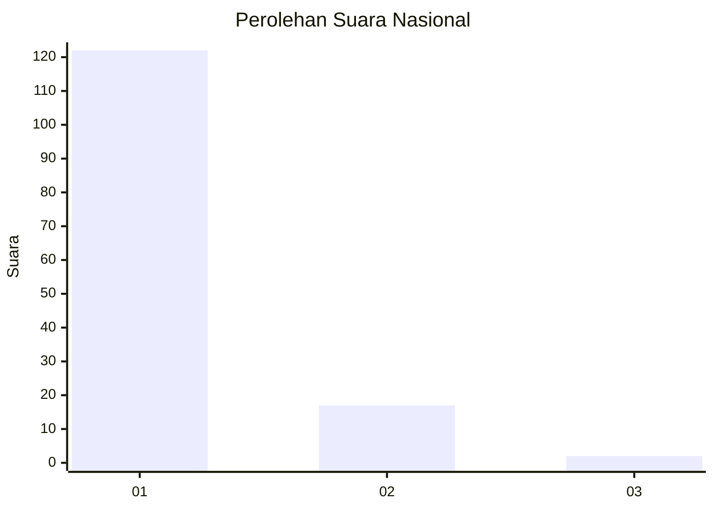
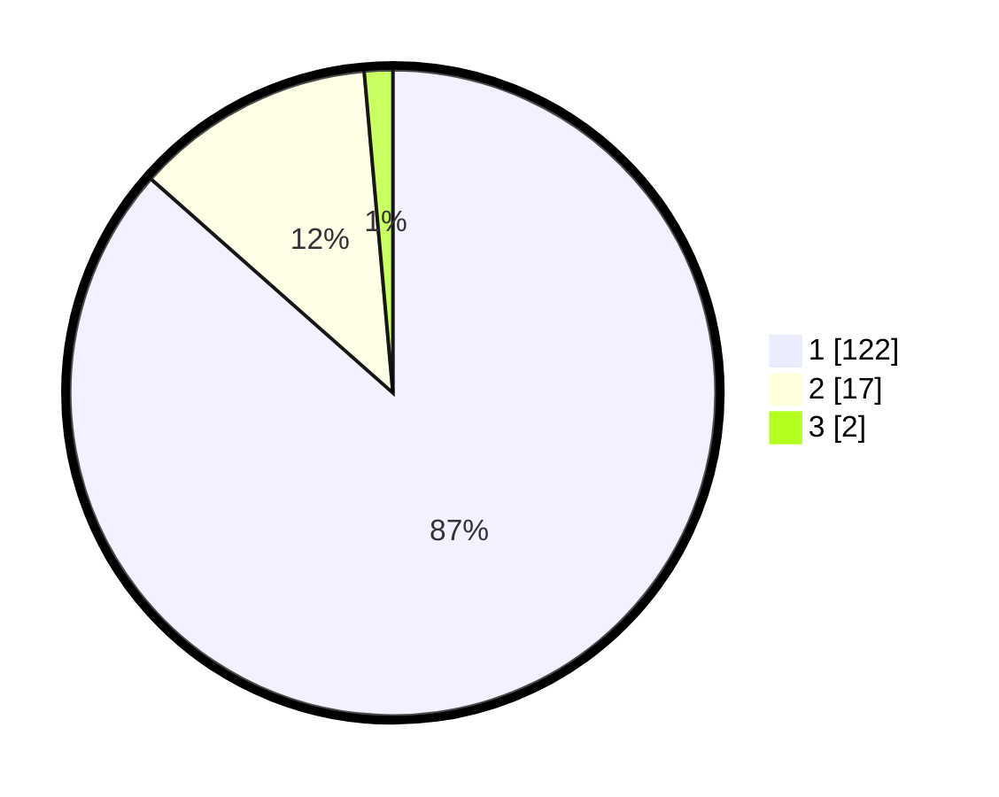

# Hasil

## Grafik

## Tabel

| No. | Nama Paslon    | Suara | Suara (raw) | Persentase |
|:--- |:-------------- | -----:| -----------:| ----------:|
| 1   | ANIES MUHAIMIN | 122   | [122][p-1]  | 86,52      |
| 2   | PRABOWO GIBRAN | 17    | [17][p-2]   | 12,06      |
| 3   | GANJAR MAHFUD  | 2     | [2][p-3]    | 1,42       |

[p-1]: https://github.com/gigit-pemilu/pemilu-2024/blob/main/pilpres/hitung-suara/sub/11-aceh/sub/03-aceh-timur/sub/12-madat/sub/2024-blang-andam/sub/004-tps/sub/paslon-1.txt
[p-2]: https://github.com/gigit-pemilu/pemilu-2024/blob/main/pilpres/hitung-suara/sub/11-aceh/sub/03-aceh-timur/sub/12-madat/sub/2024-blang-andam/sub/004-tps/sub/paslon-2.txt
[p-3]: https://github.com/gigit-pemilu/pemilu-2024/blob/main/pilpres/hitung-suara/sub/11-aceh/sub/03-aceh-timur/sub/12-madat/sub/2024-blang-andam/sub/004-tps/sub/paslon-3.txt

## Foto C Plano

https://sirekap-obj-formc.kpu.go.id/5163/pemilu/ppwp/11/03/12/20/24/1103122024004-20240215-094733--544ed19b-5820-4c2e-b228-9e0bd77f7fd4.jpg

https://sirekap-obj-formc.kpu.go.id/5163/pemilu/ppwp/11/03/12/20/24/1103122024004-20240215-095433--f008c6ce-2927-4dce-8552-a9fff605561b.jpg

https://sirekap-obj-formc.kpu.go.id/5163/pemilu/ppwp/11/03/12/20/24/1103122024004-20240215-095754--d6368ea4-eef5-4af2-9337-856423ccb531.jpg

## Metadata

| Key        | Value               |
| ---------- | ------------------- |
| Time Stamp | 2024-02-24 22:31:28 |

