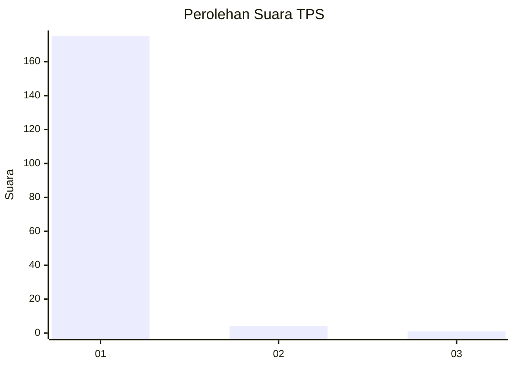
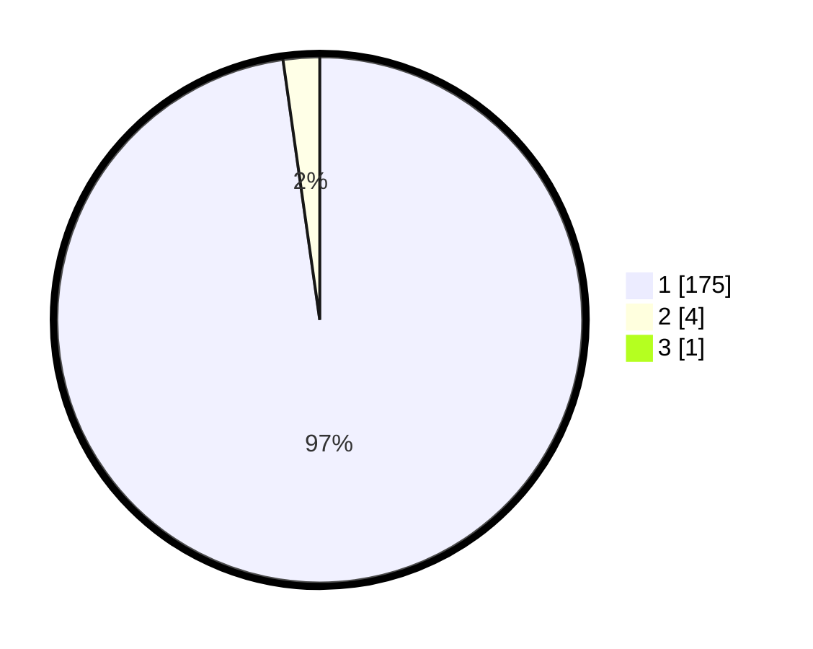

# Hasil

## Grafik

## Tabel

| No. | Nama Paslon    | Suara | Suara (raw) | Persentase |
|:--- |:-------------- | -----:| -----------:| ----------:|
| 1   | ANIES MUHAIMIN | 175   | [175][p-1]  | 97,22      |
| 2   | PRABOWO GIBRAN | 4     | [4][p-2]    | 2,22       |
| 3   | GANJAR MAHFUD  | 1     | [1][p-3]    | 0,56       |

[p-1]: https://github.com/gigit-pemilu/pemilu-2024-11-aceh/blob/main/pilpres/hitung-suara/sub/11-aceh/sub/03-aceh-timur/sub/12-madat/sub/2026-lueng-sa/sub/004-tps/sub/paslon-1.txt
[p-2]: https://github.com/gigit-pemilu/pemilu-2024-11-aceh/blob/main/pilpres/hitung-suara/sub/11-aceh/sub/03-aceh-timur/sub/12-madat/sub/2026-lueng-sa/sub/004-tps/sub/paslon-2.txt
[p-3]: https://github.com/gigit-pemilu/pemilu-2024-11-aceh/blob/main/pilpres/hitung-suara/sub/11-aceh/sub/03-aceh-timur/sub/12-madat/sub/2026-lueng-sa/sub/004-tps/sub/paslon-3.txt

## Foto C Plano

https://sirekap-obj-formc.kpu.go.id/4526/pemilu/ppwp/11/03/12/20/26/1103122026004-20240215-115113--751a2fc6-99dd-4821-8431-23510015acbe.jpg

https://sirekap-obj-formc.kpu.go.id/4526/pemilu/ppwp/11/03/12/20/26/1103122026004-20240215-115346--d3fc6648-e891-4215-8190-7267d776b34e.jpg

https://sirekap-obj-formc.kpu.go.id/4526/pemilu/ppwp/11/03/12/20/26/1103122026004-20240215-115553--b9a43a62-2fb1-4a54-8e6c-288aa05c52a2.jpg

## Metadata

| Key        | Value               |
| ---------- | ------------------- |
| Time Stamp | 2024-02-24 22:31:28 |

