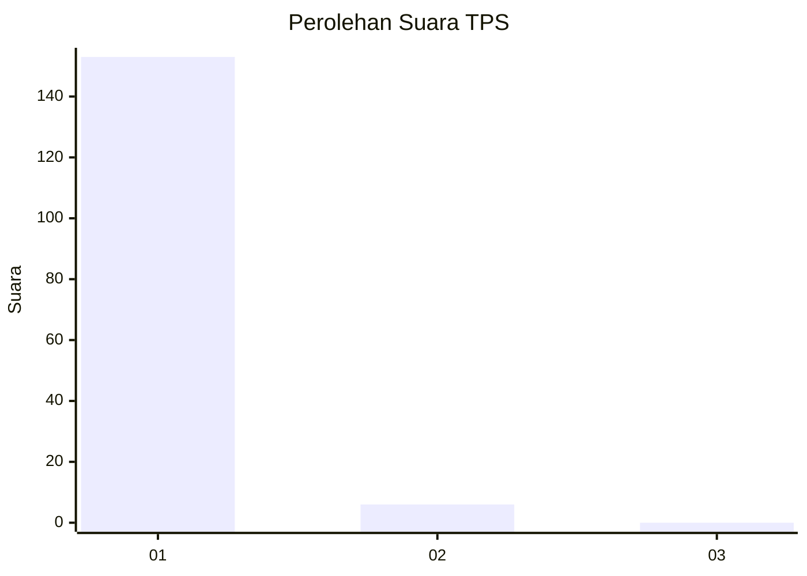
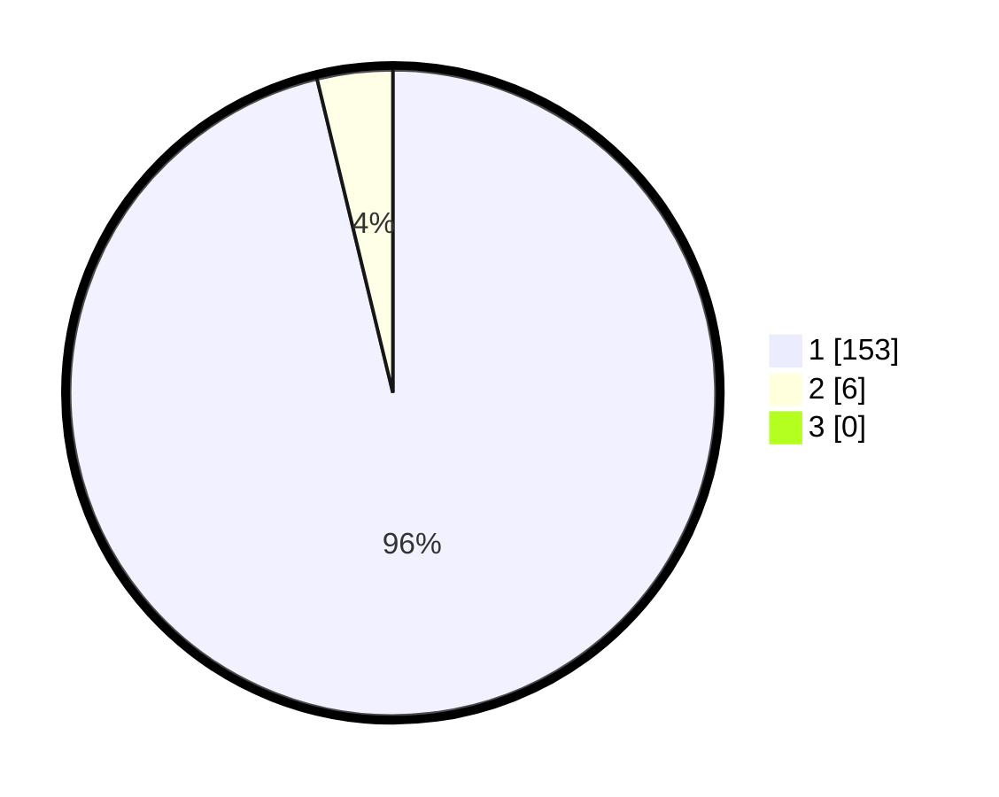

# Hasil

## Grafik

## Tabel

| No. | Nama Paslon    | Suara | Suara (raw) | Persentase |
|:--- |:-------------- | -----:| -----------:| ----------:|
| 1   | ANIES MUHAIMIN | 153   | [153][p-1]  | 96,23      |
| 2   | PRABOWO GIBRAN | 6     | [6][p-2]    | 3,77       |
| 3   | GANJAR MAHFUD  | 0     | [0][p-3]    | 0,00       |

[p-1]: https://github.com/gigit-pemilu/pemilu-2024-11-aceh/blob/main/pilpres/hitung-suara/sub/11-aceh/sub/03-aceh-timur/sub/12-madat/sub/2026-lueng-sa/sub/005-tps/sub/paslon-1.txt
[p-2]: https://github.com/gigit-pemilu/pemilu-2024-11-aceh/blob/main/pilpres/hitung-suara/sub/11-aceh/sub/03-aceh-timur/sub/12-madat/sub/2026-lueng-sa/sub/005-tps/sub/paslon-2.txt
[p-3]: https://github.com/gigit-pemilu/pemilu-2024-11-aceh/blob/main/pilpres/hitung-suara/sub/11-aceh/sub/03-aceh-timur/sub/12-madat/sub/2026-lueng-sa/sub/005-tps/sub/paslon-3.txt

## Foto C Plano

https://sirekap-obj-formc.kpu.go.id/dbac/pemilu/ppwp/11/03/12/20/26/1103122026005-20240215-113222--9fe9861a-2350-4124-a736-d6bc5fd1acd3.jpg

https://sirekap-obj-formc.kpu.go.id/dbac/pemilu/ppwp/11/03/12/20/26/1103122026005-20240215-113553--2d1aacbd-e4ba-49e9-8837-b61a9caa5c81.jpg

https://sirekap-obj-formc.kpu.go.id/dbac/pemilu/ppwp/11/03/12/20/26/1103122026005-20240215-113729--7a3ae1fc-14fa-456e-9202-0937fc760ab5.jpg

## Metadata

| Key        | Value               |
| ---------- | ------------------- |
| Time Stamp | 2024-02-24 22:31:28 |

