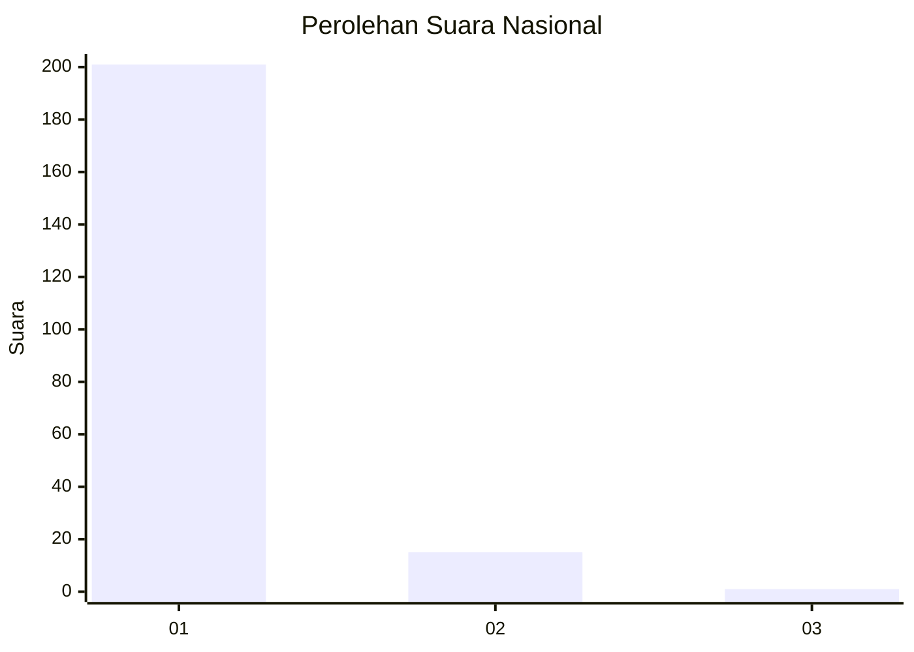
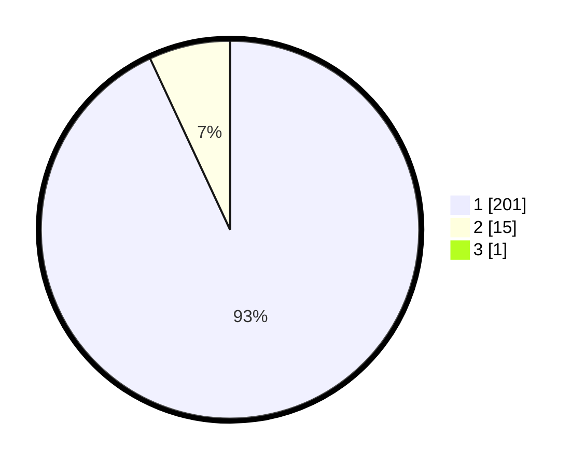

# Hasil

## Grafik

## Tabel

| No. | Nama Paslon    | Suara | Suara (raw) | Persentase |
|:--- |:-------------- | -----:| -----------:| ----------:|
| 1   | ANIES MUHAIMIN | 201   | [201][p-1]  | 92,63      |
| 2   | PRABOWO GIBRAN | 15    | [15][p-2]   | 6,91       |
| 3   | GANJAR MAHFUD  | 1     | [1][p-3]    | 0,46       |

[p-1]: https://github.com/gigit-pemilu/pemilu-2024/blob/main/pilpres/hitung-suara/sub/11-aceh/sub/03-aceh-timur/sub/12-madat/sub/2026-lueng-sa/sub/006-tps/sub/paslon-1.txt
[p-2]: https://github.com/gigit-pemilu/pemilu-2024/blob/main/pilpres/hitung-suara/sub/11-aceh/sub/03-aceh-timur/sub/12-madat/sub/2026-lueng-sa/sub/006-tps/sub/paslon-2.txt
[p-3]: https://github.com/gigit-pemilu/pemilu-2024/blob/main/pilpres/hitung-suara/sub/11-aceh/sub/03-aceh-timur/sub/12-madat/sub/2026-lueng-sa/sub/006-tps/sub/paslon-3.txt

## Foto C Plano

https://sirekap-obj-formc.kpu.go.id/af0c/pemilu/ppwp/11/03/12/20/26/1103122026006-20240215-130152--b8638732-a1c2-4e82-8d3e-bf1d7924e889.jpg

https://sirekap-obj-formc.kpu.go.id/af0c/pemilu/ppwp/11/03/12/20/26/1103122026006-20240215-130304--332d4cb9-4b59-4006-8bf2-3e7ed1817d6f.jpg

https://sirekap-obj-formc.kpu.go.id/af0c/pemilu/ppwp/11/03/12/20/26/1103122026006-20240215-130327--1717f525-072e-4881-ab19-a4aa34d739d3.jpg

## Metadata

| Key        | Value               |
| ---------- | ------------------- |
| Time Stamp | 2024-02-24 22:31:28 |

