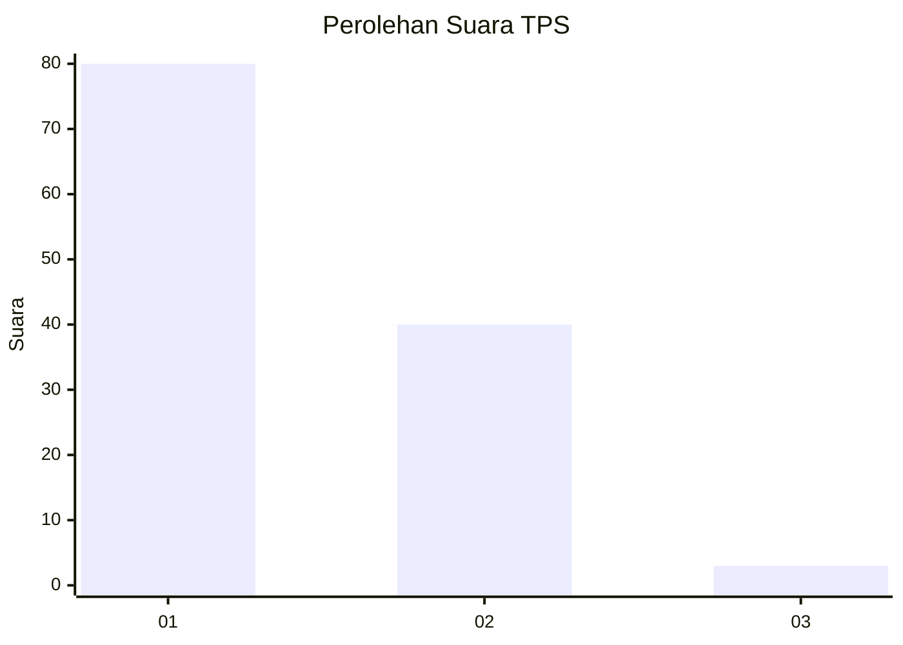
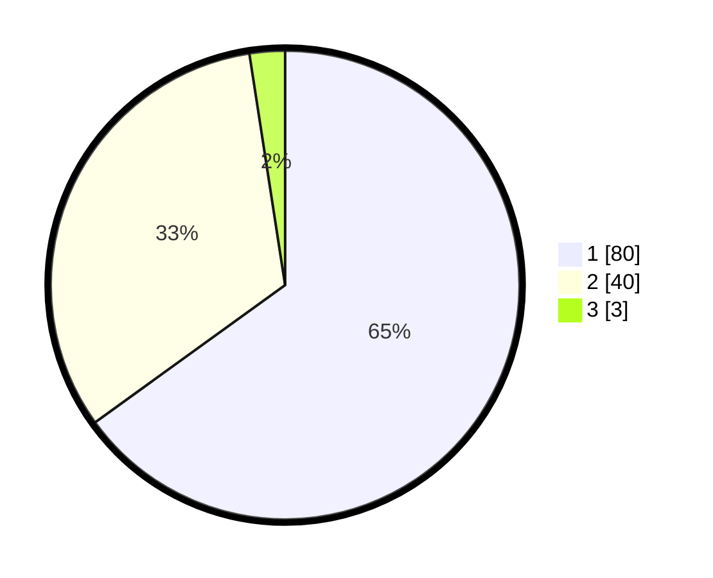

# Hasil

## Grafik

## Tabel

| No. | Nama Paslon    | Suara | Suara (raw) | Persentase |
|:--- |:-------------- | -----:| -----------:| ----------:|
| 1   | ANIES MUHAIMIN | 80    | [80][p-1]   | 65,04      |
| 2   | PRABOWO GIBRAN | 40    | [40][p-2]   | 32,52      |
| 3   | GANJAR MAHFUD  | 3     | [3][p-3]    | 2,44       |

[p-1]: https://github.com/gigit-pemilu/pemilu-2024-11-aceh/blob/main/pilpres/hitung-suara/sub/11-aceh/sub/03-aceh-timur/sub/13-indra-makmu/sub/2001-seuneubok-bayu/sub/001-tps/sub/paslon-1.txt
[p-2]: https://github.com/gigit-pemilu/pemilu-2024-11-aceh/blob/main/pilpres/hitung-suara/sub/11-aceh/sub/03-aceh-timur/sub/13-indra-makmu/sub/2001-seuneubok-bayu/sub/001-tps/sub/paslon-2.txt
[p-3]: https://github.com/gigit-pemilu/pemilu-2024-11-aceh/blob/main/pilpres/hitung-suara/sub/11-aceh/sub/03-aceh-timur/sub/13-indra-makmu/sub/2001-seuneubok-bayu/sub/001-tps/sub/paslon-3.txt

## Foto C Plano

https://sirekap-obj-formc.kpu.go.id/eda3/pemilu/ppwp/11/03/13/20/01/1103132001001-20240218-224041--41280b8a-8cb8-4f38-a0a5-3e64efc932c3.jpg

https://sirekap-obj-formc.kpu.go.id/eda3/pemilu/ppwp/11/03/13/20/01/1103132001001-20240218-224212--cf1fdc14-c837-47d3-abdc-8137ec685ca2.jpg

https://sirekap-obj-formc.kpu.go.id/eda3/pemilu/ppwp/11/03/13/20/01/1103132001001-20240218-224331--d19f63f8-4199-40d6-86af-f606c763a599.jpg

## Metadata

| Key        | Value               |
| ---------- | ------------------- |
| Time Stamp | 2024-02-19 06:16:00 |

## DATA PEMILIH TETAP

Jumlah pemilih dalam DPT: **198**.
 * L: **102**.
 * P: **96**.

## DATA PENGGUNA HAK PILIH

Jumlah pengguna hak pilih dalam DPT: **119**.
 * L: **59**.
 * P: **60**.

Jumlah pengguna hak pilih dalam DPTb: **3**.
 * L: **2**.
 * P: **1**.

Jumlah pengguna hak pilih dalam DPK: **4**.
 * L: **3**.
 * P: **1**.

Jumlah pengguna hak pilih: **126**.
 * L: **64**.
 * P: **62**.

## JUMLAH SUARA SAH DAN TIDAK SAH

JUMLAH SELURUH SUARA SAH: **123**.

JUMLAH SUARA TIDAK SAH: **3**.

JUMLAH SELURUH SUARA SAH DAN SUARA TIDAK SAH: **126**.

