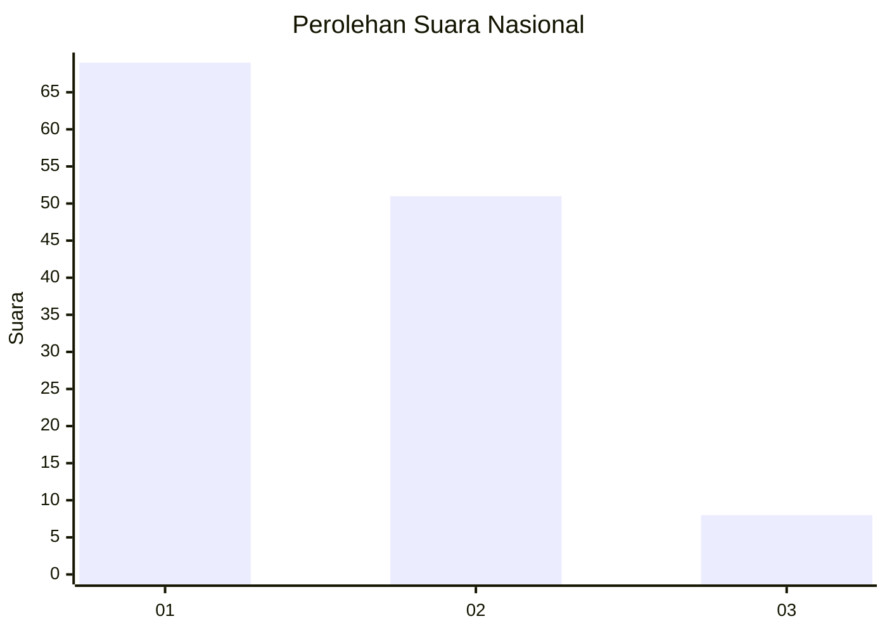
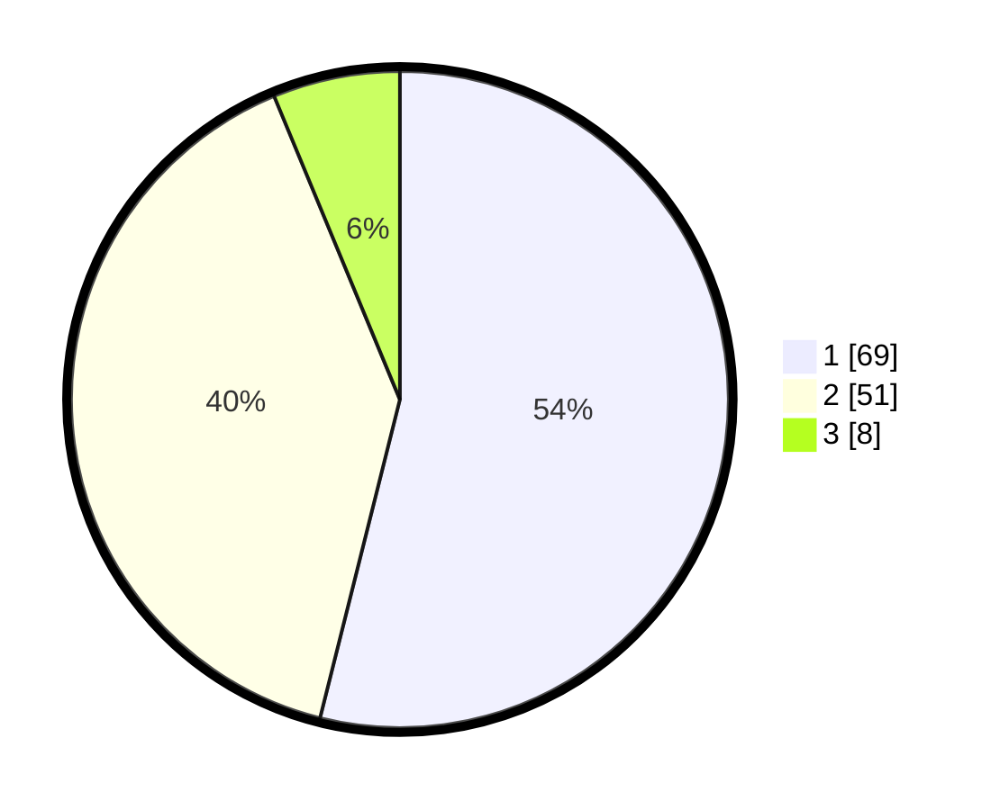

# Hasil

## Grafik

## Tabel

| No. | Nama Paslon    | Suara | Suara (raw) | Persentase |
|:--- |:-------------- | -----:| -----------:| ----------:|
| 1   | ANIES MUHAIMIN | 69    | [69][p-1]   | 53,91      |
| 2   | PRABOWO GIBRAN | 51    | [51][p-2]   | 39,84      |
| 3   | GANJAR MAHFUD  | 8     | [8][p-3]    | 6,25       |

[p-1]: https://github.com/gigit-pemilu/pemilu-2024/blob/main/pilpres/hitung-suara/sub/11-aceh/sub/03-aceh-timur/sub/13-indra-makmu/sub/2001-seuneubok-bayu/sub/002-tps/sub/paslon-1.txt
[p-2]: https://github.com/gigit-pemilu/pemilu-2024/blob/main/pilpres/hitung-suara/sub/11-aceh/sub/03-aceh-timur/sub/13-indra-makmu/sub/2001-seuneubok-bayu/sub/002-tps/sub/paslon-2.txt
[p-3]: https://github.com/gigit-pemilu/pemilu-2024/blob/main/pilpres/hitung-suara/sub/11-aceh/sub/03-aceh-timur/sub/13-indra-makmu/sub/2001-seuneubok-bayu/sub/002-tps/sub/paslon-3.txt

## Foto C Plano

https://sirekap-obj-formc.kpu.go.id/5725/pemilu/ppwp/11/03/13/20/01/1103132001002-20240215-231550--b2874572-c7d7-4bae-b838-773109046150.jpg

https://sirekap-obj-formc.kpu.go.id/5725/pemilu/ppwp/11/03/13/20/01/1103132001002-20240215-231555--eb0fade0-40f0-4a33-ae45-8fc58ce7219d.jpg

https://sirekap-obj-formc.kpu.go.id/5725/pemilu/ppwp/11/03/13/20/01/1103132001002-20240215-231553--887587a1-75a5-4c6d-bfae-bdba91e93329.jpg

## Metadata

| Key        | Value               |
| ---------- | ------------------- |
| Time Stamp | 2024-02-19 06:16:00 |

## DATA PEMILIH TETAP

Jumlah pemilih dalam DPT: **183**.
 * L: **96**.
 * P: **87**.

## DATA PENGGUNA HAK PILIH

Jumlah pengguna hak pilih dalam DPT: **121**.
 * L: **60**.
 * P: **61**.

Jumlah pengguna hak pilih dalam DPTb: **6**.
 * L: **4**.
 * P: **2**.

Jumlah pengguna hak pilih dalam DPK: **3**.
 * L: **1**.
 * P: **2**.

Jumlah pengguna hak pilih: **130**.
 * L: **65**.
 * P: **65**.

## JUMLAH SUARA SAH DAN TIDAK SAH

JUMLAH SELURUH SUARA SAH: **128**.

JUMLAH SUARA TIDAK SAH: **2**.

JUMLAH SELURUH SUARA SAH DAN SUARA TIDAK SAH: **130**.

