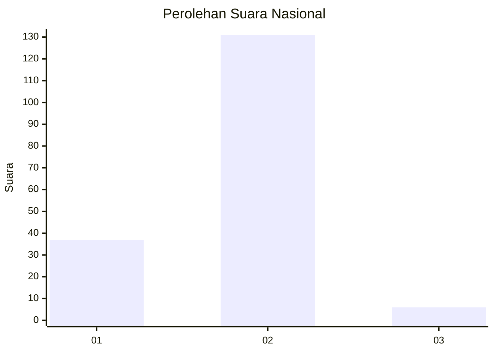

# Hasil

## Grafik

## Tabel

| No. | Nama Paslon    | Suara | Suara (raw) | Persentase |
|:--- |:-------------- | -----:| -----------:| ----------:|
| 1   | ANIES MUHAIMIN | 37    | [37][p-1]   | 21,26      |
| 2   | PRABOWO GIBRAN | 131   | [131][p-2]  | 75,29      |
| 3   | GANJAR MAHFUD  | 6     | [6][p-3]    | 3,45       |

[p-1]: https://github.com/gigit-pemilu/pemilu-2024/blob/main/pilpres/hitung-suara/sub/11-aceh/sub/03-aceh-timur/sub/13-indra-makmu/sub/2002-alue-ie-itam/sub/001-tps/sub/paslon-1.txt
[p-2]: https://github.com/gigit-pemilu/pemilu-2024/blob/main/pilpres/hitung-suara/sub/11-aceh/sub/03-aceh-timur/sub/13-indra-makmu/sub/2002-alue-ie-itam/sub/001-tps/sub/paslon-2.txt
[p-3]: https://github.com/gigit-pemilu/pemilu-2024/blob/main/pilpres/hitung-suara/sub/11-aceh/sub/03-aceh-timur/sub/13-indra-makmu/sub/2002-alue-ie-itam/sub/001-tps/sub/paslon-3.txt

## Foto C Plano

https://sirekap-obj-formc.kpu.go.id/c496/pemilu/ppwp/11/03/13/20/02/1103132002001-20240217-225902--c5ac1fbf-bea6-4f41-aebf-0ee2a0eac448.jpg

https://sirekap-obj-formc.kpu.go.id/c496/pemilu/ppwp/11/03/13/20/02/1103132002001-20240217-231449--e3898c3d-1fbe-4250-b08a-1f10052a42fb.jpg

https://sirekap-obj-formc.kpu.go.id/c496/pemilu/ppwp/11/03/13/20/02/1103132002001-20240217-233409--a4390b12-36c5-4a53-9616-34c751fde6e5.jpg

## Metadata

| Key        | Value               |
| ---------- | ------------------- |
| Time Stamp | 2024-02-19 06:16:00 |

## DATA PEMILIH TETAP

Jumlah pemilih dalam DPT: **212**.
 * L: **102**.
 * P: **110**.

## DATA PENGGUNA HAK PILIH

Jumlah pengguna hak pilih dalam DPT: **176**.
 * L: **82**.
 * P: **94**.

Jumlah pengguna hak pilih dalam DPTb: **2**.
 * L: **1**.
 * P: **1**.

Jumlah pengguna hak pilih dalam DPK: **1**.
 * L: **0**.
 * P: **1**.

Jumlah pengguna hak pilih: **179**.
 * L: **83**.
 * P: **96**.

## JUMLAH SUARA SAH DAN TIDAK SAH

JUMLAH SELURUH SUARA SAH: **174**.

JUMLAH SUARA TIDAK SAH: **5**.

JUMLAH SELURUH SUARA SAH DAN SUARA TIDAK SAH: **179**.

