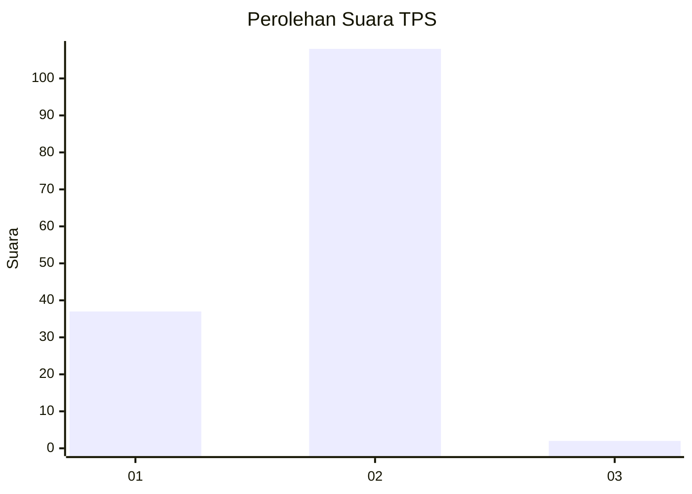
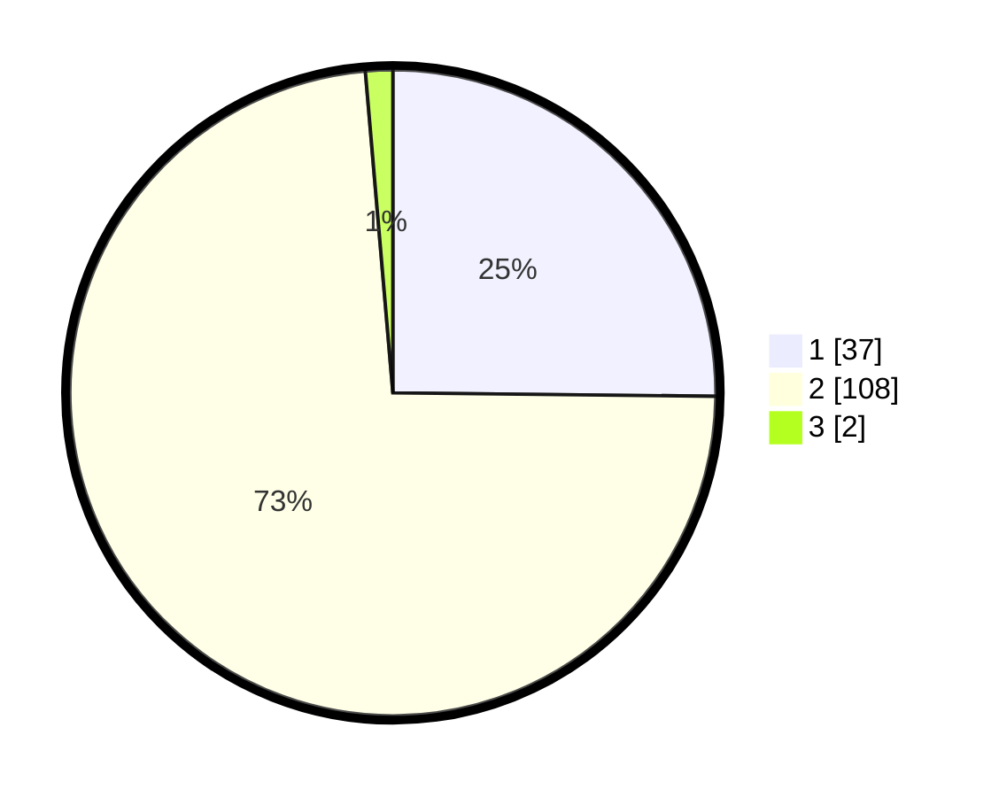

# Hasil

## Grafik

## Tabel

| No. | Nama Paslon    | Suara | Suara (raw) | Persentase |
|:--- |:-------------- | -----:| -----------:| ----------:|
| 1   | ANIES MUHAIMIN | 37    | [37][p-1]   | 25,17      |
| 2   | PRABOWO GIBRAN | 108   | [108][p-2]  | 73,47      |
| 3   | GANJAR MAHFUD  | 2     | [2][p-3]    | 1,36       |

[p-1]: https://github.com/gigit-pemilu/pemilu-2024-11-aceh/blob/main/pilpres/hitung-suara/sub/11-aceh/sub/03-aceh-timur/sub/13-indra-makmu/sub/2002-alue-ie-itam/sub/003-tps/sub/paslon-1.txt
[p-2]: https://github.com/gigit-pemilu/pemilu-2024-11-aceh/blob/main/pilpres/hitung-suara/sub/11-aceh/sub/03-aceh-timur/sub/13-indra-makmu/sub/2002-alue-ie-itam/sub/003-tps/sub/paslon-2.txt
[p-3]: https://github.com/gigit-pemilu/pemilu-2024-11-aceh/blob/main/pilpres/hitung-suara/sub/11-aceh/sub/03-aceh-timur/sub/13-indra-makmu/sub/2002-alue-ie-itam/sub/003-tps/sub/paslon-3.txt

## Foto C Plano

https://sirekap-obj-formc.kpu.go.id/1276/pemilu/ppwp/11/03/13/20/02/1103132002003-20240218-105831--b8d78f01-227b-47fc-8a8f-001c993c05fc.jpg

https://sirekap-obj-formc.kpu.go.id/1276/pemilu/ppwp/11/03/13/20/02/1103132002003-20240218-110137--0263e75a-8e36-48cd-897e-bb66f7bba612.jpg

https://sirekap-obj-formc.kpu.go.id/1276/pemilu/ppwp/11/03/13/20/02/1103132002003-20240218-110749--bcd16394-189d-4ba8-8247-c1b7095ce7fe.jpg

## Metadata

| Key        | Value               |
| ---------- | ------------------- |
| Time Stamp | 2024-02-19 11:00:00 |

## DATA PEMILIH TETAP

Jumlah pemilih dalam DPT: **172**.
 * L: **90**.
 * P: **82**.

## DATA PENGGUNA HAK PILIH

Jumlah pengguna hak pilih dalam DPT: **140**.
 * L: **69**.
 * P: **71**.

Jumlah pengguna hak pilih dalam DPTb: **3**.
 * L: **2**.
 * P: **1**.

Jumlah pengguna hak pilih dalam DPK: **4**.
 * L: **3**.
 * P: **1**.

Jumlah pengguna hak pilih: **147**.
 * L: **74**.
 * P: **73**.

## JUMLAH SUARA SAH DAN TIDAK SAH

JUMLAH SELURUH SUARA SAH: **147**.

JUMLAH SUARA TIDAK SAH: **0**.

JUMLAH SELURUH SUARA SAH DAN SUARA TIDAK SAH: **147**.

