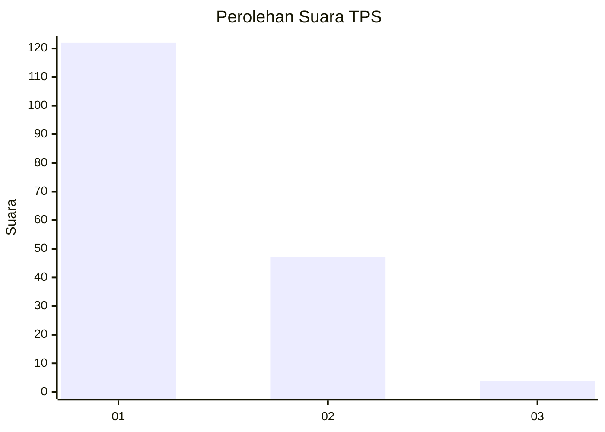
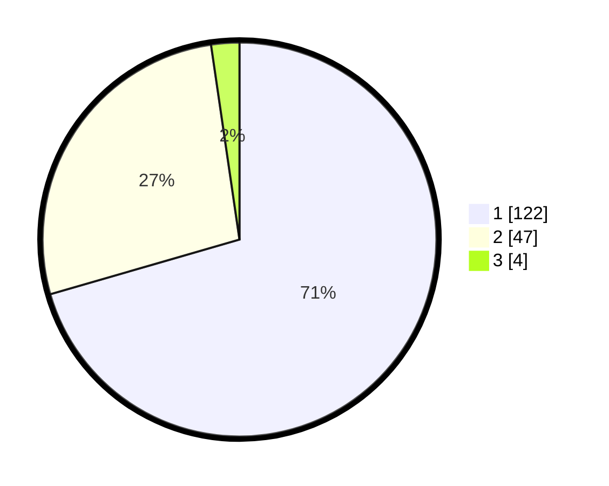

# Hasil

## Grafik

## Tabel

| No. | Nama Paslon    | Suara | Suara (raw) | Persentase |
|:--- |:-------------- | -----:| -----------:| ----------:|
| 1   | ANIES MUHAIMIN | 122   | [122][p-1]  | 70,52      |
| 2   | PRABOWO GIBRAN | 47    | [47][p-2]   | 27,17      |
| 3   | GANJAR MAHFUD  | 4     | [4][p-3]    | 2,31       |

[p-1]: https://github.com/gigit-pemilu/pemilu-2024-11-aceh/blob/main/pilpres/hitung-suara/sub/11-aceh/sub/03-aceh-timur/sub/13-indra-makmu/sub/2003-blang-nisan/sub/001-tps/sub/paslon-1.txt
[p-2]: https://github.com/gigit-pemilu/pemilu-2024-11-aceh/blob/main/pilpres/hitung-suara/sub/11-aceh/sub/03-aceh-timur/sub/13-indra-makmu/sub/2003-blang-nisan/sub/001-tps/sub/paslon-2.txt
[p-3]: https://github.com/gigit-pemilu/pemilu-2024-11-aceh/blob/main/pilpres/hitung-suara/sub/11-aceh/sub/03-aceh-timur/sub/13-indra-makmu/sub/2003-blang-nisan/sub/001-tps/sub/paslon-3.txt

## Foto C Plano

https://sirekap-obj-formc.kpu.go.id/31ec/pemilu/ppwp/11/03/13/20/03/1103132003001-20240219-154102--bea66cec-1a5d-4eea-9a2a-99d5c85a7aba.jpg

https://sirekap-obj-formc.kpu.go.id/31ec/pemilu/ppwp/11/03/13/20/03/1103132003001-20240219-154155--c5044df9-cdb5-4137-83d5-2e1aad144a34.jpg

https://sirekap-obj-formc.kpu.go.id/31ec/pemilu/ppwp/11/03/13/20/03/1103132003001-20240219-154247--ca6be172-e31f-4bfc-8117-dc59c21d6944.jpg

## Metadata

| Key        | Value               |
| ---------- | ------------------- |
| Time Stamp | 2024-02-20 11:00:00 |

