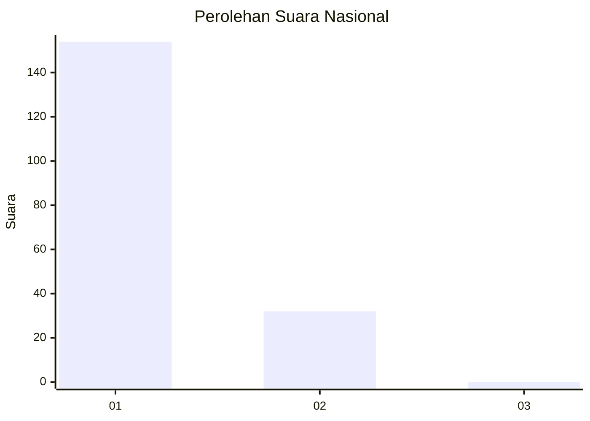
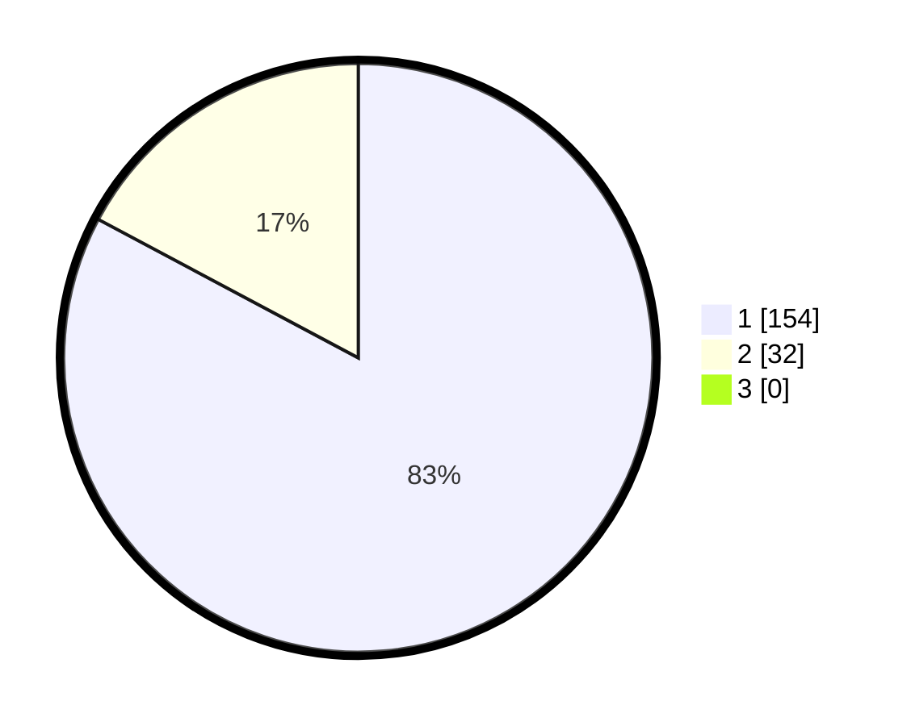

# Hasil

## Grafik

## Tabel

| No. | Nama Paslon    | Suara | Suara (raw) | Persentase |
|:--- |:-------------- | -----:| -----------:| ----------:|
| 1   | ANIES MUHAIMIN | 154   | [154][p-1]  | 82,80      |
| 2   | PRABOWO GIBRAN | 32    | [32][p-2]   | 17,20      |
| 3   | GANJAR MAHFUD  | 0     | [0][p-3]    | 0,00       |

[p-1]: https://github.com/gigit-pemilu/pemilu-2024/blob/main/pilpres/hitung-suara/sub/11-aceh/sub/03-aceh-timur/sub/13-indra-makmu/sub/2003-blang-nisan/sub/002-tps/sub/paslon-1.txt
[p-2]: https://github.com/gigit-pemilu/pemilu-2024/blob/main/pilpres/hitung-suara/sub/11-aceh/sub/03-aceh-timur/sub/13-indra-makmu/sub/2003-blang-nisan/sub/002-tps/sub/paslon-2.txt
[p-3]: https://github.com/gigit-pemilu/pemilu-2024/blob/main/pilpres/hitung-suara/sub/11-aceh/sub/03-aceh-timur/sub/13-indra-makmu/sub/2003-blang-nisan/sub/002-tps/sub/paslon-3.txt

## Foto C Plano

https://sirekap-obj-formc.kpu.go.id/2784/pemilu/ppwp/11/03/13/20/03/1103132003002-20240219-173516--c5fb106a-fac7-4078-ab0d-9bde206166c8.jpg

https://sirekap-obj-formc.kpu.go.id/2784/pemilu/ppwp/11/03/13/20/03/1103132003002-20240219-173600--92fc7923-9da2-4fdb-a8a2-c54112c3ee28.jpg

https://sirekap-obj-formc.kpu.go.id/2784/pemilu/ppwp/11/03/13/20/03/1103132003002-20240219-173642--e8640e5c-6014-4443-a10f-dda110a82c34.jpg

## Metadata

| Key        | Value               |
| ---------- | ------------------- |
| Time Stamp | 2024-02-24 22:31:28 |

