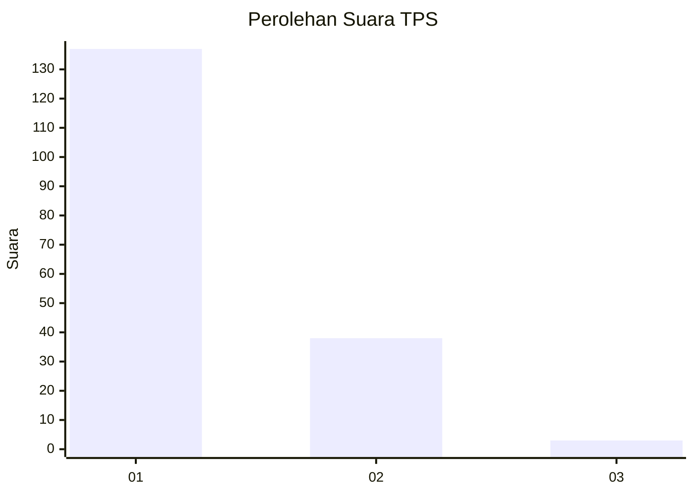
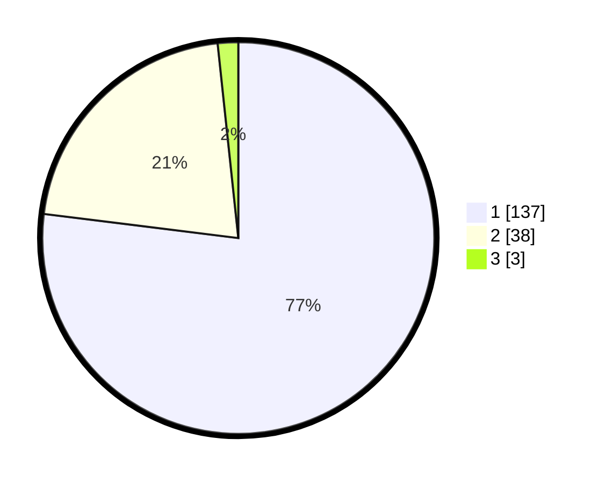

# Hasil

## Grafik

## Tabel

| No. | Nama Paslon    | Suara | Suara (raw) | Persentase |
|:--- |:-------------- | -----:| -----------:| ----------:|
| 1   | ANIES MUHAIMIN | 137   | [137][p-1]  | 76,97      |
| 2   | PRABOWO GIBRAN | 38    | [38][p-2]   | 21,35      |
| 3   | GANJAR MAHFUD  | 3     | [3][p-3]    | 1,69       |

[p-1]: https://github.com/gigit-pemilu/pemilu-2024-11-aceh/blob/main/pilpres/hitung-suara/sub/11-aceh/sub/03-aceh-timur/sub/13-indra-makmu/sub/2003-blang-nisan/sub/004-tps/sub/paslon-1.txt
[p-2]: https://github.com/gigit-pemilu/pemilu-2024-11-aceh/blob/main/pilpres/hitung-suara/sub/11-aceh/sub/03-aceh-timur/sub/13-indra-makmu/sub/2003-blang-nisan/sub/004-tps/sub/paslon-2.txt
[p-3]: https://github.com/gigit-pemilu/pemilu-2024-11-aceh/blob/main/pilpres/hitung-suara/sub/11-aceh/sub/03-aceh-timur/sub/13-indra-makmu/sub/2003-blang-nisan/sub/004-tps/sub/paslon-3.txt

## Foto C Plano

https://sirekap-obj-formc.kpu.go.id/4f5e/pemilu/ppwp/11/03/13/20/03/1103132003004-20240219-231925--377aca6b-6e12-42ef-8eab-b8c2427c316c.jpg

https://sirekap-obj-formc.kpu.go.id/4f5e/pemilu/ppwp/11/03/13/20/03/1103132003004-20240219-232012--103bdef0-6ebd-4864-9156-322b0bf16529.jpg

https://sirekap-obj-formc.kpu.go.id/4f5e/pemilu/ppwp/11/03/13/20/03/1103132003004-20240219-232214--f52aadc4-414a-4007-9c04-0257749422aa.jpg

## Metadata

| Key        | Value               |
| ---------- | ------------------- |
| Time Stamp | 2024-02-20 11:00:00 |

