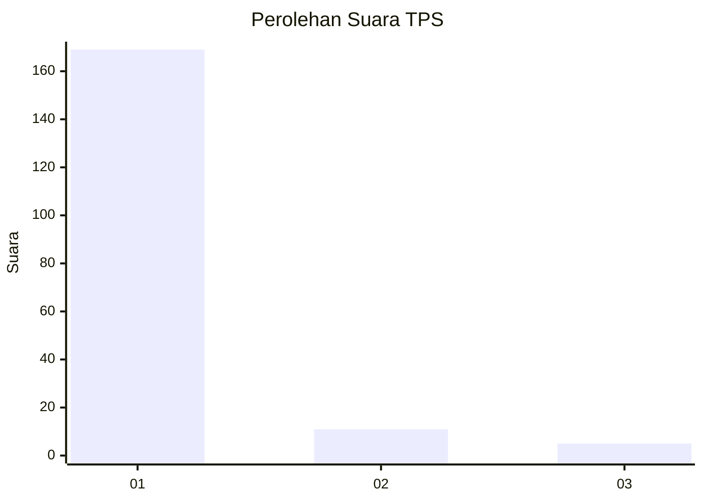
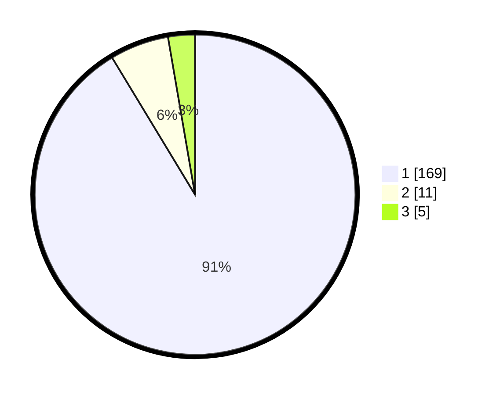

# Hasil

## Grafik

## Tabel

| No. | Nama Paslon    | Suara | Suara (raw) | Persentase |
|:--- |:-------------- | -----:| -----------:| ----------:|
| 1   | ANIES MUHAIMIN | 169   | [169][p-1]  | 91,35      |
| 2   | PRABOWO GIBRAN | 11    | [11][p-2]   | 5,95       |
| 3   | GANJAR MAHFUD  | 5     | [5][p-3]    | 2,70       |

[p-1]: https://github.com/gigit-pemilu/pemilu-2024-11-aceh/blob/main/pilpres/hitung-suara/sub/11-aceh/sub/03-aceh-timur/sub/13-indra-makmu/sub/2008-jambo-balee/sub/002-tps/sub/paslon-1.txt
[p-2]: https://github.com/gigit-pemilu/pemilu-2024-11-aceh/blob/main/pilpres/hitung-suara/sub/11-aceh/sub/03-aceh-timur/sub/13-indra-makmu/sub/2008-jambo-balee/sub/002-tps/sub/paslon-2.txt
[p-3]: https://github.com/gigit-pemilu/pemilu-2024-11-aceh/blob/main/pilpres/hitung-suara/sub/11-aceh/sub/03-aceh-timur/sub/13-indra-makmu/sub/2008-jambo-balee/sub/002-tps/sub/paslon-3.txt

## Foto C Plano

https://sirekap-obj-formc.kpu.go.id/590f/pemilu/ppwp/11/03/13/20/08/1103132008002-20240214-233822--058b6a93-c226-4000-be79-68157c858d94.jpg

https://sirekap-obj-formc.kpu.go.id/590f/pemilu/ppwp/11/03/13/20/08/1103132008002-20240214-233132--53802570-2577-4d5d-8de4-fdd3e5896ad6.jpg

https://sirekap-obj-formc.kpu.go.id/590f/pemilu/ppwp/11/03/13/20/08/1103132008002-20240214-233531--87800eaa-0abe-4629-a2ed-57f14e435ba3.jpg

## Metadata

| Key        | Value               |
| ---------- | ------------------- |
| Time Stamp | 2024-02-19 06:16:00 |

