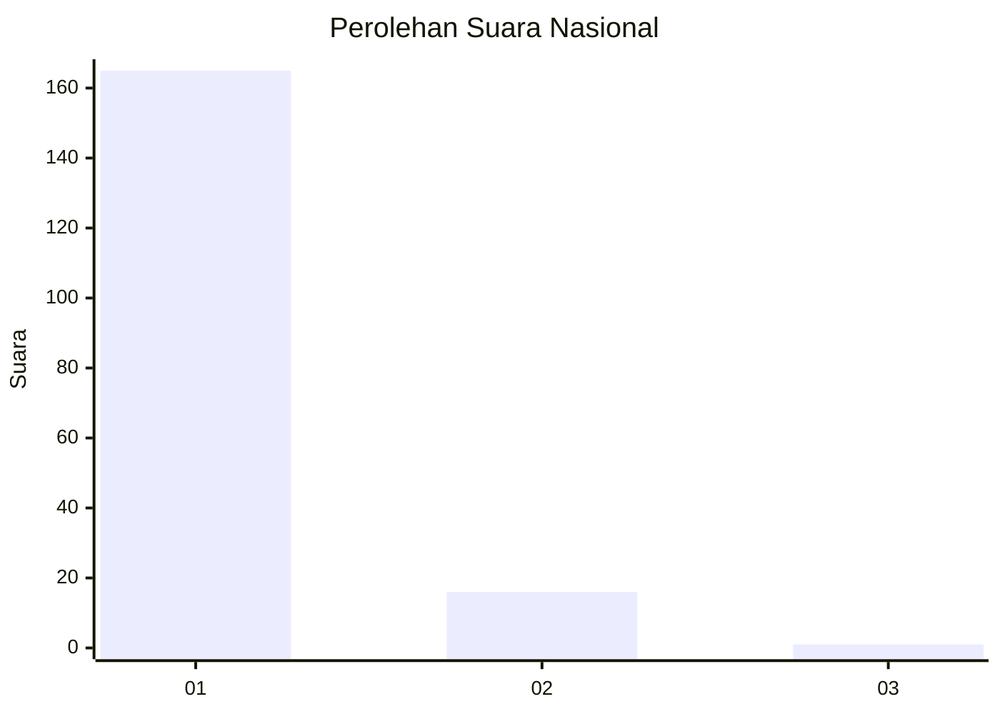
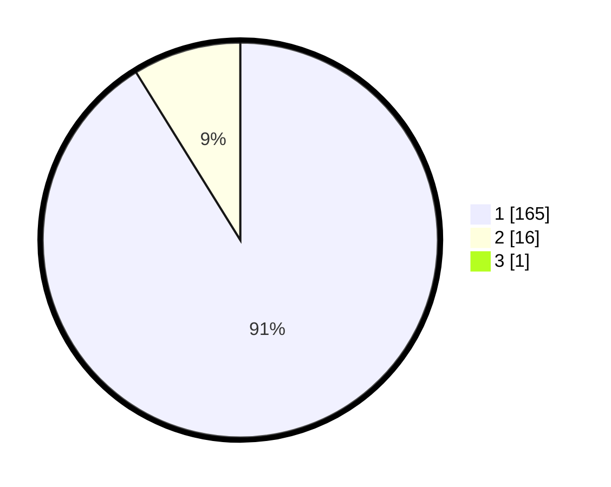

# Hasil

## Grafik

## Tabel

| No. | Nama Paslon    | Suara | Suara (raw) | Persentase |
|:--- |:-------------- | -----:| -----------:| ----------:|
| 1   | ANIES MUHAIMIN | 165   | [165][p-1]  | 90,66      |
| 2   | PRABOWO GIBRAN | 16    | [16][p-2]   | 8,79       |
| 3   | GANJAR MAHFUD  | 1     | [1][p-3]    | 0,55       |

[p-1]: https://github.com/gigit-pemilu/pemilu-2024/blob/main/pilpres/hitung-suara/sub/11-aceh/sub/03-aceh-timur/sub/13-indra-makmu/sub/2009-jambo-lubok/sub/001-tps/sub/paslon-1.txt
[p-2]: https://github.com/gigit-pemilu/pemilu-2024/blob/main/pilpres/hitung-suara/sub/11-aceh/sub/03-aceh-timur/sub/13-indra-makmu/sub/2009-jambo-lubok/sub/001-tps/sub/paslon-2.txt
[p-3]: https://github.com/gigit-pemilu/pemilu-2024/blob/main/pilpres/hitung-suara/sub/11-aceh/sub/03-aceh-timur/sub/13-indra-makmu/sub/2009-jambo-lubok/sub/001-tps/sub/paslon-3.txt

## Foto C Plano

https://sirekap-obj-formc.kpu.go.id/8d69/pemilu/ppwp/11/03/13/20/09/1103132009001-20240214-235008--82d07596-0e30-4ef1-b2bb-156510070299.jpg

https://sirekap-obj-formc.kpu.go.id/8d69/pemilu/ppwp/11/03/13/20/09/1103132009001-20240214-235220--27a7461d-42a2-40ef-a789-516b6d954ee8.jpg

https://sirekap-obj-formc.kpu.go.id/8d69/pemilu/ppwp/11/03/13/20/09/1103132009001-20240214-235410--fdce8c2e-a666-4130-969d-25f2f7046661.jpg

## Metadata

| Key        | Value               |
| ---------- | ------------------- |
| Time Stamp | 2024-02-22 11:00:00 |

