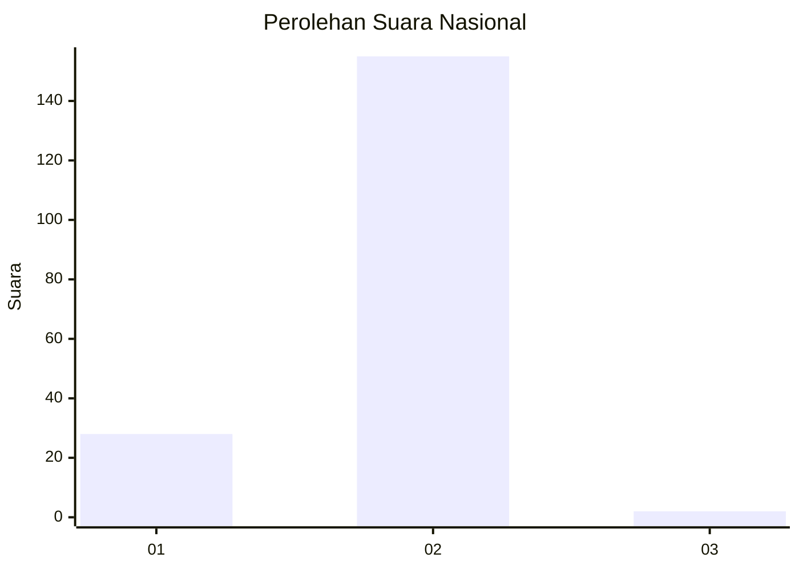
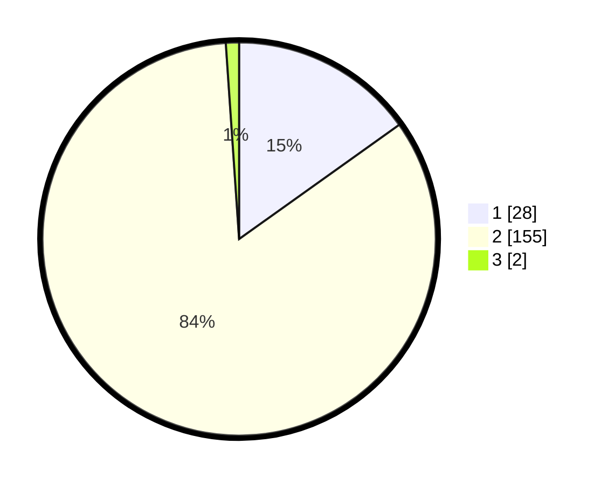

# Hasil

## Grafik

## Tabel

| No. | Nama Paslon    | Suara | Suara (raw) | Persentase |
|:--- |:-------------- | -----:| -----------:| ----------:|
| 1   | ANIES MUHAIMIN | 28    | [28][p-1]   | 15,14      |
| 2   | PRABOWO GIBRAN | 155   | [155][p-2]  | 83,78      |
| 3   | GANJAR MAHFUD  | 2     | [2][p-3]    | 1,08       |

[p-1]: https://github.com/gigit-pemilu/pemilu-2024/blob/main/pilpres/hitung-suara/sub/11-aceh/sub/03-aceh-timur/sub/13-indra-makmu/sub/2010-seuneubok-cina/sub/003-tps/sub/paslon-1.txt
[p-2]: https://github.com/gigit-pemilu/pemilu-2024/blob/main/pilpres/hitung-suara/sub/11-aceh/sub/03-aceh-timur/sub/13-indra-makmu/sub/2010-seuneubok-cina/sub/003-tps/sub/paslon-2.txt
[p-3]: https://github.com/gigit-pemilu/pemilu-2024/blob/main/pilpres/hitung-suara/sub/11-aceh/sub/03-aceh-timur/sub/13-indra-makmu/sub/2010-seuneubok-cina/sub/003-tps/sub/paslon-3.txt

## Foto C Plano

https://sirekap-obj-formc.kpu.go.id/d49d/pemilu/ppwp/11/03/13/20/10/1103132010003-20240215-124019--8af85dfa-a41f-4ad8-a07c-38ed59adf591.jpg

https://sirekap-obj-formc.kpu.go.id/d49d/pemilu/ppwp/11/03/13/20/10/1103132010003-20240215-124422--93d8eed7-365b-4b60-bcfe-e5fdf3a74fb9.jpg

https://sirekap-obj-formc.kpu.go.id/d49d/pemilu/ppwp/11/03/13/20/10/1103132010003-20240215-124746--4247ac01-62ba-4393-9cbd-d795d73e48c9.jpg

## Metadata

| Key        | Value               |
| ---------- | ------------------- |
| Time Stamp | 2024-02-19 06:16:00 |

