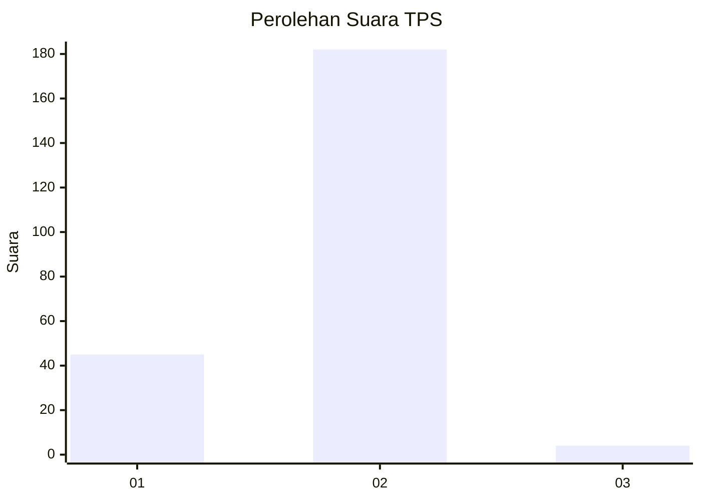
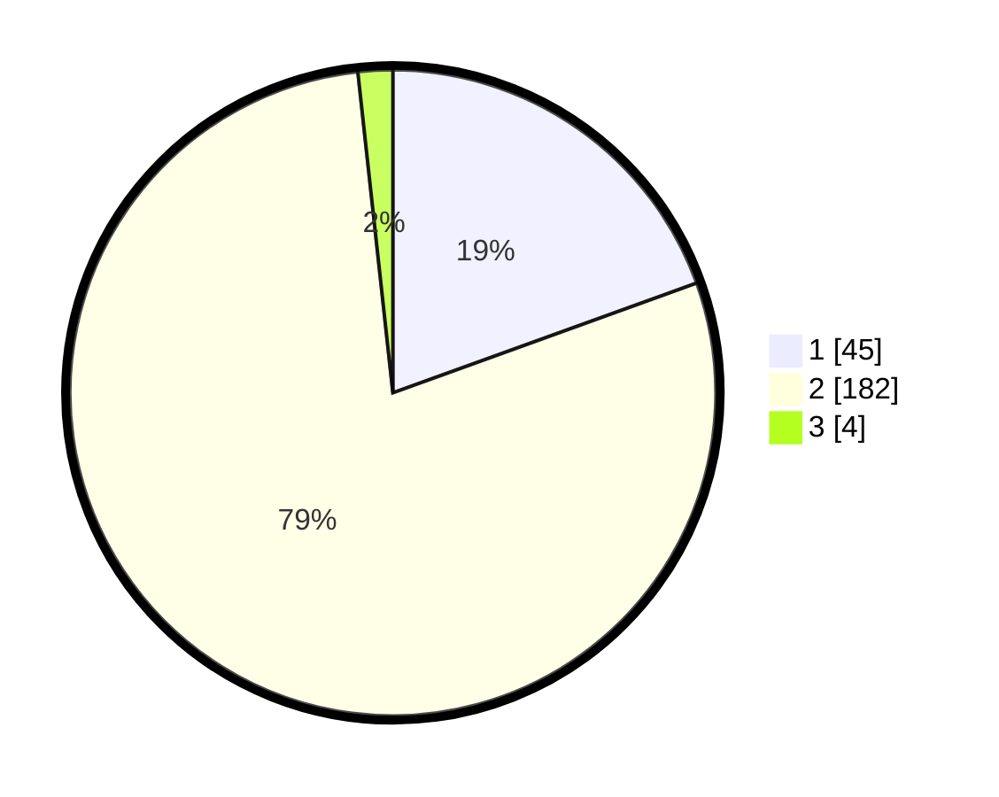

# Hasil

## Grafik

## Tabel

| No. | Nama Paslon    | Suara | Suara (raw) | Persentase |
|:--- |:-------------- | -----:| -----------:| ----------:|
| 1   | ANIES MUHAIMIN | 45    | [45][p-1]   | 19,48      |
| 2   | PRABOWO GIBRAN | 182   | [182][p-2]  | 78,79      |
| 3   | GANJAR MAHFUD  | 4     | [4][p-3]    | 1,73       |

[p-1]: https://github.com/gigit-pemilu/pemilu-2024-11-aceh/blob/main/pilpres/hitung-suara/sub/11-aceh/sub/03-aceh-timur/sub/13-indra-makmu/sub/2011-pelita-sagop-jaya/sub/002-tps/sub/paslon-1.txt
[p-2]: https://github.com/gigit-pemilu/pemilu-2024-11-aceh/blob/main/pilpres/hitung-suara/sub/11-aceh/sub/03-aceh-timur/sub/13-indra-makmu/sub/2011-pelita-sagop-jaya/sub/002-tps/sub/paslon-2.txt
[p-3]: https://github.com/gigit-pemilu/pemilu-2024-11-aceh/blob/main/pilpres/hitung-suara/sub/11-aceh/sub/03-aceh-timur/sub/13-indra-makmu/sub/2011-pelita-sagop-jaya/sub/002-tps/sub/paslon-3.txt

## Foto C Plano

https://sirekap-obj-formc.kpu.go.id/de8a/pemilu/ppwp/11/03/13/20/11/1103132011002-20240215-032116--c39d4bf6-b32a-4167-8603-c4f0f73d7f96.jpg

https://sirekap-obj-formc.kpu.go.id/de8a/pemilu/ppwp/11/03/13/20/11/1103132011002-20240215-032305--9aff169e-c78f-492d-9a5f-c7f27107e2bd.jpg

https://sirekap-obj-formc.kpu.go.id/de8a/pemilu/ppwp/11/03/13/20/11/1103132011002-20240215-032413--5bcc9ce5-189d-4905-b56a-d24486602eed.jpg

## Metadata

| Key        | Value               |
| ---------- | ------------------- |
| Time Stamp | 2024-02-19 06:16:00 |

