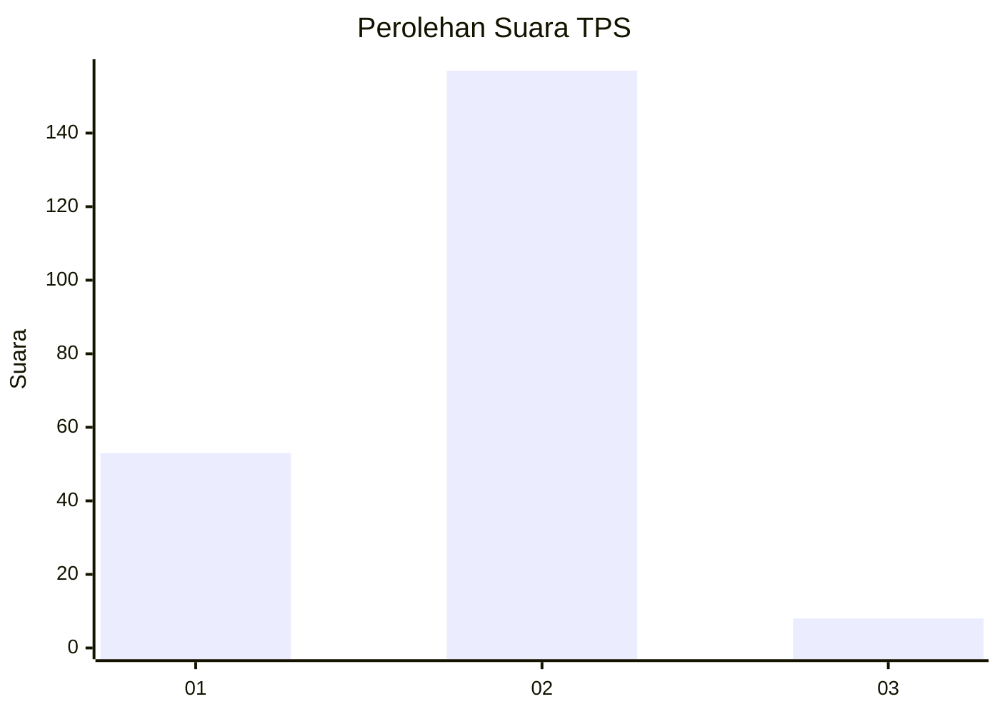

# Hasil

## Grafik

## Tabel

| No. | Nama Paslon    | Suara | Suara (raw) | Persentase |
|:--- |:-------------- | -----:| -----------:| ----------:|
| 1   | ANIES MUHAIMIN | 53    | [53][p-1]   | 24,31      |
| 2   | PRABOWO GIBRAN | 157   | [157][p-2]  | 72,02      |
| 3   | GANJAR MAHFUD  | 8     | [8][p-3]    | 3,67       |

[p-1]: https://github.com/gigit-pemilu/pemilu-2024-11-aceh/blob/main/pilpres/hitung-suara/sub/11-aceh/sub/03-aceh-timur/sub/13-indra-makmu/sub/2011-pelita-sagop-jaya/sub/004-tps/sub/paslon-1.txt
[p-2]: https://github.com/gigit-pemilu/pemilu-2024-11-aceh/blob/main/pilpres/hitung-suara/sub/11-aceh/sub/03-aceh-timur/sub/13-indra-makmu/sub/2011-pelita-sagop-jaya/sub/004-tps/sub/paslon-2.txt
[p-3]: https://github.com/gigit-pemilu/pemilu-2024-11-aceh/blob/main/pilpres/hitung-suara/sub/11-aceh/sub/03-aceh-timur/sub/13-indra-makmu/sub/2011-pelita-sagop-jaya/sub/004-tps/sub/paslon-3.txt

## Foto C Plano

https://sirekap-obj-formc.kpu.go.id/039a/pemilu/ppwp/11/03/13/20/11/1103132011004-20240214-155554--9bd2f60a-4c1f-49fc-9c97-76aedaa3d46f.jpg

https://sirekap-obj-formc.kpu.go.id/039a/pemilu/ppwp/11/03/13/20/11/1103132011004-20240214-155244--d3f8d0e7-4a48-4345-af5e-010c84f64a2d.jpg

https://sirekap-obj-formc.kpu.go.id/039a/pemilu/ppwp/11/03/13/20/11/1103132011004-20240214-155427--e39eea65-1650-4f41-82eb-aa0f33e3cde2.jpg

## Metadata

| Key        | Value               |
| ---------- | ------------------- |
| Time Stamp | 2024-02-22 11:00:00 |

