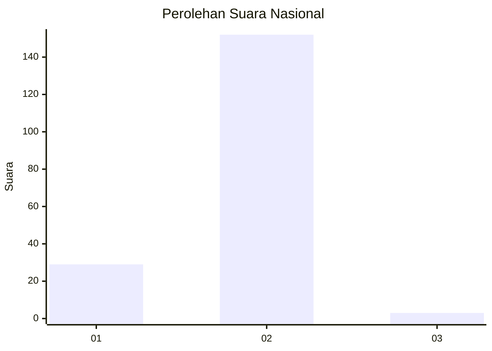
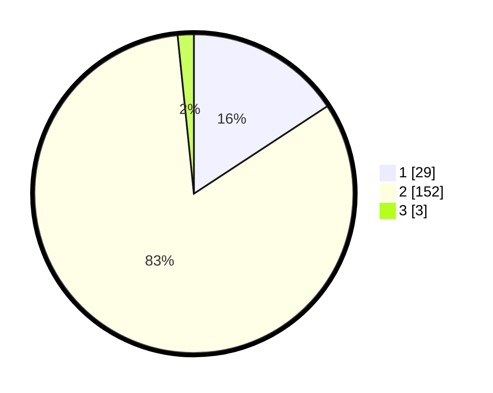

# Hasil

## Grafik

## Tabel

| No. | Nama Paslon    | Suara | Suara (raw) | Persentase |
|:--- |:-------------- | -----:| -----------:| ----------:|
| 1   | ANIES MUHAIMIN | 29    | [29][p-1]   | 15,76      |
| 2   | PRABOWO GIBRAN | 152   | [152][p-2]  | 82,61      |
| 3   | GANJAR MAHFUD  | 3     | [3][p-3]    | 1,63       |

[p-1]: https://github.com/gigit-pemilu/pemilu-2024/blob/main/pilpres/hitung-suara/sub/11-aceh/sub/03-aceh-timur/sub/13-indra-makmu/sub/2012-perkebunan-julok-rayeuk-selatan/sub/002-tps/sub/paslon-1.txt
[p-2]: https://github.com/gigit-pemilu/pemilu-2024/blob/main/pilpres/hitung-suara/sub/11-aceh/sub/03-aceh-timur/sub/13-indra-makmu/sub/2012-perkebunan-julok-rayeuk-selatan/sub/002-tps/sub/paslon-2.txt
[p-3]: https://github.com/gigit-pemilu/pemilu-2024/blob/main/pilpres/hitung-suara/sub/11-aceh/sub/03-aceh-timur/sub/13-indra-makmu/sub/2012-perkebunan-julok-rayeuk-selatan/sub/002-tps/sub/paslon-3.txt

## Foto C Plano

https://sirekap-obj-formc.kpu.go.id/6af7/pemilu/ppwp/11/03/13/20/12/1103132012002-20240218-053357--45ca2995-a245-45b3-85f7-094134df8df7.jpg

https://sirekap-obj-formc.kpu.go.id/6af7/pemilu/ppwp/11/03/13/20/12/1103132012002-20240218-053358--7e577876-b958-48f0-a711-f7a72e069876.jpg

https://sirekap-obj-formc.kpu.go.id/6af7/pemilu/ppwp/11/03/13/20/12/1103132012002-20240218-053357--3d7bbed3-f4e1-489c-a400-1dcb1bcc317a.jpg

## Metadata

| Key        | Value               |
| ---------- | ------------------- |
| Time Stamp | 2024-02-19 21:00:00 |

## DATA PEMILIH TETAP

Jumlah pemilih dalam DPT: **252**.
 * L: **132**.
 * P: **120**.

## DATA PENGGUNA HAK PILIH

Jumlah pengguna hak pilih dalam DPT: **180**.
 * L: **94**.
 * P: **86**.

Jumlah pengguna hak pilih dalam DPTb: **6**.
 * L: **4**.
 * P: **2**.

Jumlah pengguna hak pilih dalam DPK: **1**.
 * L: **1**.
 * P: **0**.

Jumlah pengguna hak pilih: **187**.
 * L: **99**.
 * P: **88**.

## JUMLAH SUARA SAH DAN TIDAK SAH

JUMLAH SELURUH SUARA SAH: **184**.

JUMLAH SUARA TIDAK SAH: **3**.

JUMLAH SELURUH SUARA SAH DAN SUARA TIDAK SAH: **187**.

